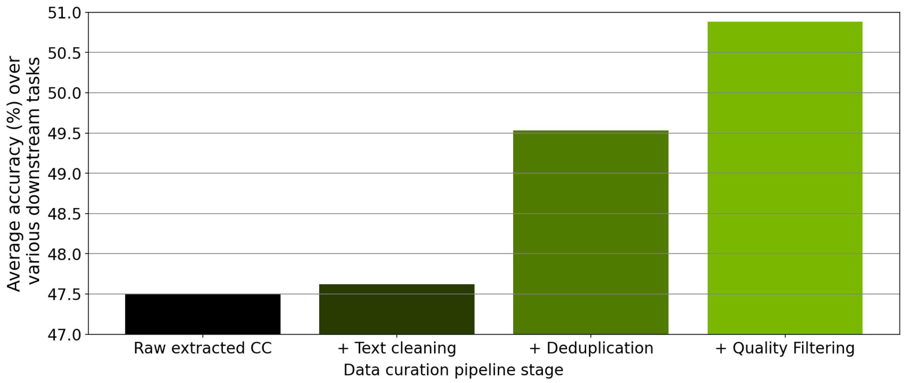
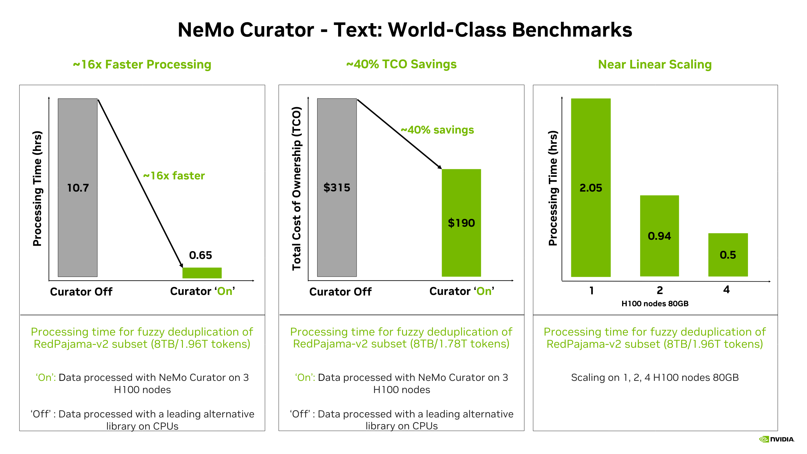

  
  
  
  
  

# Accelerate Data Processing with NVIDIA NeMo Curator

NeMo Curator, part of the NVIDIA NeMo software suite for managing the AI agent lifecycle, is a Python library specifically designed for fast and scalable data processing and curation for generative AI use cases such as foundation language model pretraining, text-to-image model training, domain-adaptive pretraining (DAPT), supervised fine-tuning (SFT) and parameter-efficient fine-tuning (PEFT).

It greatly accelerates data processing and curation by leveraging GPUs with [Dask](https://www.dask.org/) and [RAPIDS](https://developer.nvidia.com/rapids), resulting in significant time savings. The library provides a customizable and modular interface, simplifying pipeline expansion and accelerating model convergence through the preparation of high-quality tokens.

## Getting Started

New to NeMo Curator? Start with our quickstart guides for hands-on experience:

- **[Text Curation Quickstart](https://docs.nvidia.com/nemo/curator/latest/get-started/text.html)** - Set up your environment and run your first text curation pipeline in under 30 minutes
- **[Image Curation Quickstart](https://docs.nvidia.com/nemo/curator/latest/get-started/image.html)** - Learn to curate large-scale image-text datasets for generative model training
- **[Video Curation Quickstart](https://docs.nvidia.com/nemo/curator/latest/get-started/video.html)** - Process videos into high-quality clips with GPU-accelerated pipelines
- **[Audio Curation Quickstart](https://docs.nvidia.com/nemo/curator/latest/get-started/audio.html)** - Transcribe and curate speech datasets with ASR models

For production deployments and advanced configurations, refer to our [Setup & Deployment documentation](https://docs.nvidia.com/nemo/curator/latest/admin/index.html).

---

## Key Features

With NeMo Curator, you can process raw data and curate high-quality datasets for training and customizing generative AI models such as large language models (LLMs), vision language models (VLMs), and world foundation models (WFMs). NeMo Curator provides a collection of scalable data processing modules for text, image, video, and audio curation.

### Text Curation
All of our text pipelines have great multilingual support. With NeMo Curator, you can pick and choose the features you want and build your data curation pipelines. Text curation follows a two-stage workflow: **Load** → **Process**. A typical pipeline starts by downloading raw data from public resources, then applies cleaning and filtering steps to prepare high-quality training data.

#### Load Data

- **[Download and Extraction](https://docs.nvidia.com/nemo/curator/latest/curate-text/load-data/index.html)** - Default implementations for Common Crawl, Wikipedia, and ArXiv sources with easy customization for other sources

#### Process Data  

- **Quality Assessment & Filtering**
  - [Heuristic Filtering](https://docs.nvidia.com/nemo/curator/latest/curate-text/process-data/quality-assessment/heuristic.html) - More than 30 heuristic filters for punctuation density, length, and repetition analysis
  - [fastText Classification](https://docs.nvidia.com/nemo/curator/latest/curate-text/process-data/quality-assessment/classifier.html) - Fast language and quality classification
  - [GPU-Accelerated Classification](https://docs.nvidia.com/nemo/curator/latest/curate-text/process-data/quality-assessment/distributed-classifier.html) - Domain, Quality, Safety, Educational Content, Content Type, and Prompt Task/Complexity Classification

- **Deduplication**
  - [Exact Deduplication](https://docs.nvidia.com/nemo/curator/latest/curate-text/process-data/deduplication/gpudedup.html) - Remove identical documents efficiently
  - [Fuzzy Deduplication](https://docs.nvidia.com/nemo/curator/latest/curate-text/process-data/deduplication/gpudedup.html) - MinHash Locality Sensitive Hashing with optional False Positive Check
  - [Semantic Deduplication](https://docs.nvidia.com/nemo/curator/latest/curate-text/process-data/deduplication/semdedup.html) - GPU-accelerated semantic deduplication using RAPIDS cuML, cuDF, and PyTorch

- **Content Processing & Cleaning**
  - [Text Cleaning](https://docs.nvidia.com/nemo/curator/latest/curate-text/process-data/content-processing/text-cleaning.html) - Remove improperly decoded Unicode characters, inconsistent line spacing, and excessive URLs

- **Specialized Processing**
  - [Language Identification](https://docs.nvidia.com/nemo/curator/latest/curate-text/process-data/language-management/index.html) - Accurate language detection using fastText
  - [Task Decontamination](https://docs.nvidia.com/nemo/curator/latest/curate-text/process-data/specialized-processing/task-decontamination.html) - Remove potential evaluation data leakage from training datasets

---

### Image Curation

NeMo Curator provides powerful image curation features to curate high-quality image data for training generative AI models such as LLMs, VLMs, and WFMs. Image curation follows a **Load** → **Process** workflow: download datasets in WebDataset format, create embeddings, apply quality filters (NSFW and Aesthetic), and remove duplicates using semantic deduplication.

#### Load Data

- **[WebDataset Loading](https://docs.nvidia.com/nemo/curator/latest/curate-images/load-data/index.html)** - Load large-scale image-text datasets in WebDataset format

#### Process Data

- **Embeddings & Feature Extraction**
  - [Image Embedding Creation](https://docs.nvidia.com/nemo/curator/latest/curate-images/process-data/embeddings/index.html) - Generate CLIP embeddings for image analysis

- **Quality Assessment & Filtering**
  - [Aesthetic Classification](https://docs.nvidia.com/nemo/curator/latest/curate-images/process-data/classifiers/index.html) - Filter images based on aesthetic quality
  - [NSFW Classification](https://docs.nvidia.com/nemo/curator/latest/curate-images/process-data/classifiers/index.html) - Remove inappropriate content from datasets

- **Deduplication**
  - [Semantic Deduplication](https://docs.nvidia.com/nemo/curator/latest/curate-images/process-data/deduplication.html) - Remove visually similar images using embedding-based clustering

---

### Video Curation

NeMo Curator provides distributed video curation pipelines for processing large-scale video corpora with GPU acceleration. Video curation follows a **Load** → **Process** → **Write** workflow: ingest videos from local or remote sources, split into clips using scene detection or fixed stride, generate embeddings, apply quality filters, and remove near-duplicate clips.

#### Load Data

- **[Local and Cloud Storage](https://docs.nvidia.com/nemo/curator/latest/curate-video/load-data/index.html)** - Load videos from local paths, S3-compatible storage, or HTTP(S) URLs

#### Process Data

- **Video Processing**
  - [Video Clipping](https://docs.nvidia.com/nemo/curator/latest/curate-video/process-data/clipping.html) - Fixed-stride and scene-change detection (TransNetV2) for clip extraction
  - [Video Encoding](https://docs.nvidia.com/nemo/curator/latest/curate-video/process-data/transcoding.html) - GPU-accelerated H.264 encoding using hardware encoders

- **Embeddings & Analysis**
  - [Embedding Generation](https://docs.nvidia.com/nemo/curator/latest/curate-video/process-data/embeddings.html) - InternVideo2 and Cosmos-Embed1 models for clip-level embeddings
  - [Frame Extraction](https://docs.nvidia.com/nemo/curator/latest/curate-video/process-data/frame-extraction.html) - Extract frames from clips for analysis and filtering

- **Quality Assessment & Filtering**
  - [Motion Filtering](https://docs.nvidia.com/nemo/curator/latest/curate-video/process-data/filtering.html) - Motion-based filtering for quality improvement
  - [Aesthetic Filtering](https://docs.nvidia.com/nemo/curator/latest/curate-video/process-data/filtering.html) - Aesthetic quality assessment for video clips
  - [Caption Generation](https://docs.nvidia.com/nemo/curator/latest/curate-video/process-data/captions-preview.html) - Qwen-VL captions and WebP previews for video clips

- **Deduplication**
  - [Semantic Deduplication](https://docs.nvidia.com/nemo/curator/latest/curate-video/process-data/dedup.html) - K-means clustering and pairwise similarity for near-duplicate removal

---

### Audio Curation

NeMo Curator provides comprehensive audio curation capabilities for preparing high-quality speech datasets for automatic speech recognition (ASR) and multimodal model training. Audio curation follows a **Load** → **Process** → **Write** workflow: ingest audio datasets with manifests, perform ASR inference using NeMo Framework models, assess transcription quality, and filter based on quality metrics.

#### Load Data

- **[Audio Datasets](https://docs.nvidia.com/nemo/curator/latest/curate-audio/load-data/index.html)** - Load audio from local files, custom manifests, and public datasets such as FLEURS

#### Process Data

- **ASR Processing**
  - [ASR Inference](https://docs.nvidia.com/nemo/curator/latest/curate-audio/process-data/asr-inference/index.html) - Automatic speech recognition using NeMo Framework pretrained models
  - [Quality Assessment](https://docs.nvidia.com/nemo/curator/latest/curate-audio/process-data/quality-assessment/index.html) - Word Error Rate (WER) calculation and quality-based filtering

- **Audio Analysis**
  - [Duration Analysis](https://docs.nvidia.com/nemo/curator/latest/curate-audio/process-data/audio-analysis/index.html) - Duration calculation and format validation for audio files

- **Integration**
  - [Text Integration](https://docs.nvidia.com/nemo/curator/latest/curate-audio/process-data/text-integration/transcripts.html) - Integrate audio processing results with text curation workflows

---

## Module Ablation and Compute Performance

The modules within NeMo Curator were primarily designed to process and curate high-quality documents at scale.  To evaluate the quality of the data, we curated Common Crawl documents and conducted a series of ablation experiments. In these experiments, we trained a 357M-parameter GPT-style model using datasets generated at various stages of our data curation pipeline, which was implemented in NeMo Curator.

The following figure shows that the use of different data curation modules implemented in NeMo Curator led to improved model zero-shot downstream task performance.

  

NeMo Curator leverages NVIDIA RAPIDS™ libraries such as cuDF, cuML, and cuGraph along with Dask to scale workloads across multi-node, multi-GPU environments, significantly reducing data processing time. With NeMo Curator, developers achieve approximately 16× faster fuzzy deduplication on an 8 TB RedPajama v2 subset (approximately 1.78 trillion tokens), with approximately 40% lower total cost of ownership (TCO) and near-linear scaling on one to four H100 80 GB nodes.

  

## Contribute to NeMo Curator

We welcome community contributions! Please refer to [CONTRIBUTING.md](https://github.com/NVIDIA/NeMo/blob/stable/CONTRIBUTING.md) for the process.