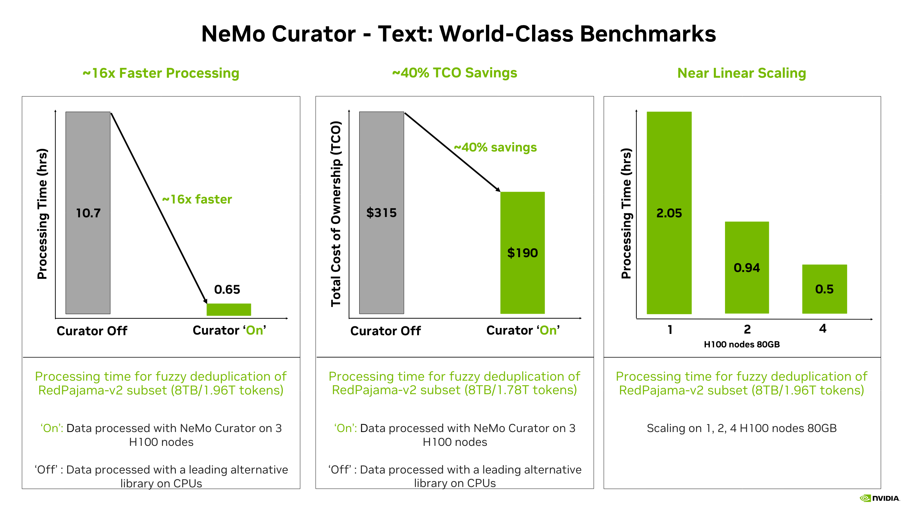

<div align="center">

  <a href="https://github.com/NVIDIA-NeMo/Curator/blob/main/LICENSE"></a>
  <a href="https://codecov.io/github/NVIDIA-NeMo/Curator"></a>
  <a href="https://pypi.org/project/nemo-curator/"></a>
  <a href="https://github.com/NVIDIA-NeMo/Curator/graphs/contributors"></a>
  <a href="https://github.com/NVIDIA-NeMo/Curator/releases"></a>
  <a href="https://pypi.org/project/nemo-curator/"></a>

</div>

# NVIDIA NeMo Curator

**GPU-accelerated data curation for training better AI models, faster.** Scale from laptop to multi-node clusters with modular pipelines for text, images, video, and audio.

> *Part of the [NVIDIA NeMo](https://www.nvidia.com/en-us/ai-data-science/products/nemo/) software suite for managing the AI agent lifecycle.*

---

## What Is NeMo Curator?

**NVIDIA NeMo Curator** is an open-source, GPU-accelerated data preprocessing and curation toolkit that prepares high-quality training datasets for large language models (LLMs) and multimodal AI. It runs on NVIDIA RAPIDS (cuDF, cuML, cuGraph) and Ray, scaling from a single workstation to multi-node, multi-GPU clusters. It supports four modalities — **Text, Image, Video, and Audio** — through a consistent, composable Python API.

**Key numbers:** 16× faster fuzzy deduplication · 40% lower TCO vs CPU-only · near-linear multi-GPU scaling · Apache-2.0 license

---

## Table of Contents

- [Is This Right for Me?](#is-this-right-for-me)
- [Prerequisites](#prerequisites)
- [Quick Start](#quick-start)
- [What You Can Do](#what-you-can-do)
- [Features by Modality](#features-by-modality)
  - [Text Curation](#text-curation)
  - [Image Curation](#image-curation)
  - [Video Curation](#video-curation)
  - [Audio Curation](#audio-curation)
- [Architecture Overview](#architecture-overview)
- [Why NeMo Curator?](#why-nemo-curator)
- [NeMo Curator vs. Alternatives](#nemo-curator-vs-alternatives)
- [Installation Options](#installation-options)
- [Frequently Asked Questions](#frequently-asked-questions)
- [Learn More](#learn-more)
- [Citation](#citation)
- [Contribute](#contribute)

---

## Is This Right for Me?

NeMo Curator is built for teams preparing **large-scale training datasets** for LLMs or multimodal models who need GPU-accelerated preprocessing pipelines.

| I want to… | Start here |
|---|---|
| Preprocess a text corpus (CommonCrawl, Wikipedia) for LLM pretraining | [Text Curation Guide](https://docs.nvidia.com/nemo/curator/latest/get-started/text.html) |
| Set up a production-grade, repeatable data pipeline | [Installation Guide](https://docs.nvidia.com/nemo/curator/latest/admin/installation.html) + [Docker](#installation-options) |
| Curate images or video for a vision-language or world-foundation model | [Image Guide](https://docs.nvidia.com/nemo/curator/latest/get-started/image.html) · [Video Guide](https://docs.nvidia.com/nemo/curator/latest/get-started/video.html) |
| Just try it out on a small dataset | [Quick Start](#quick-start) below — under 10 minutes |

**NeMo Curator is likely overkill if** you only need to process a few GB of data locally — a pandas or Polars script will be simpler. CPU-only mode is available, but the 16× deduplication speedup and GPU classifiers require CUDA.

---

## Prerequisites

> Check these before installing to avoid the most common setup failures.

| Requirement | Minimum | Recommended |
|---|---|---|
| Python | 3.10 | 3.12 |
| CUDA toolkit | 12.0 | 12.x (latest) |
| GPU VRAM | 8 GB | 80 GB (A100 / H100) |
| System RAM | 32 GB | 128 GB+ for large corpora |
| OS | Linux x86-64 | Ubuntu 22.04 / 24.04 |

**Verify before installing:**

```bash
nvidia-smi          # check GPU and driver version (CUDA ≥ 12.0)
python --version    # must be 3.10, 3.11, or 3.12
```

> **No GPU?** CPU-only variants are available — replace `_cuda12` with `_cpu` in any install command. Expect roughly 10–16× slower deduplication on large corpora.

---

## Quick Start

**Step 1 — Install** (GPU with CUDA 12):

```bash
uv pip install "nemo-curator[text_cuda12]"
```

> `uv` is strongly recommended for fast, reproducible installs. Get it with `pip install uv`.

**Step 2 — Validate the install:**

```bash
python -c "import nemo_curator; print('NeMo Curator', nemo_curator.__version__)"
```

Expected: `NeMo Curator 1.x.x` — if you see an import error, check the [FAQ](#frequently-asked-questions).

**Step 3 — Run your first pipeline** (text filtering + deduplication):

```python
import nemo_curator as nc
from nemo_curator.datasets import DocumentDataset

# Load a JSONL corpus
dataset = DocumentDataset.read_json("data/raw/*.jsonl", add_filename=True)

# Compose a pipeline: quality filter → exact deduplication
pipeline = nc.Sequential([
    nc.ScoreFilter(nc.HeuristicFilter(), score_field="quality_score", min_score=0.5),
    nc.ExactDuplicates(hash_method="md5"),
])

result = pipeline(dataset)
result.to_json("data/curated/", write_to_filename=True)
print(f"Curated dataset: {len(result)} documents")
```

**Full setup options:** [Installation Guide](https://docs.nvidia.com/nemo/curator/latest/admin/installation.html) · [Docker / NGC](#installation-options) · [All Tutorials](tutorials/)

---

## What You Can Do

| Modality | Key Capabilities | Get Started |
|----------|-----------------|-------------|
| **Text** | Deduplication · Classification · Quality Filtering · Language Detection | [Text Guide](https://docs.nvidia.com/nemo/curator/latest/get-started/text.html) |
| **Image** | Aesthetic Filtering · NSFW Detection · Embedding Generation · Deduplication | [Image Guide](https://docs.nvidia.com/nemo/curator/latest/get-started/image.html) |
| **Video** | Scene Detection · Clip Extraction · Motion Filtering · Deduplication | [Video Guide](https://docs.nvidia.com/nemo/curator/latest/get-started/video.html) |
| **Audio** | ASR Transcription · Quality Assessment · WER Filtering | [Audio Guide](https://docs.nvidia.com/nemo/curator/latest/get-started/audio.html) |

---

## Features by Modality

### Text Curation

Process and curate high-quality text datasets for large language model (LLM) training with multilingual support.

| Category | Features | Documentation |
|----------|----------|---------------|
| **Data Sources** | Common Crawl · Wikipedia · ArXiv · Custom datasets | [Load Data](https://docs.nvidia.com/nemo/curator/latest/curate-text/load-data/index.html) |
| **Quality Filtering** | 30+ heuristic filters · fastText classification · GPU-accelerated classifiers for domain, quality, safety, and content type | [Quality Assessment](https://docs.nvidia.com/nemo/curator/latest/curate-text/process-data/quality-assessment/heuristic.html) |
| **Deduplication** | Exact (MD5) · Fuzzy (MinHash LSH) · Semantic (GPU-accelerated) | [Deduplication](https://docs.nvidia.com/nemo/curator/latest/curate-text/process-data/deduplication/index.html) |
| **Processing** | Text cleaning · Language identification · PII redaction | [Content Processing](https://docs.nvidia.com/nemo/curator/latest/curate-text/process-data/content-processing/text-cleaning.html) |
| **Synthetic Data** | Prompt generation · Dialogue generation · OpenAI-compatible API integration | [Synthetic Data](https://docs.nvidia.com/nemo/curator/latest/curate-text/synthetic-data/index.html) |

---

### Image Curation

Curate large-scale image datasets for vision language models (VLMs) and generative AI training.

| Category | Features | Documentation |
|----------|----------|---------------|
| **Data Loading** | WebDataset format · Large-scale image-text pairs | [Load Data](https://docs.nvidia.com/nemo/curator/latest/curate-images/load-data/index.html) |
| **Embeddings** | CLIP embeddings for semantic analysis and deduplication | [Embeddings](https://docs.nvidia.com/nemo/curator/latest/curate-images/process-data/embeddings/index.html) |
| **Filtering** | Aesthetic quality scoring · NSFW detection · Resolution filtering | [Filters](https://docs.nvidia.com/nemo/curator/latest/curate-images/process-data/filters/index.html) |

---

### Video Curation

Process large-scale video corpora with distributed, GPU-accelerated pipelines for world foundation models (WFMs).

| Category | Features | Documentation |
|----------|----------|---------------|
| **Data Loading** | Local paths · S3-compatible storage · HTTP(S) URLs | [Load Data](https://docs.nvidia.com/nemo/curator/latest/curate-video/load-data/index.html) |
| **Clipping** | Fixed-stride splitting · Scene-change detection (TransNetV2) | [Clipping](https://docs.nvidia.com/nemo/curator/latest/curate-video/process-data/clipping.html) |
| **Processing** | GPU H.264 encoding · Frame extraction · Motion filtering · Aesthetic filtering | [Processing](https://docs.nvidia.com/nemo/curator/latest/curate-video/process-data/filtering.html) |
| **Embeddings** | Cosmos-Embed1 for clip-level embeddings | [Embeddings](https://docs.nvidia.com/nemo/curator/latest/curate-video/process-data/embeddings.html) |
| **Deduplication** | K-means clustering · Pairwise similarity for near-duplicates | [Deduplication](https://docs.nvidia.com/nemo/curator/latest/curate-video/process-data/dedup.html) |

---

### Audio Curation

Prepare high-quality speech datasets for automatic speech recognition (ASR) and multimodal AI training.

| Category | Features | Documentation |
|----------|----------|---------------|
| **Data Loading** | Local files · Custom manifests · Public datasets (FLEURS) | [Load Data](https://docs.nvidia.com/nemo/curator/latest/curate-audio/load-data/index.html) |
| **ASR Processing** | NeMo Framework pretrained models · Automatic transcription | [ASR Inference](https://docs.nvidia.com/nemo/curator/latest/curate-audio/process-data/asr-inference/index.html) |
| **Quality Assessment** | Word Error Rate (WER) calculation · Duration analysis · Quality-based filtering | [Quality Assessment](https://docs.nvidia.com/nemo/curator/latest/curate-audio/process-data/quality-assessment/index.html) |
| **Integration** | Text curation workflow integration for multimodal pipelines | [Text Integration](https://docs.nvidia.com/nemo/curator/latest/curate-audio/process-data/text-integration/index.html) |

---

## Architecture Overview

Understanding how the pieces connect saves debugging time. NeMo Curator pipelines compose discrete **stages** that run through a **Ray executor** backed by the **RAPIDS** GPU layer.

```
Your Pipeline Script
        │
        ▼
┌─────────────────────────────────────────────────┐
│              Ray Executor                       │
│  (local single-GPU → multi-node cluster)        │
└──────────┬──────────────────────┬───────────────┘
           │  schedules & routes  │
    ┌──────▼──────┐        ┌──────▼──────┐
    │  CPU Stage  │        │  GPU Stage  │
    │  (load,     │        │  (filter,   │
    │   extract)  │        │   dedup,    │
    └─────────────┘        │   classify) │
                           └──────┬──────┘
                                  │
                    ┌─────────────▼────────────┐
                    │     RAPIDS Backend       │
                    │  cuDF · cuML · cuGraph   │
                    └──────────────────────────┘
```

- **Stage** — a single, reusable processing step (filter, dedup, classify). Stages are stateless and composable.
- **Ray Executor** — schedules stages across CPU and GPU workers. Runs locally on a laptop; auto-distributes on a cluster.
- **RAPIDS backend** — cuDF replaces pandas for GPU-native DataFrame operations; cuML handles GPU ML (clustering, nearest-neighbor); cuGraph runs graph algorithms (connected components for fuzzy dedup).

**Text data flow:** Raw HTML/WARC/JSON → extraction → language detection → heuristic filtering → exact/fuzzy/semantic deduplication → quality classification → training-ready JSONL or Parquet.

---

## Why NeMo Curator?

### Performance at Scale

NeMo Curator leverages NVIDIA RAPIDS™ libraries (cuDF, cuML, cuGraph) and Ray to scale across multi-node, multi-GPU environments.

**Proven results:**
- **16× faster** fuzzy deduplication on 8 TB RedPajama v2 (1.78 trillion tokens)
- **40% lower** total cost of ownership (TCO) vs. CPU-only alternatives
- **Near-linear scaling** from 1 to 4 H100 80 GB nodes (2.05 hrs → 0.50 hrs)

<p align="center">
  
</p>

### Quality Improvements

Data curation measurably improves model performance. In ablation studies on a 357M-parameter GPT model trained on curated Common Crawl data, progressive curation stages (text cleaning → deduplication → quality filtering) produced consistent gains in zero-shot downstream task accuracy.

<p align="center">
  
</p>

---

## NeMo Curator vs. Alternatives

| Feature | NeMo Curator | Apache Spark | HF `datasets` | DataTrove |
|---|---|---|---|---|
| GPU acceleration | Yes (RAPIDS) | No | No | No |
| Fuzzy dedup at scale | Yes — 16× faster | CPU only | Limited | Yes (CPU) |
| Multimodal (Text + Image + Video + Audio) | Yes — all four | No | Text + Image | Text only |
| Built-in quality classifiers | Yes (DeBERTa, AEGIS, domain) | No | No | Partial |
| PII redaction | Yes (Presidio + LLM) | Custom only | No | No |
| Semantic deduplication | Yes (GPU embedding) | No | No | No |
| Synthetic data generation | Yes | No | No | No |
| Common Crawl native support | Yes (WARC) | Partial | Partial | Yes |
| Multi-node GPU scaling | Yes (Ray) | Yes (CPU) | No | No |
| License | Apache-2.0 | Apache-2.0 | Apache-2.0 | Apache-2.0 |

---

## Installation Options

### GPU — CUDA 12 (recommended)

```bash
uv pip install "nemo-curator[text_cuda12]"    # text
uv pip install "nemo-curator[image]"           # image
uv pip install "nemo-curator[video]"           # video
uv pip install "nemo-curator[audio_cuda12]"    # audio
```

### CPU-only (no GPU required)

```bash
uv pip install "nemo-curator[text_cpu]"
```

### Legacy CUDA 11

```bash
uv pip install "nemo-curator[text_cuda11]"
```

### Docker / NGC (production — zero CUDA config)

```bash
# Pull the pre-built container (CUDA 12, all modalities)
docker pull nvcr.io/nvidia/nemo-curator:latest

# Run with GPU passthrough
docker run --gpus all -it --rm \
  -v $(pwd):/workspace \
  nvcr.io/nvidia/nemo-curator:latest bash
```

Browse all available tags: [NGC Container Catalog](https://catalog.ngc.nvidia.com/orgs/nvidia/containers/nemo-curator)

### From Source

```bash
git clone https://github.com/NVIDIA-NeMo/Curator.git
cd Curator
uv pip install -e ".[text_cuda12]"
```

---

## Frequently Asked Questions

**Q: Does NeMo Curator require a GPU?**

No. Install any `_cpu` variant (e.g., `nemo-curator[text_cpu]`). The full pipeline API works on CPU via Ray. Expect 10–16× slower processing on large corpora compared to the GPU path. CPU mode is ideal for development and small datasets under a few GB.

**Q: What Python versions are supported?**

Python 3.10, 3.11, and 3.12 (`>=3.10, <3.13`). Python 3.13 is not yet supported.

**Q: What CUDA version do I need?**

CUDA 12.x for the `_cuda12` extras (recommended). CUDA 11.x for the `_cuda11` extras (legacy hardware). Check with `nvcc --version` or `nvidia-smi`.

**Q: How does fuzzy deduplication work and why is it 16× faster?**

NeMo Curator's fuzzy dedup uses MinHash + Locality Sensitive Hashing (LSH). The 16× speedup comes from the RAPIDS cuDF and cuGraph backends: all DataFrame operations (hashing, grouping, joins) and graph algorithms (connected components for dedup grouping) run natively on GPU memory, eliminating PCIe transfers and serial Python overhead that bottleneck CPU pipelines at scale.

**Q: What is the difference between exact, fuzzy, and semantic deduplication?**

- **Exact dedup** — removes documents with identical content via MD5/SHA hashing. Zero false positives.
- **Fuzzy dedup** — removes near-duplicates using MinHash + LSH with a configurable Jaccard similarity threshold. GPU-accelerated.
- **Semantic dedup** — removes semantically similar documents using GPU embedding similarity (cuML nearest-neighbor). Catches paraphrases and near-duplicates exact/fuzzy miss.

**Q: What data sources does NeMo Curator support?**

Common Crawl (WARC), Wikipedia, ArXiv, Hugging Face Hub datasets, custom JSONL/Parquet, and any S3-compatible or HTTP(S) source. Image and video pipelines accept URL manifests or local file paths.

**Q: Does NeMo Curator support languages other than English?**

Yes. Language identification supports 176 languages via fastText. The Multilingual Domain Classifier supports 52 languages. Heuristic quality filters are largely language-agnostic and are configurable per pipeline.

**Q: How does PII removal work?**

The `PiiModifier` wraps Microsoft Presidio and supports redaction, replacement, and hashing strategies across 18+ entity types (email, phone, SSN, name, credit card, IP address, etc.). An `AsyncLLMPiiModifier` provides LLM-backed redaction for nuanced cases via any OpenAI-compatible endpoint.

**Q: Can I add a custom filter or classifier?**

Yes. Subclass `ScoreFilter` and implement `score_document(text: str) -> float`. Your stage is then composable with all built-in stages and runs through the same Ray executor.

**Q: How do I scale to multiple GPUs or nodes?**

Replace `LocalExecutor` with a Ray cluster. On SLURM: use the provided `tools/ray.sub` helper to start a Ray head and register workers, then run your driver script. Adding nodes reduces wall-clock time near-linearly.

**Q: What real-world datasets have been built with NeMo Curator?**

[Nemotron-CC](https://developer.nvidia.com/blog/building-nemotron-cc-a-high-quality-trillion-token-dataset-for-llm-pretraining-from-common-crawl-using-nvidia-nemo-curator/) — a multi-trillion-token pretraining dataset from Common Crawl. A Llama 3.1 8B model trained on 1T tokens from Nemotron-CC scored **+5.6 MMLU points** over the DCLM baseline.

**Q: Is NeMo Curator the same repository as NeMo Framework?**

No. NeMo Curator (`NVIDIA-NeMo/Curator`) is a standalone data-curation toolkit. The [NeMo Framework](https://github.com/NVIDIA-NeMo/NeMo) (`NVIDIA-NeMo/NeMo`) is the model training framework. Curator prepares datasets; NeMo trains on them. You can use either independently.

**Q: Where do I report bugs?**

[Open an issue](https://github.com/NVIDIA-NeMo/Curator/issues) with your NeMo Curator version, Python version, CUDA version, and full stack trace. For security vulnerabilities, see [SECURITY.md](SECURITY.md).

---

## Learn More

| Resource | Links |
|----------|-------|
| **Documentation** | [Main Docs](https://docs.nvidia.com/nemo/curator/latest/) · [API Reference](https://docs.nvidia.com/nemo/curator/latest/apidocs/index.html) · [Concepts](https://docs.nvidia.com/nemo/curator/latest/about/concepts/index.html) |
| **Tutorials** | [Text](tutorials/text/) · [Image](tutorials/image/) · [Video](tutorials/video/) · [Audio](tutorials/audio/) |
| **Deployment** | [Installation](https://docs.nvidia.com/nemo/curator/latest/admin/installation.html) · [Infrastructure](https://docs.nvidia.com/nemo/curator/latest/reference/infrastructure/index.html) |
| **Community** | [GitHub Discussions](https://github.com/NVIDIA-NeMo/Curator/discussions) · [Issues](https://github.com/NVIDIA-NeMo/Curator/issues) |
| **Releases** | [Changelog](https://github.com/NVIDIA-NeMo/Curator/releases) · [PyPI](https://pypi.org/project/nemo-curator/) |

---

## Citation

If you use NeMo Curator in research or production work, please cite using [`CITATION.cff`](CITATION.cff) or the BibTeX below:

```bibtex
@software{nemo_curator,
  title   = {{NeMo-Curator}: a toolkit for data curation},
  author  = {Jennings, Joseph and Patwary, Mostofa and Subramanian, Sandeep
             and Prabhumoye, Shrimai and Dattagupta, Ayush and Jawa, Vibhu
             and Liu, Jiwei and Wolf, Ryan and Yurick, Sarah and Singh, Varun
             and Chang, Dong Hyuk and Tang, Ao and Lane, Lawrence and
             Truong, Charlie and Vu, Huy and Garg, Abhinav and
             Mahajan, Praateek and Karpov, Nikolay and K{\"o}nig, Oliver},
  url     = {https://github.com/NVIDIA-NeMo/Curator},
  license = {Apache-2.0},
}
```

For work using NeMo Curator to produce pretraining data, also consider citing:

```bibtex
@article{nemotron_cc_2024,
  title   = {Nemotron-CC: Transforming Common Crawl into a Refined Long-Horizon Pretraining Dataset},
  author  = {NVIDIA ADLR Team},
  journal = {arXiv preprint arXiv:2412.02595},
  year    = {2024},
  url     = {https://arxiv.org/abs/2412.02595},
}
```

---

## Contribute

We welcome community contributions! Please refer to [CONTRIBUTING.md](CONTRIBUTING.md) for guidelines on code style, test coverage requirements, and the PR process.

- Browse [`good first issue`](https://github.com/NVIDIA-NeMo/Curator/issues?q=is%3Aopen+label%3A%22good+first+issue%22) labels for entry points
- Use [GitHub Discussions](https://github.com/NVIDIA-NeMo/Curator/discussions) for questions before opening issues
- Sign commits with `-s` (DCO) as required by the contribution guide
