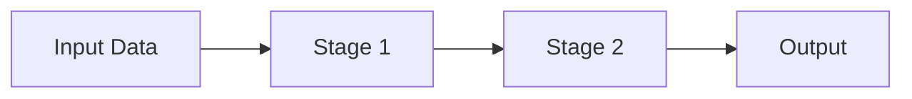

# RFC: Migration from Sphinx MyST to Fern Docs

**Status:** Draft  
**Author:** [Author Name]  
**Owner:** [Owner Name]  
**Created:** 2026-01-14  
**Last Updated:** 2026-01-14  
**Target Completion:** [YYYY-MM-DD]  
**Pages to Migrate:** 122 manual + 15 API reference = 137 total

---

## Summary

This RFC proposes migrating the NeMo Curator documentation from Sphinx with MyST Markdown to [Fern Docs](https://buildwithfern.com/learn/docs/getting-started/overview). The migration will be performed incrementally by creating a new `fern/` directory, preserving all existing content while adapting to Fern's component system.

## Motivation

This migration is **mandated** as part of NVIDIA's documentation platform standardization initiative.

**Additional benefits:**

- **Modern documentation platform**: Fern offers AI-native features including Ask Fern and auto-generated MCP servers
- **Enhanced API documentation**: Better support for API reference documentation from OpenAPI specs
- **Improved developer experience**: Rich component library with interactive elements
- **Self-hosting options**: Flexible deployment for enterprise requirements
- **Simplified toolchain**: Eliminates complex Sphinx extension ecosystem dependencies

## Scope

### In Scope

- 1:1 content migration (no content changes)
- Component mapping from Sphinx MyST to Fern equivalents
- Navigation structure preservation
- API reference documentation migration (autodoc2 → 15 manual MDX pages)
- Multi-modality documentation organization (text, image, video, audio)
- Mermaid diagram migration (syntax conversion only)
- Search migration (Fern built-in search)
- Frontmatter simplification

### Out of Scope

- Content rewrites or restructuring
- New features or sections
- Removal of existing documentation
- Custom Sphinx extensions (all deprecated, not ported):
  - `content_gating/`, `json_output/`, `search_assets/`, `ai_assistant/`, `rich_metadata/`, `llm_txt_output/`, `myst_codeblock_substitutions.py`

---

## Current Documentation Inventory

### File Structure

```
docs/
├── index.md                          # Home page with grid navigation
├── conf.py                           # Sphinx configuration
├── about/
│   ├── index.md                      # About overview
│   ├── key-features.md               # Key features page
│   ├── concepts/
│   │   ├── index.md                  # Concepts overview
│   │   ├── deduplication.md          # Cross-modality deduplication
│   │   ├── text/                     # Text concepts (5 pages)
│   │   ├── image/                    # Image concepts (4 pages)
│   │   ├── video/                    # Video concepts (4 pages)
│   │   └── audio/                    # Audio concepts (7 pages)
│   └── release-notes/                # Release notes (3 pages)
├── get-started/
│   ├── index.md                      # Getting started overview
│   ├── text.md                       # Text quickstart
│   ├── image.md                      # Image quickstart
│   ├── video.md                      # Video quickstart
│   └── audio.md                      # Audio quickstart
├── curate-text/
│   ├── index.md                      # Text curation overview
│   ├── tutorials/                    # Text tutorials (1 page)
│   ├── load-data/                    # Data loading (6 pages)
│   └── process-data/                 # Processing (17 pages)
│       ├── content-processing/       # Text cleaning, IDs
│       ├── deduplication/            # Exact, fuzzy, semantic
│       ├── language-management/      # Language detection
│       ├── quality-assessment/       # Classifiers, heuristics
│       └── specialized-processing/   # Code processing
├── curate-images/
│   ├── index.md                      # Image curation overview
│   ├── tutorials/                    # Image tutorials (3 pages)
│   ├── load-data/                    # Data loading (2 pages)
│   ├── process-data/                 # Processing (6 pages)
│   └── save-export.md                # Export guide
├── curate-video/
│   ├── index.md                      # Video curation overview
│   ├── tutorials/                    # Video tutorials (9 pages)
│   ├── load-data/                    # Data loading (1 page)
│   ├── process-data/                 # Processing (8 pages)
│   └── save-export.md                # Export guide
├── curate-audio/
│   ├── index.md                      # Audio curation overview
│   ├── tutorials/                    # Audio tutorials (2 pages)
│   ├── load-data/                    # Data loading (4 pages)
│   ├── process-data/                 # Processing (10 pages)
│   └── save-export.md                # Export guide
├── admin/
│   ├── index.md                      # Admin overview
│   ├── installation.md               # Installation guide
│   ├── deployment/                   # Deployment guides (3 pages)
│   └── integrations/                 # Integrations (1 page)
├── reference/
│   ├── index.md                      # Reference overview
│   ├── infrastructure/               # Infrastructure guides (6 pages)
│   └── related-tools.md              # Related tools
├── apidocs/                          # Auto-generated API docs (~220 pages)
│   ├── index.rst
│   ├── backends/                     # Backend modules
│   ├── pipeline/                     # Pipeline modules
│   ├── stages/                       # Processing stages (~180 pages)
│   ├── tasks/                        # Task types
│   └── utils/                        # Utilities
└── _extensions/                      # Custom Sphinx extensions (all deprecated, not migrated)
    ├── ai_assistant/                 # AI chatbot → Fern has Ask AI
    ├── content_gating/               # Conditional content → Not needed
    ├── json_output/                  # Search indexes → Fern built-in search
    ├── llm_txt_output/               # LLM output → Not needed
    ├── myst_codeblock_substitutions.py  # Variables → Build-time script (see Section 7)
    ├── rich_metadata/                # SEO → Fern handles SEO
    └── search_assets/                # Search UI → Fern built-in search
```

### Page Count Summary

| Section | Manual Pages | Auto-generated | Total |
|---------|-------------|----------------|-------|
| About | 27 | 0 | 27 |
| Get Started | 5 | 0 | 5 |
| Curate Text | 25 | 0 | 25 |
| Curate Images | 13 | 0 | 13 |
| Curate Video | 20 | 0 | 20 |
| Curate Audio | 18 | 0 | 18 |
| Admin | 6 | 0 | 6 |
| Reference | 8 | 0 | 8 |
| API Reference | 0 | ~220 | ~220 |
| **Total** | **122** | **~220** | **~342** |

**About Section Breakdown:**
- `about/index.md`, `about/key-features.md` (2)
- `about/concepts/index.md`, `about/concepts/deduplication.md` (2)
- `about/concepts/text/*.md` (5 files)
- `about/concepts/image/*.md` (4 files)
- `about/concepts/video/*.md` (4 files)
- `about/concepts/audio/*.md` (7 files)
- `about/release-notes/*.md` (3 files: index, migration-faq, migration-guide)

### Current Navigation Structure (from index.md toctrees)

```yaml
nav:
  - Home
  - About NeMo Curator:
      - Overview
      - Key Features
      - Concepts:
          - Overview
          - Text (5 pages)
          - Image (4 pages)
          - Video (4 pages)
          - Audio (7 pages)
          - Deduplication
      - Release Notes (3 pages)
  - Get Started:
      - Overview
      - Text Quickstart
      - Image Quickstart
      - Video Quickstart
      - Audio Quickstart
  - Curate Text:
      - Overview
      - Tutorials (1 page)
      - Load Data (6 pages)
      - Process Data (17 pages nested)
  - Curate Images:
      - Overview
      - Tutorials (3 pages)
      - Load Data (2 pages)
      - Process Data (6 pages)
      - Save and Export
  - Curate Video:
      - Overview
      - Tutorials (9 pages)
      - Load Data (1 page)
      - Process Data (8 pages)
      - Save and Export
  - Curate Audio:
      - Overview
      - Tutorials (2 pages)
      - Load Data (4 pages)
      - Process Data (10 pages)
      - Save and Export
  - Setup & Deployment:
      - Overview
      - Installation
      - Deployment (3 pages)
      - Integrations
  - Reference:
      - Overview
      - Infrastructure (6 pages)
      - API Reference (~220 auto-generated)
      - Related Tools
```

---

## Component Mapping

### Sphinx MyST → Fern Component Equivalents

Reference: [Fern Components Overview](https://buildwithfern.com/learn/docs/writing-content/components/overview)

| Sphinx/MyST Feature | Current Syntax | Fern Equivalent | Notes |
|---------------------|----------------|-----------------|-------|
| **Admonitions** | `:::{note}`, `:::{warning}` | `<Note>`, `<Warning>`, `<Tip>`, `<Info>` | See [Admonitions](#1-admonitions--callouts) |
| **Tab Sets** | `::::{tab-set}` / `:::{tab-item}` | `<Tabs>` + `<Tab>` | See [Tabs](#2-tabbed-content) |
| **Grid Cards** | `::::{grid}` / `:::{grid-item-card}` | `<Cards>` + `<Card>` | See [Cards](#3-grid-cards) |
| **Code Blocks** | ` ```python ` | ` ```python ` | Direct compatibility |
| **Dropdowns** | `:::{dropdown}` | `<Accordion>` or `<Expandable>` | See [Dropdowns](#4-dropdowns) |
| **List Tables** | `{list-table}` | Standard markdown tables | Convert to markdown |
| **Cross-refs** | `{ref}` / `(anchor)=` | Standard markdown links | See [Links](#5-cross-references) |
| **Mermaid Diagrams** | ` ```{mermaid} ` | ` ```mermaid ` | ✅ Native support, minor syntax change |
| **Substitutions** | `{{ variable }}` | Build-time script | See [Documentation Variables](#7-documentation-variables) |
| **toctree** | `::::{toctree}` | `docs.yml` navigation | Handled in config |
| **Icons** | `{octicon}` | Emoji or text labels | No direct equivalent |
| **Badges** | `{bdg-*}` | Remove or convert to text | No direct equivalent |
| **LaTeX Math** | `$...$` / `$$...$$` | `$...$` / `$$...$$` | ✅ Direct compatibility |
| **Intersphinx** | `intersphinx_mapping` | Hardcoded URLs / Variables | See [External References](#11-external-references-intersphinx) |
| **API Docs** | autodoc2 | Manual MDX | See [API Reference](#8-api-reference) |

---

## Detailed Component Migrations

### 1. Admonitions → Callouts

**Current MyST syntax:**

```markdown
:::{note}
This is a note with important information.
:::

:::{warning}
This action cannot be undone.
:::

:::{dropdown} Advanced Configuration
:icon: gear
Additional configuration options...
:::
```

**Fern equivalent:**

```mdx
<Note>
This is a note with important information.
</Note>

<Warning>
This action cannot be undone.
</Warning>

<Accordion title="Advanced Configuration">
Additional configuration options...
</Accordion>
```

**Migration mapping:**

| MyST Admonition | Fern Callout |
|-----------------|--------------|
| `:::{note}` | `<Note>` |
| `:::{tip}` | `<Tip>` |
| `:::{info}` | `<Info>` |
| `:::{warning}` | `<Warning>` |
| `:::{caution}` | `<Warning>` |
| `:::{danger}` | `<Warning>` |
| `:::{important}` | `<Note>` |

### 2. Tabbed Content

**Current MyST syntax (from installation.md):**

```markdown
::::{tab-set}

:::{tab-item} PyPI Installation (Recommended)

Install NeMo Curator from the Python Package Index using `uv`:

```bash
uv pip install nemo-curator[all]
```

:::

:::{tab-item} Source Installation

Install from GitHub:

```bash
git clone https://github.com/NVIDIA-NeMo/Curator.git
```

:::

::::
```

**Fern equivalent:**

```mdx
<Tabs>
  <Tab title="PyPI Installation (Recommended)">
    Install NeMo Curator from the Python Package Index using `uv`:

    ```bash
    uv pip install nemo-curator[all]
    ```
  </Tab>
  <Tab title="Source Installation">
    Install from GitHub:

    ```bash
    git clone https://github.com/NVIDIA-NeMo/Curator.git
    ```
  </Tab>
</Tabs>
```

### 3. Grid Cards

**Current MyST syntax (from index.md):**

```markdown
::::{grid} 1 2 2 2
:gutter: 1 1 1 2

:::{grid-item-card} {octicon}`book;1.5em;sd-mr-1` About Curator
:link: about-overview
:link-type: ref
Overview of NeMo Curator and its capabilities.
+++
{bdg-secondary}`target-users` {bdg-secondary}`how-it-works`
:::

:::{grid-item-card} {octicon}`image;1.5em;sd-mr-1` Key Features
:link: about-key-features
:link-type: ref
Discover the main features of NeMo Curator for data curation.
+++
{bdg-secondary}`features` {bdg-secondary}`capabilities`
:::

::::
```

**Fern equivalent:**

```mdx
<Cards>
  <Card
    title="About Curator"
    icon="book"
    href="/docs/about"
  >
    Overview of NeMo Curator and its capabilities.
  </Card>
  <Card
    title="Key Features"
    icon="image"
    href="/docs/about/key-features"
  >
    Discover the main features of NeMo Curator for data curation.
  </Card>
</Cards>
```

### 4. Dropdowns

**Current MyST syntax:**

```markdown
:::{dropdown} Performance Considerations
:icon: zap

**Performance characteristics**:

- Uses MD5 hashing over the configured text field
- Runs as a Ray-based workflow
- Stores only document IDs in output files

:::
```

**Fern equivalent:**

```mdx
<Accordion title="Performance Considerations">
**Performance characteristics**:

- Uses MD5 hashing over the configured text field
- Runs as a Ray-based workflow
- Stores only document IDs in output files
</Accordion>
```

### 5. Cross-References

**Current MyST syntax:**

```markdown
(text-process-data-dedup-exact)=

# Exact Duplicate Removal

For an overview, refer to {ref}`Deduplication <text-process-data-dedup>`.
```

**Fern equivalent:**

```mdx
# Exact Duplicate Removal

For an overview, refer to [Deduplication](/docs/curate-text/process-data/deduplication).
```

**Migration notes:**

- Remove MyST anchor definitions `(anchor-name)=`
- Convert `{ref}` directives to standard markdown links with full paths
- Update all internal links to use Fern URL structure

### 6. Mermaid Diagrams

**Current usage:** Mermaid diagrams are used for architecture and flow visualizations via `sphinxcontrib.mermaid`.

**Current MyST syntax:**

```markdown
```{mermaid}
flowchart LR
    A[Input Data] --> B[Stage 1]
    B --> C[Stage 2]
    C --> D[Output]
```
```

**Fern equivalent:** ✅ Native support via standard markdown code blocks

Fern [natively supports Mermaid diagrams](https://buildwithfern.com/learn/docs/writing-content/markdown-media#diagrams). Simply use a standard markdown code block with `mermaid` as the language:

```mdx

```

**Migration:** Remove the MyST directive syntax `{mermaid}` and use standard markdown fence:

| MyST Syntax | Fern Syntax |
|-------------|-------------|
| ` ```{mermaid} ` | ` ```mermaid ` |

**Supported diagram types:**
- Flowcharts
- Entity-relationship diagrams
- Gantt charts
- Sequence diagrams
- Class diagrams
- All standard Mermaid diagram types

### 7. Documentation Variables

**Current usage:** MyST substitutions enable variables in prose and code blocks via `myst_substitutions` in `conf.py` and the custom `myst_codeblock_substitutions.py` extension.

**Current MyST syntax:**

```markdown
docker pull nvcr.io/nvidia/nemo-curator:{{ container_version }}
```

With `conf.py`:
```python
myst_substitutions = {
    "container_version": "25.09",
    "product_name": "NeMo Curator",
}
```

**Fern variable support:**

| Scope | Fern Support | Syntax |
|-------|--------------|--------|
| Config files (`docs.yml`) | ✅ Yes | `${VARIABLE_NAME}` |
| MDX prose content | ❌ No | — |
| Code blocks | ❌ No | — |

Fern supports environment variables in `docs.yml` for analytics/integrations, but **not for content substitution in MDX files**.

**Conversion Strategy Options:**

| Option | Approach | Pros | Cons |
|--------|----------|------|------|
| **A: Hardcode + Checklist** | Replace variables with literal values; maintain `RELEASE_CHECKLIST.md` | Simple, no tooling | Manual updates each release |
| **B: Build-time script** | Pre-process MDX files with `sed`/Python before `fern generate` | Automated, single source of truth | Adds build complexity |
| **C: MDX imports** | Define constants in shared `.mdx` file, import where needed | Native MDX, type-safe | Verbose, doesn't work in code blocks |

**Recommendation: Option B (Build-time script)**

Create a simple pre-processing step that replaces variables before Fern build:

```python
#!/usr/bin/env python3
"""Replace documentation variables in MDX files."""
import re
from pathlib import Path

VARIABLES = {
    "container_version": "25.09",
    "product_name": "NeMo Curator",
    "release": "25.09",
}

def substitute_variables(content: str) -> str:
    for var, value in VARIABLES.items():
        content = content.replace(f"{{{{ {var} }}}}", value)
    return content

if __name__ == "__main__":
    for mdx_file in Path("fern/pages").rglob("*.mdx"):
        content = mdx_file.read_text()
        updated = substitute_variables(content)
        if content != updated:
            mdx_file.write_text(updated)
            print(f"Updated: {mdx_file}")
```

**CI/CD Integration:**

```yaml
- name: Substitute variables
  run: python scripts/substitute_variables.py

- name: Generate docs
  run: fern generate --docs
```

**Variables to migrate:**

| Variable | Current Value | Used In |
|----------|---------------|---------|
| `product_name` | `NeMo Curator` | Throughout docs |
| `product_name_short` | `Curator` | Throughout docs |
| `company` | `NVIDIA` | Throughout docs |
| `version` | `25.09` | Throughout docs |
| `current_year` | `2025` | Footers/About |
| `github_repo` | `https://github.com/NVIDIA-NeMo/Curator` | Installation/About |
| `docs_url` | `https://docs.nvidia.com/nemo-curator` | References |
| `support_email` | `nemo-curator-support@nvidia.com` | About/Support |
| `min_python_version` | `3.8` | Installation |
| `recommended_cuda` | `12.0+` | Installation |
| `container_version` | `25.09` | Installation/Get Started |
| `current_release` | `25.09` | Release notes |

### 8. API Reference (autodoc2)

**Current approach:** autodoc2 generates ~220 markdown pages from Python docstrings automatically.

**Current structure:**

```
apidocs/
├── backends/           # 21 files
├── pipeline/           # 2 files
├── stages/             # 180 files
├── tasks/              # 8 files
└── utils/              # 14 files
```

**Fern options:**

**Option A: Manual Documentation (Recommended for Core APIs)**

- Manually document the most important public APIs
- Focus on: Pipeline, ProcessingStage, Task classes, Executors
- Add curated examples and cross-references
- **CRITICAL**: Each page must include a "Source Code" section linking directly to the file on GitHub (e.g., `[Source](https://github.com/NVIDIA-NeMo/Curator/blob/main/nemo_curator/pipeline/pipeline.py)`)
- Target: **15 essential API pages** (see checklist in Phase 5)

**Option B: Full Manual Migration**
- Convert all 220 autodoc2 pages to MDX
- High effort, maintenance burden
- Not recommended unless required

**Option C: OpenAPI Integration**
- Not applicable (no REST API to document)

**Recommendation:** 
- Create manual API reference for **15 core classes** (detailed in conversion checklist)
- Link to source code on GitHub for complete reference
- Defer comprehensive API migration to post-launch

**API pages to create (15 total):**
1. `api-reference/index.mdx` - Overview
2. `api-reference/pipeline.mdx` - Pipeline class
3. `api-reference/processing-stage.mdx` - ProcessingStage base
4. `api-reference/composite-stage.mdx` - CompositeStage
5. `api-reference/tasks/document-batch.mdx` - DocumentBatch
6. `api-reference/tasks/image-batch.mdx` - ImageBatch
7. `api-reference/tasks/video-task.mdx` - VideoTask
8. `api-reference/tasks/audio-batch.mdx` - AudioBatch
9. `api-reference/executors/xenna-executor.mdx` - XennaExecutor
10. `api-reference/executors/experimental.mdx` - Experimental executors
11. `api-reference/resources.mdx` - Resources configuration
12. `api-reference/stages/text-stages.mdx` - Common text stages
13. `api-reference/stages/image-stages.mdx` - Common image stages
14. `api-reference/stages/video-stages.mdx` - Common video stages
15. `api-reference/stages/audio-stages.mdx` - Common audio stages

### 9. List Tables

**Current MyST syntax:**

```markdown
```{list-table} Available Package Extras
:header-rows: 1
:widths: 20 30 50

* - Extra
  - Installation Command
  - Description
* - **text_cpu**
  - `uv pip install nemo-curator[text_cpu]`
  - CPU-only text processing
```

**Fern equivalent (standard markdown table):**

```markdown
| Extra | Installation Command | Description |
|-------|---------------------|-------------|
| **text_cpu** | `uv pip install nemo-curator[text_cpu]` | CPU-only text processing |
|```

### 11. External References (Intersphinx)

**Current usage:** `intersphinx_mapping` in `conf.py` allows for shorthand links to other NVIDIA documentation projects (e.g., `:ref:ctk:gpu-operator`).

**Fern equivalent:** Fern does not support Intersphinx. 

**Migration:**

1. Identify all external Intersphinx links using `grep`.
2. Convert to standard markdown links using the full URL defined in `conf.py`.
3. Optionally, add base URLs to the **Documentation Variables** script (Section 7) to maintain a single source of truth.

| Project | Base URL | Variable Name |
| :--- | :--- | :--- |
| CTK | `https://docs.nvidia.com/datacenter/cloud-native/container-toolkit/latest` | `url_ctk` |
| GPU Operator | `https://docs.nvidia.com/datacenter/cloud-native/gpu-operator/latest` | `url_gpu_op` |
| NeMo Guardrails | `https://docs.nvidia.com/nemo/guardrails/latest` | `url_guardrails` |

### 10. Frontmatter Metadata

**Current frontmatter schema (8 fields):**

```yaml
---
description: "Complete installation guide..."
categories: ["getting-started"]
tags: ["installation", "system-requirements", "pypi"]
personas: ["admin-focused", "devops-focused", "data-scientist-focused"]
difficulty: "beginner"
content_type: "how-to"
modality: "universal"
---
```

**Fern frontmatter mapping:**

| Current Field | Fern Equivalent | Migration Action |
|---------------|-----------------|------------------|
| `description` | `description` | ✅ Direct mapping |
| `categories` | — | ❌ Drop (use navigation structure) |
| `tags` | — | ❌ Drop (Fern has no tag system) |
| `personas` | — | ❌ Drop (encode in content/navigation) |
| `difficulty` | — | ❌ Drop (add to title if needed) |
| `content_type` | — | ❌ Drop (use Fern page types) |
| `modality` | — | ❌ Drop (encode in navigation) |
| — | `title` | ✅ Add (extract from H1) |
| — | `slug` | ⚠️ Optional (auto-generated from filename) |
| — | `subtitle` | ⚠️ Optional |

**Fern frontmatter template:**

```yaml
---
title: Installation Guide
description: Complete installation guide for NeMo Curator with system requirements, package extras, verification steps, and troubleshooting
---
```

**Impact assessment:**
- **Lost**: Persona-based content filtering, difficulty badges, content type classification
- **Mitigation**: Encode difficulty in page titles (e.g., "Advanced: ..."), use navigation sections for personas
- **Searchability**: Fern's AI search (Ask Fern) indexes full content, reducing need for tag-based filtering

---

## Proposed Directory Structure

```
fern/
├── fern.config.json              # Fern configuration
├── docs.yml                      # Navigation and settings
├── versions/
│   └── v25.09.yml                # Version configuration
├── pages/
│   ├── index.mdx                 # Home page
│   ├── about/
│   │   ├── index.mdx             # About overview
│   │   ├── key-features.mdx      # Key features
│   │   ├── concepts/
│   │   │   ├── index.mdx
│   │   │   ├── deduplication.mdx
│   │   │   ├── text/
│   │   │   │   ├── index.mdx
│   │   │   │   ├── data-acquisition.mdx
│   │   │   │   ├── data-loading.mdx
│   │   │   │   ├── data-processing.mdx
│   │   │   │   └── pipeline.mdx
│   │   │   ├── image/
│   │   │   │   ├── index.mdx
│   │   │   │   ├── data-loading.mdx
│   │   │   │   ├── data-processing.mdx
│   │   │   │   └── data-export.mdx
│   │   │   ├── video/
│   │   │   │   ├── index.mdx
│   │   │   │   ├── architecture.mdx
│   │   │   │   ├── abstractions.mdx
│   │   │   │   └── data-flow.mdx
│   │   │   └── audio/
│   │   │       ├── index.mdx
│   │   │       ├── asr-pipeline.mdx
│   │   │       ├── audio-batch.mdx
│   │   │       ├── manifests-ingest.mdx
│   │   │       ├── quality-metrics.mdx
│   │   │       ├── text-integration.mdx
│   │   │       └── curation-pipeline.mdx
│   │   └── release-notes/
│   │       ├── index.mdx
│   │       ├── v25-09.mdx
│   │       └── v25-06.mdx
│   ├── get-started/
│   │   ├── index.mdx
│   │   ├── text.mdx
│   │   ├── image.mdx
│   │   ├── video.mdx
│   │   └── audio.mdx
│   ├── curate-text/
│   │   ├── index.mdx
│   │   ├── tutorials/
│   │   │   └── index.mdx
│   │   ├── load-data/
│   │   │   ├── index.mdx
│   │   │   └── [6 pages].mdx
│   │   └── process-data/
│   │       ├── index.mdx
│   │       ├── content-processing/
│   │       ├── deduplication/
│   │       ├── language-management/
│   │       ├── quality-assessment/
│   │       └── specialized-processing/
│   ├── curate-images/
│   │   ├── index.mdx
│   │   ├── tutorials/
│   │   ├── load-data/
│   │   ├── process-data/
│   │   └── save-export.mdx
│   ├── curate-video/
│   │   ├── index.mdx
│   │   ├── tutorials/
│   │   ├── load-data/
│   │   ├── process-data/
│   │   └── save-export.mdx
│   ├── curate-audio/
│   │   ├── index.mdx
│   │   ├── tutorials/
│   │   ├── load-data/
│   │   ├── process-data/
│   │   └── save-export.mdx
│   ├── admin/
│   │   ├── index.mdx
│   │   ├── installation.mdx
│   │   ├── deployment/
│   │   │   ├── index.mdx
│   │   │   ├── requirements.mdx
│   │   │   ├── kubernetes.mdx
│   │   │   └── options.mdx
│   │   └── integrations/
│   │       └── mlops.mdx
│   ├── reference/
│   │   ├── index.mdx
│   │   └── infrastructure/
│   │       ├── index.mdx
│   │       ├── memory-management.mdx
│   │       ├── gpu-processing.mdx
│   │       ├── resumable-processing.mdx
│   │       └── [other pages].mdx
│   └── api-reference/
│       ├── index.mdx             # API overview
│       ├── pipeline.mdx          # Pipeline class
│       ├── processing-stage.mdx  # ProcessingStage base
│       ├── composite-stage.mdx   # CompositeStage
│       ├── tasks/
│       │   ├── document-batch.mdx
│       │   ├── image-batch.mdx
│       │   ├── video-task.mdx
│       │   └── audio-batch.mdx
│       ├── executors/
│       │   ├── xenna-executor.mdx
│       │   └── experimental.mdx
│       └── resources.mdx         # Resources configuration
├── assets/
│   ├── favicon.png
│   └── images/
│       ├── ablation.png
│       ├── scaling.png
│       └── text-benchmarks.png
└── styles/
    └── custom.css                # Custom styling (if needed)
```

---

## URL Redirect Mapping

To preserve existing bookmarks and SEO, all old URLs must redirect to their new locations.

### Redirect Rules (Sample)

| Old Sphinx URL | New Fern URL |
|----------------|--------------|
| `/` | `/docs` |
| `/about/index.html` | `/docs/about` |
| `/about/key-features.html` | `/docs/about/key-features` |
| `/about/concepts/index.html` | `/docs/about/concepts` |
| `/about/concepts/text/index.html` | `/docs/about/concepts/text` |
| `/get-started/index.html` | `/docs/get-started` |
| `/get-started/text.html` | `/docs/get-started/text` |
| `/curate-text/index.html` | `/docs/curate-text` |
| `/curate-text/process-data/deduplication/exact.html` | `/docs/curate-text/process-data/deduplication/exact` |
| `/admin/installation.html` | `/docs/admin/installation` |
| `/apidocs/index.html` | `/api` |
| `/apidocs/pipeline/pipeline.pipeline.html` | `/api/pipeline` |

### URL Pattern Transformations

| Pattern | Transformation |
|---------|----------------|
| `*.html` | Remove extension |
| `_` in paths | Convert to `-` (kebab-case) |
| `index.html` | Directory path only |

### Implementation

**Option A: Fern redirects configuration** (if supported)

```yaml
# In docs.yml
redirects:
  - from: /about/concepts/index.html
    to: /docs/about/concepts
  # ... additional redirects
```

**Option B: Hosting platform redirects**

For Netlify (`_redirects` file):
```
/about/*.html           /docs/about/:splat      301
/curate-text/*.html     /docs/curate-text/:splat 301
/apidocs/*              /api/:splat              301
```

---

## Configuration Files

### fern.config.json

```json
{
  "organization": "nvidia-nemo",
  "version": "3.40.1"
}
```

### docs.yml

```yaml
instances:
  - url: https://nemo-curator.docs.buildwithfern.com

title: NeMo Curator

versions:
  - display-name: v25.09
    path: versions/v25.09.yml
    slug: v25.09

tabs:
  docs:
    display-name: Documentation
    slug: docs
  api:
    display-name: API Reference
    slug: api

navigation:
  - tab: docs
    layout:
      - section: Home
        contents:
          - page: Welcome
            path: pages/index.mdx
      - section: About NeMo Curator
        contents:
          - page: Overview
            path: pages/about/index.mdx
          - page: Key Features
            path: pages/about/key-features.mdx
          - section: Concepts
            contents:
              - page: Overview
                path: pages/about/concepts/index.mdx
              - page: Deduplication
                path: pages/about/concepts/deduplication.mdx
              - section: Text Concepts
                contents:
                  - page: Overview
                    path: pages/about/concepts/text/index.mdx
                  - page: Data Loading
                    path: pages/about/concepts/text/data-loading.mdx
                  - page: Data Processing
                    path: pages/about/concepts/text/data-processing.mdx
                  - page: Pipeline
                    path: pages/about/concepts/text/pipeline.mdx
              - section: Image Concepts
                contents:
                  - page: Overview
                    path: pages/about/concepts/image/index.mdx
                  # ... additional pages
              - section: Video Concepts
                contents:
                  - page: Overview
                    path: pages/about/concepts/video/index.mdx
                  # ... additional pages
              - section: Audio Concepts
                contents:
                  - page: Overview
                    path: pages/about/concepts/audio/index.mdx
                  # ... additional pages
          - section: Release Notes
            contents:
              - page: Overview
                path: pages/about/release-notes/index.mdx
      - section: Get Started
        contents:
          - page: Overview
            path: pages/get-started/index.mdx
          - page: Text Quickstart
            path: pages/get-started/text.mdx
          - page: Image Quickstart
            path: pages/get-started/image.mdx
          - page: Video Quickstart
            path: pages/get-started/video.mdx
          - page: Audio Quickstart
            path: pages/get-started/audio.mdx
      - section: Curate Text
        contents:
          - page: Overview
            path: pages/curate-text/index.mdx
          - section: Tutorials
            contents:
              - page: Overview
                path: pages/curate-text/tutorials/index.mdx
          - section: Load Data
            contents:
              - page: Overview
                path: pages/curate-text/load-data/index.mdx
              # ... additional pages
          - section: Process Data
            contents:
              - page: Overview
                path: pages/curate-text/process-data/index.mdx
              - section: Content Processing
                contents:
                  - page: Overview
                    path: pages/curate-text/process-data/content-processing/index.mdx
                  - page: Add IDs
                    path: pages/curate-text/process-data/content-processing/add-id.mdx
                  - page: Text Cleaning
                    path: pages/curate-text/process-data/content-processing/text-cleaning.mdx
              - section: Deduplication
                contents:
                  - page: Overview
                    path: pages/curate-text/process-data/deduplication/index.mdx
                  - page: Exact Deduplication
                    path: pages/curate-text/process-data/deduplication/exact.mdx
                  - page: Fuzzy Deduplication
                    path: pages/curate-text/process-data/deduplication/fuzzy.mdx
                  - page: Semantic Deduplication
                    path: pages/curate-text/process-data/deduplication/semdedup.mdx
              # ... additional sections
      - section: Curate Images
        contents:
          - page: Overview
            path: pages/curate-images/index.mdx
          # ... mirror structure from text
      - section: Curate Video
        contents:
          - page: Overview
            path: pages/curate-video/index.mdx
          # ... mirror structure
      - section: Curate Audio
        contents:
          - page: Overview
            path: pages/curate-audio/index.mdx
          # ... mirror structure
      - section: Setup & Deployment
        contents:
          - page: Overview
            path: pages/admin/index.mdx
          - page: Installation
            path: pages/admin/installation.mdx
          - section: Deployment
            contents:
              - page: Overview
                path: pages/admin/deployment/index.mdx
              - page: Requirements
                path: pages/admin/deployment/requirements.mdx
              - page: Kubernetes
                path: pages/admin/deployment/kubernetes.mdx
          - section: Integrations
            contents:
              - page: MLOps
                path: pages/admin/integrations/mlops.mdx
      - section: Reference
        contents:
          - page: Overview
            path: pages/reference/index.mdx
          - section: Infrastructure
            contents:
              - page: Overview
                path: pages/reference/infrastructure/index.mdx
              - page: Memory Management
                path: pages/reference/infrastructure/memory-management.mdx
              - page: GPU Processing
                path: pages/reference/infrastructure/gpu-processing.mdx
              - page: Resumable Processing
                path: pages/reference/infrastructure/resumable-processing.mdx
  - tab: api
    layout:
      - section: API Reference
        contents:
          - page: Overview
            path: pages/api-reference/index.mdx
          - page: Pipeline
            path: pages/api-reference/pipeline.mdx
          - page: ProcessingStage
            path: pages/api-reference/processing-stage.mdx
          - page: CompositeStage
            path: pages/api-reference/composite-stage.mdx
          - section: Tasks
            contents:
              - page: DocumentBatch
                path: pages/api-reference/tasks/document-batch.mdx
              - page: ImageBatch
                path: pages/api-reference/tasks/image-batch.mdx
              - page: VideoTask
                path: pages/api-reference/tasks/video-task.mdx
              - page: AudioBatch
                path: pages/api-reference/tasks/audio-batch.mdx
          - section: Executors
            contents:
              - page: XennaExecutor
                path: pages/api-reference/executors/xenna-executor.mdx
              - page: Experimental
                path: pages/api-reference/executors/experimental.mdx
          - page: Resources
            path: pages/api-reference/resources.mdx

colors:
  accent-primary:
    dark: "#76B900"
    light: "#4a7300"
  background:
    dark: "#1a1a1a"
    light: "#ffffff"

logo:
  dark: assets/favicon.png
  light: assets/favicon.png

favicon: assets/favicon.png

navbar-links:
  - type: github
    value: https://github.com/NVIDIA-NeMo/Curator
```

---

## Migration Plan

### Phase 1: Setup (1-2 days)

1. Create `fern/` directory structure
2. Initialize Fern configuration files
3. Set up local development environment
4. Verify Fern CLI works (`fern check`, `fern generate`)
5. Create helper scripts for component conversion

### Phase 2: Core Infrastructure Pages (3-4 days)

1. Migrate About section
   - `index.md` → `index.mdx`
   - `key-features.md` → `key-features.mdx`
   - Concepts subsections (20 pages)
   - Release notes (3 pages)

2. Migrate Get Started section (5 pages)
   - Overview and all modality quickstarts

3. Migrate Admin section (6 pages)
   - Installation guide (complex tab sets)
   - Deployment guides

### Phase 3: Modality Documentation (5-7 days)

1. **Curate Text** (25 pages)
   - Most complex section with nested hierarchy
   - Deduplication guides with dropdowns
   - Quality assessment documentation

2. **Curate Images** (13 pages)
   - Tutorials
   - Processing guides

3. **Curate Video** (20 pages)
   - Complex tutorials section
   - Processing pipelines

4. **Curate Audio** (18 pages)
   - ASR pipeline documentation
   - Quality metrics guides

### Phase 4: Reference Section (2-3 days)

1. Infrastructure guides (6 pages)
2. Related tools documentation

### Phase 5: API Reference (3-4 days)

1. Create manual API documentation for core classes:
   - Pipeline
   - ProcessingStage / CompositeStage
   - Task types (DocumentBatch, ImageBatch, VideoTask, AudioBatch)
   - Executors (XennaExecutor, experimental)
   - Resources configuration

2. Add code examples and usage patterns
3. Cross-link with relevant how-to guides

### Phase 6: Styling and Polish (2-3 days)

1. Apply NVIDIA branding (green accent: #76B900)
2. Configure navigation and tabs
3. Add favicon and logos
4. Test responsive design
5. Optimize images

### Phase 7: Testing and Validation (2-3 days)

1. Review all pages for rendering issues
2. Verify all links work (internal and external)
3. Test navigation flow
4. Compare against original docs for completeness
5. Validate code examples still work

---

## CI/CD Pipeline Changes

### Current Sphinx Pipeline

```yaml
# Current workflow (to be replaced)
- name: Build docs
  run: |
    pip install -r requirements-docs.txt
    sphinx-build -b html docs docs/_build/html

- name: Deploy docs
  run: # Deploy to hosting platform
```

### New Fern Pipeline

```yaml
# .github/workflows/docs.yml
name: Documentation

on:
  push:
    branches: [main]
    paths:
      - 'fern/**'
  pull_request:
    paths:
      - 'fern/**'

jobs:
  docs:
    runs-on: ubuntu-latest
    steps:
      - uses: actions/checkout@v4

      - name: Setup Node.js
        uses: actions/setup-node@v4
        with:
          node-version: '20'

      - name: Install Fern CLI
        run: npm install -g fern-api

      - name: Validate Fern config
        run: fern check
        working-directory: fern

      - name: Generate docs (PR preview)
        if: github.event_name == 'pull_request'
        run: fern generate --docs --preview
        working-directory: fern
        env:
          FERN_TOKEN: ${{ secrets.FERN_TOKEN }}

      - name: Deploy docs (production)
        if: github.ref == 'refs/heads/main'
        run: fern generate --docs
        working-directory: fern
        env:
          FERN_TOKEN: ${{ secrets.FERN_TOKEN }}
```

### Required Secrets

| Secret | Description |
|--------|-------------|
| `FERN_TOKEN` | API token from Fern dashboard for deployments |

### Local Development

```bash
# Install Fern CLI
npm install -g fern-api

# Navigate to docs directory
cd fern

# Validate configuration
fern check

# Local preview (starts dev server)
fern docs dev

# Generate static output
fern generate --docs
```

---

## Deprecation Timeline

### Week 1-3: Parallel Operation

- `fern/` is the primary documentation source
- `docs/` remains for reference and rollback capability
- Both directories exist in repository
- Sphinx config (`conf.py`) remains but is not used in CI

### Week 4: Soft Deprecation

- Remove Sphinx from CI/CD pipeline
- Add deprecation notice to `docs/README.md`:
  ```markdown
  > ⚠️ **DEPRECATED**: This directory is no longer maintained.
  > Documentation has moved to `fern/`.
  > This directory will be removed on [DATE].
  ```
- Update `CONTRIBUTING.md` to reference new docs location

### Week 5: Hard Deprecation

- Delete `docs/` directory (except `_extensions/` if needed elsewhere)
- Remove Sphinx dependencies from `requirements-docs.txt`
- Update `.gitignore` to remove Sphinx artifacts (`_build/`)
- Archive final Sphinx state in git tag: `sphinx-docs-final`

### Post-Migration Cleanup

- Remove custom Sphinx extensions (`_extensions/`)
- Remove Sphinx-specific configuration files
- Update README.md documentation links

---

## Search Migration

Fern provides built-in search that replaces all custom Sphinx extensions:

| Current | Fern Replacement |
|---------|------------------|
| `search_assets/` (custom UI) | Built-in search UI |
| `json_output/` (indexes) | Automatic indexing |
| Tag/category facets | Ask Fern AI |

**No action required.** Fern search works out-of-the-box with full-text search and AI-powered Q&A.

---

## Risks and Mitigations

| Risk | Impact | Likelihood | Mitigation | Owner |
|------|--------|------------|------------|-------|
| API reference quality loss | High | High | Manual documentation of 15 core API pages; link to GitHub source | [Owner] |
| Grid card layout differences | Medium | Medium | Test Fern Cards early; simplify layouts if needed | [Owner] |
| Complex tab sets breaking | Medium | Medium | Convert tabs incrementally; test each section | [Owner] |
| Icon support gaps | Low | High | Replace `{octicon}` with emoji or text labels; document in style guide | [Owner] |
| Documentation variables | Medium | High | Build-time script with single source of truth (see Section 7) | [Owner] |
| Build/deploy workflow breaks | Medium | Medium | Test CI/CD in separate branch before merging; keep Sphinx as fallback | [Owner] |
| SEO ranking drop | Medium | Medium | Implement all redirects before deprecating old URLs | [Owner] |
| Broken links post-migration | Medium | High | Run automated link checker; fix all broken links | [Owner] |
| Large page count (~122 manual pages) | Medium | Low | Phase migration by section; prioritize high-traffic pages | [Owner] |
| Frontmatter metadata loss | Low | High | Document lost fields; encode critical info in navigation/titles | [Owner] |
| Search functionality regression | Low | Low | Fern search is feature-complete; test post-migration | [Owner] |

---

## Common Pitfalls & Troubleshooting

### Pitfall 1: Sphinx Design Grid Syntax

Sphinx Design grids have complex syntax that doesn't map directly to Fern.

**Problem:**
```markdown
::::{grid} 1 2 2 2
:gutter: 1 1 1 2

:::{grid-item-card} Title
:link: some-ref
:link-type: ref
Content
+++
{bdg-secondary}`tag`
:::
::::
```

**Solution:** Convert to Fern Cards, dropping badges and simplifying:
```mdx
<Cards>
  <Card title="Title" href="/path/to/page">
    Content
  </Card>
</Cards>
```

### Pitfall 2: MyST Cross-References

MyST uses `{ref}` and anchors extensively.

**Problem:**
```markdown
(my-anchor)=
# My Section

See {ref}`other section <other-anchor>`.
```

**Solution:** Convert to standard markdown:
```mdx
# My Section

See [other section](/docs/path/to/other-section).
```

### Pitfall 3: Colon Fence Directives

MyST uses `:::` for directives, which conflicts with MDX.

**Problem:**
```markdown
:::{note}
Content
:::
```

**Solution:** Convert to Fern components:
```mdx
<Note>
Content
</Note>
```

### Pitfall 4: Nested Directives

MyST supports deeply nested directives with varying colon counts.

**Problem:**
```markdown
:::::{tab-set}
::::{tab-item} Tab 1
:::{note}
Nested note
:::
::::
:::::
```

**Solution:** Flatten structure, avoid deep nesting:
```mdx
<Tabs>
  <Tab title="Tab 1">
    <Note>
    Nested note
    </Note>
  </Tab>
</Tabs>
```

### Pitfall 5: Frontmatter Metadata

Current docs have rich frontmatter for content gating and SEO.

**Problem:**
```yaml
---
description: "..."
categories: ["how-to-guides"]
tags: ["exact-dedup", "hashing"]
personas: ["data-scientist-focused"]
difficulty: "intermediate"
content_type: "how-to"
modality: "text-only"
---
```

**Solution:** Keep essential metadata, simplify for Fern:
```yaml
---
title: Exact Duplicate Removal
description: Identify and remove exact duplicates using MD5 hashing
---
```

### Pitfall 6: MDX JSX Syntax Requirements

MDX files use JSX syntax, not pure HTML. HTML attributes must use camelCase.

Reference: [Fern MDX documentation](https://buildwithfern.com/learn/docs/writing-content/markdown-media)

**Problem:**
```html
<!-- This will fail in MDX -->
<video src="demo.mp4" autoplay loop playsinline muted></video>
<iframe src="embed.html" frameborder="0" allowfullscreen></iframe>
```

**Solution:** Use camelCase for HTML attributes in MDX:
```mdx
<!-- Correct MDX syntax -->
<video src="demo.mp4" autoPlay loop playsInline muted></video>
<iframe src="embed.html" frameBorder="0" allowFullScreen></iframe>
```

**Common attribute conversions:**

| HTML Attribute | MDX Attribute |
|----------------|---------------|
| `autoplay` | `autoPlay` |
| `playsinline` | `playsInline` |
| `frameborder` | `frameBorder` |
| `allowfullscreen` | `allowFullScreen` |
| `class` | `className` |
| `for` | `htmlFor` |

### Troubleshooting Commands

```bash
# Validate all Fern configuration
fern check

# See detailed errors
fern check --log-level debug

# Preview locally before deploying
fern docs dev

# Check for broken internal links
grep -r '](/[^)]*\.mdx)' fern/pages/ | grep -v '^#'

# Find unconverted MyST syntax
grep -r ':::' fern/pages/
grep -r '{ref}' fern/pages/
grep -r '{octicon}' fern/pages/
grep -r '```{mermaid}' fern/pages/   # Should be ```mermaid
grep -r '{{ ' fern/pages/            # Unconverted substitutions

# Check for HTML attributes that need camelCase
grep -r 'autoplay' fern/pages/       # Should be autoPlay
grep -r 'frameborder' fern/pages/    # Should be frameBorder
```

---

## Rollback Plan

If critical issues are discovered post-migration, follow this rollback procedure:

### Trigger Conditions

Initiate rollback if any of these occur within 3 weeks of go-live:

- [ ] >10% of pages have rendering issues
- [ ] Search functionality broken
- [ ] CI/CD pipeline repeatedly failing
- [ ] Critical content missing or incorrect
- [ ] Stakeholder requests rollback

### Rollback Steps

**Step 1: Restore Sphinx CI/CD (15 minutes)**

```yaml
# Revert .github/workflows/docs.yml to Sphinx version
git revert <fern-migration-commit>
git push origin main
```

**Step 2: Restore DNS/Hosting (if changed)**

Point documentation URL back to Sphinx deployment location.

**Step 3: Communicate**

Notify team:
> Documentation rollback initiated due to [REASON].
> Sphinx docs restored at [URL].
> Fern migration paused pending [ISSUE] resolution.

**Step 4: Preserve Fern Work**

```bash
# Don't delete - branch and preserve
git checkout -b fern-migration-paused
git push origin fern-migration-paused
```

**Step 5: Post-Mortem**

Document:
- What triggered the rollback
- Root cause analysis
- Required fixes before retry
- Updated timeline

### Rollback Window

- **Weeks 1-3**: Full rollback capability (Sphinx still in repo)
- **Week 4+**: Rollback requires restoring from `sphinx-docs-final` tag
- **Week 5+**: Rollback requires significant effort (Sphinx deleted)

---

## Pre-Flight Checklist

Before starting migration, ensure:

- [ ] Fern account created and `FERN_TOKEN` obtained
- [ ] Hosting decision finalized (Section: Decisions #4)
- [ ] Timeline approved and dates filled in (Section: Decisions #5)
- [ ] Owner assigned in RFC header
- [ ] Team notified of upcoming changes
- [ ] Current docs snapshot archived (`git tag sphinx-docs-pre-migration`)
- [ ] Custom extensions evaluated for post-migration needs

---

## Conversion Checklist

### File-by-File Migration Tracker

Use this checklist during Phases 2-5 to track progress:

#### About Section (27 pages)
- [ ] `about/index.md` → `pages/about/index.mdx`
- [ ] `about/key-features.md` → `pages/about/key-features.mdx`
- [ ] `about/concepts/index.md` → `pages/about/concepts/index.mdx`
- [ ] `about/concepts/deduplication.md` → `pages/about/concepts/deduplication.mdx`
- [ ] `about/concepts/text/*.md` (5 files: index, data-acquisition-concepts, data-curation-pipeline, data-loading-concepts, data-processing-concepts)
- [ ] `about/concepts/image/*.md` (4 files: index, data-export-concepts, data-loading-concepts, data-processing-concepts)
- [ ] `about/concepts/video/*.md` (4 files: index, abstractions, architecture, data-flow)
- [ ] `about/concepts/audio/*.md` (7 files: index, asr-pipeline, audio-batch, curation-pipeline, manifests-ingest, quality-metrics, text-integration)
- [ ] `about/release-notes/*.md` (3 files: index, migration-faq, migration-guide)

#### Get Started Section (5 pages)
- [ ] `get-started/index.md` → `pages/get-started/index.mdx`
- [ ] `get-started/text.md` → `pages/get-started/text.mdx`
- [ ] `get-started/image.md` → `pages/get-started/image.mdx`
- [ ] `get-started/video.md` → `pages/get-started/video.mdx`
- [ ] `get-started/audio.md` → `pages/get-started/audio.mdx`

#### Curate Text Section (25 pages)
- [ ] `curate-text/index.md` → `pages/curate-text/index.mdx`
- [ ] `curate-text/tutorials/*.md` (1 file)
- [ ] `curate-text/load-data/*.md` (6 files)
- [ ] `curate-text/process-data/index.md`
- [ ] `curate-text/process-data/content-processing/*.md` (3 files)
- [ ] `curate-text/process-data/deduplication/*.md` (4 files)
- [ ] `curate-text/process-data/language-management/*.md` (3 files)
- [ ] `curate-text/process-data/quality-assessment/*.md` (4 files)
- [ ] `curate-text/process-data/specialized-processing/*.md` (2 files)

#### Curate Images Section (13 pages)
- [ ] `curate-images/index.md` → `pages/curate-images/index.mdx`
- [ ] `curate-images/tutorials/*.md` (3 files)
- [ ] `curate-images/load-data/*.md` (2 files)
- [ ] `curate-images/process-data/*.md` (6 files)
- [ ] `curate-images/save-export.md` → `pages/curate-images/save-export.mdx`

#### Curate Video Section (20 pages)
- [ ] `curate-video/index.md` → `pages/curate-video/index.mdx`
- [ ] `curate-video/tutorials/*.md` (9 files)
- [ ] `curate-video/load-data/*.md` (1 file)
- [ ] `curate-video/process-data/*.md` (8 files)
- [ ] `curate-video/save-export.md` → `pages/curate-video/save-export.mdx`

#### Curate Audio Section (18 pages)
- [ ] `curate-audio/index.md` → `pages/curate-audio/index.mdx`
- [ ] `curate-audio/tutorials/*.md` (2 files)
- [ ] `curate-audio/load-data/*.md` (4 files)
- [ ] `curate-audio/process-data/*.md` (10 files)
- [ ] `curate-audio/save-export.md` → `pages/curate-audio/save-export.mdx`

#### Admin Section (6 pages)
- [ ] `admin/index.md` → `pages/admin/index.mdx`
- [ ] `admin/installation.md` → `pages/admin/installation.mdx`
- [ ] `admin/deployment/*.md` (3 files)
- [ ] `admin/integrations/*.md` (1 file)

#### Reference Section (8 pages)
- [ ] `reference/index.md` → `pages/reference/index.mdx`
- [ ] `reference/infrastructure/*.md` (6 files)
- [ ] `reference/related-tools.md` → `pages/reference/related-tools.mdx`

#### API Reference (Manual, ~15 pages)
- [ ] Create `pages/api-reference/index.mdx`
- [ ] Create `pages/api-reference/pipeline.mdx`
- [ ] Create `pages/api-reference/processing-stage.mdx`
- [ ] Create `pages/api-reference/composite-stage.mdx`
- [ ] Create `pages/api-reference/tasks/document-batch.mdx`
- [ ] Create `pages/api-reference/tasks/image-batch.mdx`
- [ ] Create `pages/api-reference/tasks/video-task.mdx`
- [ ] Create `pages/api-reference/tasks/audio-batch.mdx`
- [ ] Create `pages/api-reference/executors/xenna-executor.mdx`
- [ ] Create `pages/api-reference/executors/experimental.mdx`
- [ ] Create `pages/api-reference/resources.mdx`

#### Assets
- [ ] Copy `_images/*.png` → `assets/images/`
- [ ] Copy favicon assets

---

## Success Criteria

- [ ] **Content Parity**: All existing manual documentation pages migrated (~122 pages)
- [ ] **Core API Coverage**: 15 essential API pages documented with source code links
- [ ] **Navigation Integrity**: Navigation structure preserved with modality organization
- [ ] **Visual Consistency**: NVIDIA branding applied (green accent: #76B900)
- [ ] **Technical Performance**:
  - [ ] Page load time < 2 seconds
  - [ ] Search indexing includes 100% of new content
  - [ ] PR preview deployments generate in < 5 minutes
- [ ] **Zero Broken Links**: 100% of internal and external links functional (automated check)
- [ ] **Maintainability**: Variable substitution script integrated and documented in `fern/README.md`
- [ ] **SEO Stability**: All 301 redirects verified using automated tools

---

## Decisions

The following decisions need to be made before starting:

### 1. API Reference Approach

**Decision:** [Manual documentation for core APIs / Full migration / Defer]

**Options:**

| Option | Effort | Coverage | Maintenance |
|--------|--------|----------|-------------|
| A: Manual core APIs | Medium | ~15 pages | Moderate |
| B: Full autodoc migration | Very High | ~220 pages | High |
| C: Defer API docs | Low | Link to source | Low |

**Recommendation:** Option A - Manual documentation for ~15 core API pages covering Pipeline, ProcessingStage, Tasks, and Executors.

### 2. Documentation Variables Strategy

**Decision:** [Hardcode + Checklist / Build-time script / MDX imports]

Current variables used in docs:
- `{{ container_version }}` - Container image version
- `{{ product_name }}` - Product name
- `{{ release }}` - Release version

**Recommendation:** Build-time script (Option B from Section 7). Provides single source of truth with automated substitution during CI/CD.

### 3. Versioning Strategy

**Decision:** [Single version / Multi-version]

**Options:**
- Single version initially (matches current)
- Multi-version from start (v25.06, v25.09)

**Recommendation:** Single version initially; add versioning when needed.

### 4. Hosting

**Decision:** [Fern-hosted | Self-hosted]

**If Fern-hosted:**
- URL: `https://nemo-curator.docs.buildwithfern.com` or custom domain
- Zero infrastructure management
- Built-in CDN and SSL

**If self-hosted:**
- Deploy to existing NVIDIA infrastructure
- Use `fern generate --docs` to produce static output

### 5. Timeline

**Decision:** [X weeks] from RFC approval

| Milestone | Target Date |
|-----------|-------------|
| Phase 1 (Setup) complete | [DATE] |
| Phase 2-3 (Core + Modalities) complete | [DATE] |
| Phase 4-5 (Reference + API) complete | [DATE] |
| Phase 6-7 (Polish & Testing) complete | [DATE] |
| Go-live | [DATE] |
| Old docs deprecated | [DATE + 3 weeks] |

---

## Helper Scripts

### 1. MyST Admonition Converter

```python
#!/usr/bin/env python3
"""Convert MyST admonitions to Fern callouts."""
import re
import sys

ADMONITION_MAP = {
    "note": "Note",
    "tip": "Tip",
    "info": "Info",
    "warning": "Warning",
    "caution": "Warning",
    "danger": "Warning",
    "important": "Note",
    "attention": "Warning",
}

def convert_admonitions(content: str) -> str:
    """Convert :::{type} admonitions to <Callout> components."""
    # Pattern for MyST admonitions
    pattern = r':::\{(\w+)\}\s*\n(.*?):::'
    
    def replace(match: re.Match) -> str:
        admon_type = match.group(1).lower()
        body = match.group(2).strip()
        fern_type = ADMONITION_MAP.get(admon_type, "Note")
        return f'<{fern_type}>\n{body}\n</{fern_type}>'
    
    return re.sub(pattern, replace, content, flags=re.DOTALL)

if __name__ == "__main__":
    content = sys.stdin.read()
    print(convert_admonitions(content))
```

### 2. Tab Set Converter

```python
#!/usr/bin/env python3
"""Convert MyST tab sets to Fern Tabs components."""
import re
import sys

def convert_tabs(content: str) -> str:
    """Convert ::::{tab-set} to <Tabs> components."""
    # Remove tab-set wrapper
    content = re.sub(r'::::\{tab-set\}\s*\n', '<Tabs>\n', content)
    content = re.sub(r'\n::::', '\n</Tabs>', content)
    
    # Convert tab-item
    pattern = r':::\{tab-item\}\s+(.+)\n(.*?):::'
    
    def replace(match: re.Match) -> str:
        title = match.group(1).strip()
        body = match.group(2).strip()
        return f'<Tab title="{title}">\n{body}\n</Tab>'
    
    return re.sub(pattern, replace, content, flags=re.DOTALL)

if __name__ == "__main__":
    content = sys.stdin.read()
    print(convert_tabs(content))
```

### 3. Grid Cards Converter

```python
#!/usr/bin/env python3
"""Convert Sphinx Design grid cards to Fern Cards."""
import re
import sys

def convert_grids(content: str) -> str:
    """Convert ::::{grid} to <Cards> components."""
    # Remove grid wrapper
    content = re.sub(r'::::\{grid\}.*?\n', '<Cards>\n', content)
    content = re.sub(r':gutter:.*?\n', '', content)
    
    # Convert grid-item-card
    pattern = r':::\{grid-item-card\}\s+\{octicon\}`[^`]+`\s*(.+)\n:link:\s*(\S+)\n:link-type:\s*\w+\n(.*?)\+\+\+.*?:::'
    
    def replace(match: re.Match) -> str:
        title = match.group(1).strip()
        link = match.group(2).strip()
        body = match.group(3).strip()
        # Convert ref-style links to paths
        href = f"/docs/{link.replace('-', '/')}"
        return f'<Card title="{title}" href="{href}">\n{body}\n</Card>'
    
    return re.sub(pattern, replace, content, flags=re.DOTALL)

if __name__ == "__main__":
    content = sys.stdin.read()
    print(convert_grids(content))
```

### 4. Cross-Reference Converter

```python
#!/usr/bin/env python3
"""Convert MyST cross-references to standard markdown links."""
import re
import sys

def convert_refs(content: str) -> str:
    """Convert {ref}`text <target>` to [text](/path)."""
    # Remove anchor definitions
    content = re.sub(r'\([a-z0-9-]+\)=\n', '', content)
    
    # Convert {ref} with custom text
    pattern = r'\{ref\}`([^<]+)<([^>]+)>`'
    
    def replace(match: re.Match) -> str:
        text = match.group(1).strip()
        target = match.group(2).strip()
        # Convert target to path
        path = target.replace('-', '/').replace('_', '-')
        return f'[{text}](/docs/{path})'
    
    content = re.sub(pattern, replace, content)
    
    # Convert simple {ref}`target`
    pattern2 = r'\{ref\}`([^`]+)`'
    content = re.sub(pattern2, r'[\1](/docs/\1)', content)
    
    return content

if __name__ == "__main__":
    content = sys.stdin.read()
    print(convert_refs(content))
```

### 5. Mermaid Syntax Converter

```python
#!/usr/bin/env python3
"""Convert MyST mermaid blocks to standard markdown mermaid blocks."""
import re
import sys

def convert_mermaid(content: str) -> str:
    """Convert ```{mermaid} to ```mermaid syntax."""
    # Pattern for MyST mermaid blocks
    pattern = r'```\{mermaid\}'
    return re.sub(pattern, '```mermaid', content)

if __name__ == "__main__":
    content = sys.stdin.read()
    print(convert_mermaid(content))
```

### 6. Batch Conversion Script

```bash
#!/bin/bash
# batch_convert.sh - Run all conversions
set -e

SCRIPTS_DIR="scripts"
DOCS_DIR="docs"
FERN_DIR="fern/pages"

# Create directory structure
mkdir -p "$FERN_DIR"/{about/concepts/{text,image,video,audio},about/release-notes}
mkdir -p "$FERN_DIR"/{get-started,admin/{deployment,integrations}}
mkdir -p "$FERN_DIR"/curate-text/{tutorials,load-data,process-data/{content-processing,deduplication,language-management,quality-assessment,specialized-processing}}
mkdir -p "$FERN_DIR"/curate-images/{tutorials,load-data,process-data}
mkdir -p "$FERN_DIR"/curate-video/{tutorials,load-data,process-data}
mkdir -p "$FERN_DIR"/curate-audio/{tutorials,load-data,process-data}
mkdir -p "$FERN_DIR"/reference/infrastructure
mkdir -p "$FERN_DIR"/api-reference/{tasks,executors}

echo "Directory structure created."
echo "Run individual converters on each file."
echo "Example: cat docs/admin/installation.md | python scripts/convert_all.py > fern/pages/admin/installation.mdx"
```

### 7. Link Checker

```bash
#!/bin/bash
# Check all links in Fern docs
cd fern

echo "=== Internal Links ==="
grep -roh '\[.*\](/[^)]*\.mdx)' pages/ | sort | uniq

echo ""
echo "=== Unconverted MyST Syntax ==="
grep -r ':::' pages/ || echo "None found"
grep -r '{ref}' pages/ || echo "None found"
grep -r '{octicon}' pages/ || echo "None found"
grep -r '{bdg-' pages/ || echo "None found"
grep -r '```{mermaid}' pages/ || echo "None found"
grep -r '{{ ' pages/ || echo "None found (substitutions)"

echo ""
echo "=== External Links ==="
grep -roh 'https://[^)]*' pages/ | sort | uniq | head -20
```

---

## References

### Fern Documentation
- [Fern Docs Getting Started](https://buildwithfern.com/learn/docs/getting-started/overview)
- [Fern Components Overview](https://buildwithfern.com/learn/docs/writing-content/components/overview)
- [Fern Rich Media (Images, Videos, Diagrams)](https://buildwithfern.com/learn/docs/writing-content/markdown-media)
- [Fern Configuration](https://buildwithfern.com/learn/docs/configuration/site-level-settings)

### Current Documentation References
- [MyST Parser Documentation](https://myst-parser.readthedocs.io/)
- [Sphinx Design Documentation](https://sphinx-design.readthedocs.io/)
- [Mermaid.js Documentation](https://mermaid.js.org/)
- [Current Sphinx Configuration](conf.py)
- [DataDesigner Fern Migration RFC](../../../DataDesigner/docs/RFC-FERN-MIGRATION.md) - Reference implementation

---

## Appendix: Sample Migration

### Before (Sphinx MyST - installation.md excerpt)

```markdown
---
description: "Installation guide for NeMo Curator"
---

(admin-installation)=

# Installation Guide

::::{tab-set}

:::{tab-item} PyPI Installation (Recommended)

Install NeMo Curator from PyPI:

```bash
uv pip install nemo-curator[all]
```

:::

:::{tab-item} Source Installation

Install from GitHub:

```bash
git clone https://github.com/NVIDIA-NeMo/Curator.git
```

:::

::::

:::{note}
For GPU support, ensure CUDA is installed.
:::

```{list-table} Package Extras
:header-rows: 1

* - Extra
  - Description
* - text_cpu
  - CPU-only text processing
```
```

### After (Fern MDX - installation.mdx excerpt)

```mdx
---
title: Installation Guide
description: Installation guide for NeMo Curator
---

# Installation Guide

<Tabs>
  <Tab title="PyPI Installation (Recommended)">
    Install NeMo Curator from PyPI:

    ```bash
    uv pip install nemo-curator[all]
    ```
  </Tab>
  <Tab title="Source Installation">
    Install from GitHub:

    ```bash
    git clone https://github.com/NVIDIA-NeMo/Curator.git
    ```
  </Tab>
</Tabs>

<Note>
For GPU support, ensure CUDA is installed.
</Note>

| Extra | Description |
|-------|-------------|
| text_cpu | CPU-only text processing |
```

---

## Revision History

| Date | Version | Changes |
|------|---------|---------|
| 2026-01-14 | 1.0 | Initial draft |
| 2026-01-14 | 1.1 | Corrected page counts; Updated Mermaid to native Fern support; Added frontmatter mapping; Clarified API scope (15 pages); Added MDX/JSX syntax pitfall |
| 2026-01-14 | 1.2 | Simplified extensions (all deprecated, none ported); Added comprehensive documentation variables strategy with build-time script recommendation; Consolidated duplicate substitutions sections |
