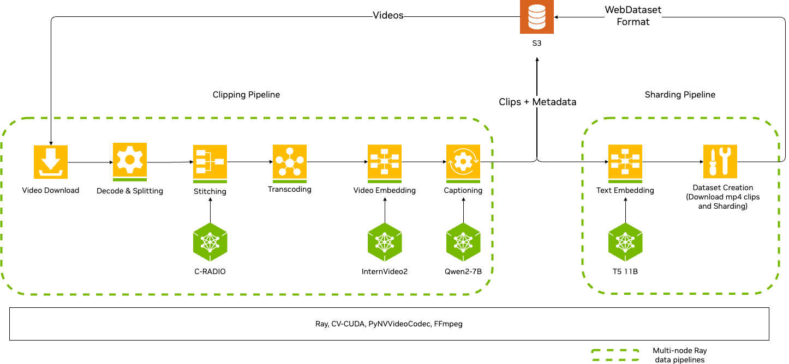

(about-concepts-video-abstractions)=
# Key Abstractions

NeMo Curator introduces two primary abstractions to organize and scale video curation workflows:

- **Stages**: Individual processing units that perform a single step in the workflow (e.g., downloading videos, transcoding, splitting, embedding, scoring).
- **Pipelines**: Ordered sequences of stages that together form an end-to-end curation workflow.



## Stages

A stage represents a single step in your data curation workflow. For example, stages can:

- Download videos
- Transcode media
- Split videos into clips
- Generate embeddings
- Calculate scores

### Stage Architecture

Each stage must:

1. Inherit from the `Stage` class
2. Define resource requirements:
   - CPU count
   - GPU count
   - Conda environment specifications
3. Implement two key functions:

```python
def setup(self):
    # Initializes models in the stage's conda environment
    # Note: Don't initialize models in __init__

def process_data(self, task):
    # Processes one input task
    # Returns one or more output tasks
```

## Pipelines

A pipeline orchestrates multiple stages into an end-to-end workflow. Key characteristics:

- **Stage Sequence**: Stages must follow a logical order where each stage's output feeds into the next
- **Input Configuration**: Specifies the data source location
- **Model Configuration**: Defines the path to model weights, which are cached on each node
- **Execution Mode**: Supports two processing modes: Batch and Stream Processing 