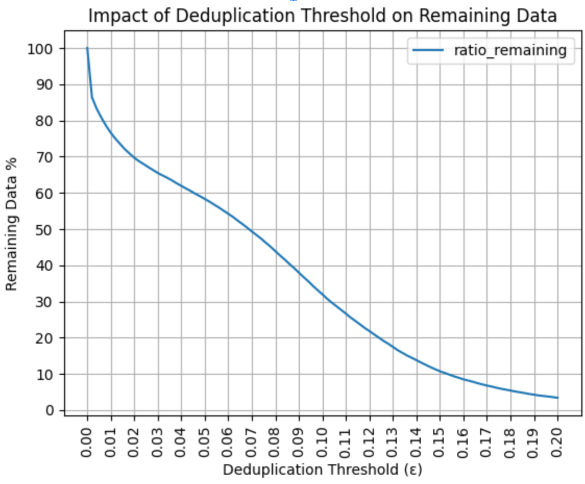

(video-tutorials-split-dedup-shard-workflow)=
# Split-Dedup-Shard Workflow

Learn how to run all three of Curator's [default video pipelines](video-pipelines) together in a single workflow to convert your video data into a de-duplicated dataset ready for use.

```{contents} Tutorial Steps:
:local:
:depth: 2
```

## Before You Start

- You must [set up the container](gs-video).
- Review references to the following pipelines:
   - [Splitting pipeline](video-pipelines-splitting)
   - [Semantic Deduplication pipeline](video-pipelines-dedup)
   - [Sharding pipeline](video-pipelines-sharding)

---

## Run the Workflow

### 1. Build the Environment

```sh
video_curator image build \
    --image-name nemo_video_curator \
    --image-tag 1.0.0 \
    --envs model_download,unified,video_splitting,vllm,text_curator
```

### 2. Generate Clips and Embeddings

Run the [Sharding pipeline](video-pipelines-sharding) to download and process your videos into clips and captions.

:::{tip}
Already have embeddings? You can skip this step and use the `--output-clip-path` argument with the value  `/iv2_embd_parquet`.
:::

::::{tab-set}

:::{tab-item} S3 & Cloud

```sh
video_curator launch --image-name nemo_video_curator --image-tag 1.0.0 \
-- python3 -m nemo_curator.video.pipelines.video.run_pipeline split \
--input-video-path s3://video-storage/input_videos/ \
--output-clip-path s3://video-storage/clips/ --verbose
```

:::

:::{tab-item} Local

```sh
video_curator launch \
--image-name nemo_video_curator \
--image-tag 1.0.0 \
--no-mount-s3-creds -- python3 -m nemo_curator.video.pipelines.video.run_pipeline split \
--input-video-path /config/raw_videos/ \
--output-clip-path /config/clips/ --verbose

```

:::

::::

### 3. Analyze Potential Duplicates

Now that you have clips, run the [Semantic Deduplication pipeline](video-pipelines-dedup) to flag any possible duplicates. Which clips are considered duplicates depends on the threshold chosen (a larger value being more aggressive in duplication removal).

There are two possible approaches:

1. Set a fixed value (such as `--eps-threshold 0.3`) _before_ running the pipeline.
2. Run the pipeline _without_ setting a threshold value and analyze the semantic results first. By default, the pipeline will run with `--eps-threshold 0.1`). Then, choose a threshold value to pass to the Sharding pipeline in the next step based on your insights.

For this tutorial, we are going to follow option 2 and review the results.

::::{tab-set}

:::{tab-item} S3 & Cloud

```sh
video_curator launch --image-name nemo_video_curator --image-tag 1.0.0 \
    --env text_curator \
    -- python -m nemo_curator.video.pipelines.video.run_pipeline dedup \
    --input-embeddings-path s3://video-storage/clips/iv2_embd_parquet/ \
    --output-path s3://video-storage/clips/semantic \
    --n-clusters 4

```

:::

:::{tab-item} Local

```sh
video_curator launch --image-name nemo_video_curator --image-tag 1.0.0 \
    --env text_curator \
    -- python -m nemo_curator.video.pipelines.video.run_pipeline dedup \
    --input-embeddings-path /config/clips/iv2_embd_parquet \
    --output-path /config/clips/semantic \
    --n-clusters 4
```

:::

::::

#### Review Results

Use the results output to the `semdedup_pruning_tables` directory to determine what the optimal threshold is. This step enables you to evaluate a potential threshold target _before_ committing to it during the sharding phase. 

For example, you may decide that `0.3` is too aggressive for your dataset and actually removes valuable non-duplicative data. By plotting and inspecting potential duplicates, you'll know to fine-tune the threshold to be more sensitive.

##### Plot

You can create a visualization to help you determine the optimal deduplication threshold for your dataset. For example, the following plot shows the relationship between the threshold value and the percentage of data that remains after deduplication. A steeper slope indicates a more aggressive removal of similar clips.

:::{note}
The following plot is just an example; your plot output will vary based on your dataset.
:::



:::{dropdown} Plot Deduplication Threshold Impact Code
:icon: code-square

```py
import pandas as pd
import os
import numpy as np
import matplotlib.pyplot as plt

storage_options = dict(key="xxx", secret="yyy")
path = "..."
df = pd.read_parquet(
   os.path.join(path, "extraction/semdedup_pruning_tables"),
   storage_options=storage_options,
)

thresholds = np.linspace(0, 0.2, 101)[::-1]
data = []
total_num_clips = len(df)
for threshold in thresholds:
   num_clips_similar = (df["cosine_sim_score"] > 1 - threshold).sum()
   num_clips_remanining = total_num_clips - num_clips_similar
   data.append((threshold, num_clips_remanining * 100 / total_num_clips))

# Create a DataFrame for plotting
plot_df = pd.DataFrame(data, columns=["threshold", "ratio_remaining"])

plot_df.plot(
   x="threshold",
   y="ratio_remaining",
)

# Customize the plot for clarity
plt.xlabel("Deduplication Threshold (ε)")
plt.ylabel("Remaining Data %")
plt.xticks(np.linspace(0, 0.2, 21), rotation=90)
plt.yticks(np.linspace(0, 100, 11))
plt.title("Impact of Deduplication Threshold on Remaining Data")
plt.grid()
plt.show()
```

:::

##### Inspect

You can create a detailed view of similar clips by examining the output data. For example, the following table shows clips that were identified as similar (with a cosine similarity score > 0.99):

| Clip ID | Similar Clip ID |
|---------|----------------|
| 42b28805-0101-5f68-9037-cb1503b99bf5 | 4568be6f-027d-5482-9c93-4244ded553ad |
| 546143ba-7d31-53e1-a22a-37c2730b1c6c | 787c30e0-a12c-5657-93ea-584f969169b0 |
| ca52e8b7-df98-5c1d-afd2-c4c0fbf5d7ce | 787c30e0-a12c-5657-93ea-584f969169b0 |
| 26a20b97-c1b4-5214-adb5-f1680a2c51a8 | 546143ba-7d31-53e1-a22a-37c2730b1c6c |
| c8379cbe-3c75-55f2-a42e-5e68959ce480 | 26a20b97-c1b4-5214-adb5-f1680a2c51a8 |

You can manually inspect these clips at `{output-path-of-splitting-pipeline}/clips/{id}.mp4`

:::{dropdown} Inspect Similar Clips Code
:icon: code-square

```py
import pandas as pd
import os
import numpy as np
import matplotlib.pyplot as plt

storage_options = dict(key="xxx", secret="yyy")
path = "..."
df = pd.read_parquet(
   os.path.join(path, "extraction/semdedup_pruning_tables"),
   storage_options=storage_options,
)

df[df["cosine_sim_score"] > 0.99][["id", "max_id"]]
```

:::

### 4. Shard Dataset

Now that you've performed a deduplication analysis and determined your ideal threshold, you can use that value with the `--semantic-dedup-epsilon` argument when running the [Sharding Pipeline](video-pipelines-sharding) to generate a dataset compatible with training a video model.

:::{tip}
The Sharding pipeline accepts both `input-semantic-dedup-path` and `semantic-dedup-epsilon`.
:::

```sh
video_curator launch\
 --image-name nemo_video_curator\
 --image-tag 1.0.0\
 --curator-path ./\
 -- python3 -m nemo_curator.video.pipelines.video.run_pipeline shard\
 --input-clip-path s3://video-storage/clips/raw_clips/\
 --output-dataset-path s3://video-storage/clips/webdatasets_video/\
 --annotation-version v0\
 --input-semantic-dedup-path s3://video-storage/clips/semantic/\
 --semantic-dedup-epsilon 0.02\
 --verbose

```
