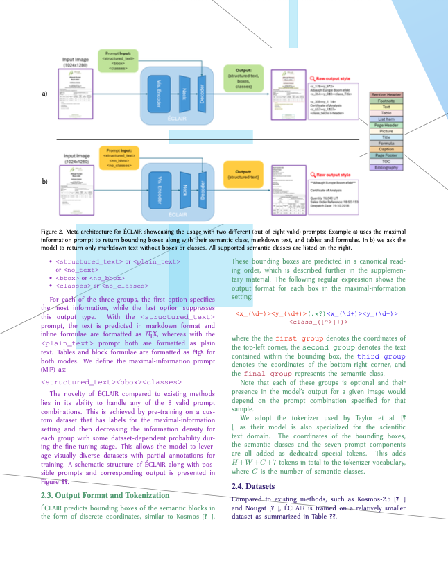
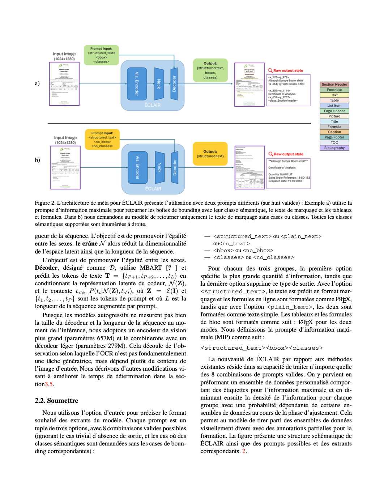

# LaTeX source augmentation tool

Translate English ArXiv documents to multiple languages for multilingual OCR model pretraining.

There are also a variety of LaTeX document augmentations available, to randomize the appearance of the whole document:

- font family
- font size
- line spacing
- letter spacing
- word spacing

> **Note:** the augmentation and translation processes are best-effort because correct LaTeX parsing is difficult. Therefore, not all LaTeX documents can be processed correctly, and the generated LaTeX source files may not even compile. This is still an acceptable tradeoff when processing a large amount of documents.

## Local installation

Install [tree-sitter-latex](https://github.com/latex-lsp/tree-sitter-latex) LaTeX parser locally. Additionally, you can consider installing the [parsing improvements for Arxiv papers](https://github.com/latex-lsp/tree-sitter-latex/pull/227) pull request.

```sh
git clone https://github.com/latex-lsp/tree-sitter-latex.git
cd tree-sitter-latex
npx -y -p tree-sitter-cli tree-sitter generate
cd ..
uv sync
```

To compile LaTeX documents locally, install TeX Live:

```sh
apt-get update
apt-get install -y texlive-full
```

If `texlive-full` installation gets stuck at the following line, [keep the enter key pressed](https://askubuntu.com/questions/956006/pregenerating-context-markiv-format-this-may-take-some-time-takes-forever) (affects at least Ubuntu 22.04.4 LTS):

```
Pregenerating ConTeXt MarkIV format. This may take some time...
```

On macOS, install [MacTeX](https://tug.org/mactex/).

## Command line usage

### Augmentation

To apply random augmentations to a LaTeX document, run

```sh
PYTHONPATH=src uv run python -m latex_augment augment manuscript.tex
```

This will write `manuscript_augmented.tex` as the augmented LaTeX file.

<a href="assets/augment_example.png"></a>

### Translation

To translate a LaTeX document, it has to be prepared first. The preparation process parses the LaTeX syntax and splits the text content into sentences for translation.

```sh
PYTHONPATH=src uv run python -m latex_augment prepare manuscript.tex
```

The prepared document is saved as `manuscript_parse.tex` and after preparation, the document can be translated.

```sh
PYTHONPATH=src uv run python -m latex_augment translate --lang fr manuscript_parse.tex
```

This will write `manuscript_parse_fr.tex` as the resulting LaTeX file.

<a href="assets/translate_example.png"></a>

## Docker image

```sh
docker buildx build --platform=linux/amd64 -t latex-augment .
```

## Batch processing

See separate instructions for

- [arXiv batch processing](scripts/arxiv/README.md)
- [Wikipedia batch processing](scripts/wikipedia/README.md)
- [Random OCR batch processing](scripts/randomocr/README.md)

## Testing

Running all tests (slow tests are excluded by default):

```sh
PYTHONPATH=src uv run python -m pytest --run-slow
```

Running only a subset of tests

```sh
PYTHONPATH=src uv run python -m pytest -k "figure"
```
