Learn how to curate high-quality image datasets using NeMo Curator's powerful image processing pipeline. NeMo Curator enables you to efficiently process large-scale image-text datasets, applying quality filtering, content filtering, and semantic deduplication at scale.

## Use Cases

- Prepare high-quality image datasets for training generative AI models such as LLMs, VLMs, and WFMs
- Curate datasets for text-to-image model training and fine-tuning
- Process large-scale image collections for multimodal foundation model pretraining
- Apply quality control and content filtering to remove inappropriate or low-quality images
- Generate embeddings and semantic features for image search and retrieval applications
- Remove duplicate images from large datasets using semantic deduplication

## Architecture

NeMo Curator's image curation follows a modular pipeline architecture where data flows through configurable stages. Each stage performs a specific operation and passes processed data to the next stage in the pipeline.

```mermaid
flowchart LR
    A[Tar Archive Input] --> B[File Partitioning]
    B --> C[Image Reader<br/>DALI GPU-accelerated]
    C --> D[CLIP Embeddings<br/>ViT-L/14]
    D --> E[Aesthetic Filtering<br/>Quality scoring]
    E --> F[NSFW Filtering<br/>Content filtering]
    F --> G[Duplicate Removal<br/>Semantic deduplication]
    G --> H[Export & Sharding<br/>Tar + Parquet output]
    
    classDef input fill:#e1f5fe,stroke:#0277bd,color:#000
    classDef processing fill:#f3e5f5,stroke:#7b1fa2,color:#000
    classDef output fill:#e8f5e8,stroke:#2e7d32,color:#000
    
    class A input
    class B,C,D,E,F,G processing
    class H output
```

This pipeline architecture provides:

- **Modularity**: Add, remove, or reorder stages based on your workflow needs
- **Scalability**: Distributed processing across multiple GPUs and nodes using Ray
- **Flexibility**: Configure parameters for each stage independently
- **Efficiency**: GPU-accelerated processing with DALI and CLIP models

## Introduction

Master the fundamentals of NeMo Curator's image curation pipeline and set up your processing environment.

<Cards>

<Card title="Concepts" href="/about/concepts/image">
Learn about ImageBatch, ImageObject, and pipeline stages for efficient image curation
</Card>

<Card title="Get Started" href="/get-started/image">
Learn prerequisites, setup instructions, and initial configuration for image curation
</Card>

</Cards>
## Curation Tasks

### Load Data

Load and process large-scale image datasets from local storage using tar archives with GPU-accelerated DALI for efficient distributed processing.

<Cards>

<Card title="Tar Archives" href="/curate-images/load-data/tar-archives">
Load and process JPEG images from tar archives using DALI
</Card>

</Cards>
### Process Data

Transform and enhance your image data through embeddings, classification, and filters.

<Cards>

<Card title="Process Data" href="/curate-images/process-data">
Generate embeddings, apply filters, and prepare images for training
</Card>

<Card title="Deduplication Tutorial" href="/curate-images/tutorials/dedup-workflow">
Remove duplicate images using semantic similarity and clustering
</Card>

</Cards>
### Pipeline Management

Optimize and manage your image curation pipelines with advanced execution backends and resource management.

<Cards>

<Card title="Execution Backends" href="/reference/infrastructure/execution-backends">
Configure Ray-based executors for distributed processing and resource management
</Card>

</Cards>
### Save & Export

Export your curated image datasets with metadata preservation, custom resharding options, and support for downstream training pipelines.

<Cards>

<Card title="Save & Export" href="/curate-images/save-export">
Save metadata to Parquet and export filtered datasets with custom resharding
</Card>

</Cards>

