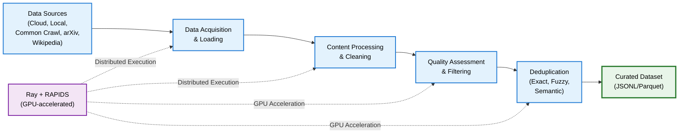

NeMo Curator provides comprehensive text curation capabilities to prepare high-quality data for large language model (LLM) training. The toolkit includes a collection of processors for loading, filtering, formatting, and analyzing text data from various sources using a [pipeline-based architecture](/docs/about/concepts/text/data/curation/pipeline).

## Use Cases

- Clean and prepare web-scraped data from sources like Common Crawl, Wikipedia, and arXiv
- Create custom text curation pipelines for specific domain needs
- Scale text processing across CPU and GPU clusters efficiently

## Architecture

The following diagram provides a high-level outline of NeMo Curator's text curation architecture.

---

## Introduction

Master the fundamentals of NeMo Curator and set up your text processing environment.

<Cards>

<Card title="Concepts" href="/docs/about/concepts/text">
Learn about pipeline architecture and core processing stages for efficient text curation
</Card>

<Card title="Get Started" href="/docs/get-started/text">
Learn prerequisites, setup instructions, and initial configuration for text curation
</Card>

</Cards>
## Curation Tasks

### Download Data

Download text data from remote sources and import existing datasets into NeMo Curator's processing pipeline.

<Cards>

<Card title="Read Existing Data" href="/docs/text/load/data/read/existing">
Read existing JSONL and Parquet datasets using Curator's reader stages
</Card>

<Card title="arXiv" href="/docs/text/load/data/arxiv">
Download and extract scientific papers from arXiv
</Card>

<Card title="Common Crawl" href="/docs/text/load/data/common/crawl">
Download and extract web archive data from Common Crawl
</Card>

<Card title="Wikipedia" href="/docs/text/load/data/wikipedia">
Download and extract Wikipedia articles from Wikipedia dumps
</Card>

<Card title="Custom Data Sources" href="/docs/text/load/data/custom">
Implement a download and extract pipeline for a custom data source
</Card>

</Cards>
### Process Data

Transform and enhance your text data through comprehensive processing and curation steps.

<Cards>

<Card title="Language Management" href="/docs/process/data/language/management/index">
Handle multilingual content and language-specific processing
</Card>

<Card title="Content Processing & Cleaning" href="/docs/process/data/content/processing/index">
Clean, normalize, and transform text content
</Card>

<Card title="Deduplication" href="/docs/process/data/deduplication/index">
Remove duplicate and near-duplicate documents efficiently
</Card>

<Card title="Quality Assessment & Filtering" href="/docs/process/data/quality/assessment/index">
Score and remove low-quality content
</Card>

<Card title="Specialized Processing" href="/docs/process/data/specialized/processing/index">
Domain-specific processing for code and advanced curation tasks
</Card>

</Cards>
{/* Tutorials section - content available at /docs/curate-text/tutorials */}

