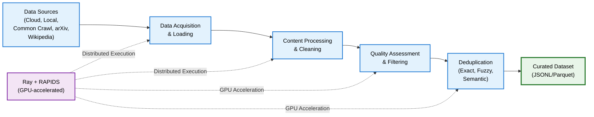

(text-overview)=
# About Text Curation

NeMo Curator provides comprehensive text curation capabilities to prepare high-quality data for large language model (LLM) training. The toolkit includes a collection of processors for loading, filtering, formatting, and analyzing text data from various sources using a [pipeline-based architecture ](/about-concepts-text-data-curation-pipeline).

## Use Cases

- Clean and prepare web-scraped data from sources like Common Crawl, Wikipedia, and arXiv
- Create custom text curation pipelines for specific domain needs
- Scale text processing across CPU and GPU clusters efficiently

## Architecture

The following diagram provides a high-level outline of NeMo Curator's text curation architecture.

---

## Introduction

Master the fundamentals of NeMo Curator and set up your text processing environment.

<Cards>

<Card title="{octicon}`database;1.5em;sd-mr-1` Concepts" href="about-concepts-text">
Learn about pipeline architecture and core processing stages for efficient text curation
+++
{bdg-secondary}`data-structures`
{bdg-secondary}`distributed`
{bdg-secondary}`architecture`

</Card>

<Card title="{octicon}`rocket;1.5em;sd-mr-1` Get Started" href="gs-text">
Learn prerequisites, setup instructions, and initial configuration for text curation
+++
{bdg-secondary}`setup`
{bdg-secondary}`configuration`
{bdg-secondary}`quickstart`

</Tabs>

## Curation Tasks

### Download Data

Download text data from remote sources and import existing datasets into NeMo Curator's processing pipeline.

<Cards>

</Card>

<Card title="{octicon}`file;1.5em;sd-mr-1` Read Existing Data" href="text-load-data-read-existing">
Read existing JSONL and Parquet datasets using Curator's reader stages
+++
{bdg-secondary}`jsonl`
{bdg-secondary}`parquet`

</Card>

<Card title="{octicon}`download;1.5em;sd-mr-1` arXiv" href="text-load-data-arxiv">
Download and extract scientific papers from arXiv
+++
{bdg-secondary}`academic`
{bdg-secondary}`pdf`
{bdg-secondary}`latex`

</Card>

<Card title="{octicon}`download;1.5em;sd-mr-1` Common Crawl" href="text-load-data-common-crawl">
Download and extract web archive data from Common Crawl
+++
{bdg-secondary}`web-data`
{bdg-secondary}`warc`
{bdg-secondary}`distributed`

</Card>

<Card title="{octicon}`download;1.5em;sd-mr-1` Wikipedia" href="text-load-data-wikipedia">
Download and extract Wikipedia articles from Wikipedia dumps
+++
{bdg-secondary}`articles`
{bdg-secondary}`multilingual`
{bdg-secondary}`dumps`

</Card>

<Card title="{octicon}`download;1.5em;sd-mr-1` Custom Data Sources" href="text-load-data-custom">
Implement a download and extract pipeline for a custom data source
+++
{bdg-secondary}`jsonl`
{bdg-secondary}`parquet`
{bdg-secondary}`custom-formats`

</Tabs>

### Process Data

Transform and enhance your text data through comprehensive processing and curation steps.

<Cards>

</Card>

<Card title="{octicon}`globe;1.5em;sd-mr-1` Language Management" href="process-data/language-management/index">
Handle multilingual content and language-specific processing
+++
{bdg-secondary}`language-detection`
{bdg-secondary}`stopwords`
{bdg-secondary}`multilingual`

</Card>

<Card title="{octicon}`pencil;1.5em;sd-mr-1` Content Processing & Cleaning" href="process-data/content-processing/index">
Clean, normalize, and transform text content
+++
{bdg-secondary}`cleaning`
{bdg-secondary}`normalization`
{bdg-secondary}`formatting`

</Card>

<Card title="{octicon}`duplicate;1.5em;sd-mr-1` Deduplication" href="process-data/deduplication/index">
Remove duplicate and near-duplicate documents efficiently
+++
{bdg-secondary}`fuzzy-dedup`
{bdg-secondary}`semantic-dedup`
{bdg-secondary}`exact-dedup`

</Card>

<Card title="{octicon}`shield-check;1.5em;sd-mr-1` Quality Assessment & Filtering" href="process-data/quality-assessment/index">
Score and remove low-quality content
+++
{bdg-secondary}`heuristics`
{bdg-secondary}`classifiers`
{bdg-secondary}`quality-scoring`

</Card>

<Card title="{octicon}`tools;1.5em;sd-mr-1` Specialized Processing" href="process-data/specialized-processing/index">
Domain-specific processing for code and advanced curation tasks
+++
{bdg-secondary}`code-processing`

</Card>

<Card title="{octicon}`sparkles;1.5em;sd-mr-1` Synthetic Data Generation" href="synthetic/index">
Generate and augment training data using LLMs
+++
{bdg-secondary}`llm`
{bdg-secondary}`augmentation`
{bdg-secondary}`multilingual`
{bdg-secondary}`nemotron-cc`

</Tabs>

{/* ## Tutorials

Build practical experience with step-by-step guides for common text curation workflows.

<Cards>

</Card>

<Card title="{octicon}`mortar-board;1.5em;sd-mr-1` Text Curation Tutorials (Placeholder)" href="tutorials/index">
Learn how to customize NeMo Curator's pipelines for your specific needs
+++
{bdg-primary}`staged-nolink`
{bdg-secondary}`custom-pipelines`
{bdg-secondary}`optimization`
{bdg-secondary}`examples`

:::: */}
