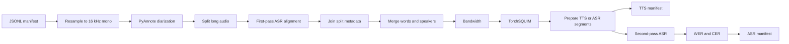

# Audio Tagging Pipeline

Turn unlabeled audio into segmented TTS or ASR training manifests with the configuration-driven example in `tutorials/audio/tagging`. The shared pipeline resamples audio, identifies speakers and overlap, aligns an initial transcript, attaches bandwidth and SQUIM quality metrics, and builds training-length segments. The ASR configuration adds an independent transcription pass and WER/CER validation.

<Warning>
The current audio tagging package does not include an LLM punctuation-and-capitalization (PnC) stage, a reusable vLLM lifecycle, or an Arabic diacritic-removal stage. Do not configure the unshipped `PNCwithvLLMInferenceStage`, `CleanLLMOutputStage`, or `VLLMInference` names. Use an ASR model that emits punctuation, or insert a custom stage after alignment is merged with diarization. `ComputeWERStage.compute_pnc_wer` measures punctuation-sensitive accuracy; it does not add punctuation or capitalization.
</Warning>

## Pipeline flow



The order is significant. Diarization supplies speaker boundaries; the first ASR pass supplies word timestamps; merging connects the two; quality stages score those segments; and `PrepareModuleSegmentsStage` uses the combined speaker, word, punctuation, pause, and metric data. The ASR-only validation pass must run after segment preparation so it can transcribe the final training segments independently.

## Prerequisites

Run the complete example on x86_64 Linux with a CUDA GPU. The `audio_cuda12` extra installs the NeMo ASR, PyAnnote, WhisperX, TorchAudio, TorchSQUIM, OpenCC, and NeMo text-processing dependencies used here. Those ASR and text-normalization dependencies are not installed by this extra on ARM platforms.

From the repository root:

```bash
uv sync --extra audio_cuda12
sudo apt-get install -y ffmpeg
```

The diarization stage also needs a Hugging Face token with access to the gated model configured by `PyAnnoteDiarizationStage`—by default, `pyannote/speaker-diarization-3.1`—and any gated dependencies that model requires. Accept the model licenses before running the pipeline.

GPU memory use depends on model choice, audio length, and concurrency. If a worker runs out of memory, lower ASR `batch_size` and `transcribe_batch_size`, PyAnnote segmentation and embedding batch sizes, or SQUIM `batch_size`. This pipeline does not load vLLM and has no vLLM memory or lifecycle setting.

## Create an input manifest

Create a JSONL file with one audio recording per line:

```json
{"audio_filepath": "/data/calls/call-001.wav", "audio_item_id": "call-001"}
{"audio_filepath": "/data/calls/call-002.wav", "audio_item_id": "call-002"}
```

| Field | Requirement | Behavior |
| --- | --- | --- |
| `audio_filepath` | Required | Local or filesystem-supported input path. A missing or unreadable file fails an audio-loading stage. |
| `audio_item_id` | Optional | Stable identifier used for resampled filenames and speaker IDs. If omitted, resampling derives `<stem>_<path-hash>`. Supply it for reproducible, recognizable output. |

Relative paths are resolved from the directory where you launch the tutorial. `ManifestReader` ignores blank lines and creates one `AudioTask` per nonblank JSON object.

## Run the TTS pipeline

The repository includes a two-record fixture, so you can exercise the complete configuration without preparing a manifest:

```bash
export HF_TOKEN="hf_..."

uv run python tutorials/audio/tagging/main.py \
  --config-path . \
  --config-name tts_pipeline \
  input_manifest=tests/fixtures/audio/tagging/sample_input.jsonl \
  final_manifest=/tmp/tts_output.jsonl \
  hf_token="$HF_TOKEN"
```

The TTS configuration creates 5–20 second, single-speaker segments. `full_utterance_ratio: 1.0` prefers complete punctuation-bounded utterances, while pause and bandwidth changes can also close a segment after its minimum duration.

## Run the ASR pipeline

```bash
uv run python tutorials/audio/tagging/main.py \
  --config-path . \
  --config-name asr_pipeline \
  input_manifest=tests/fixtures/audio/tagging/sample_input.jsonl \
  final_manifest=/tmp/asr_output.jsonl \
  hf_token="$HF_TOKEN"
```

The ASR configuration uses `full_utterance_ratio: 0.8`, may combine speakers, and then transcribes each prepared segment with `nvidia/stt_en_conformer_ctc_large`. `ComputeWERStage` compares the second-pass `text_2` value with first-pass `text`.

Both commands default to the Xenna backend and streaming execution. Set `backend=ray_data` to use Ray Data. Any other backend name fails before execution.

## Understand the stages

| # | Stage | Consumes | Produces | Failure and skip behavior |
| --- | --- | --- | --- | --- |
| 0 | `ManifestReader` | JSONL path | One `AudioTask` per line | Invalid JSON or an unreadable manifest fails the read. |
| 1 | `ResampleAudioStage` | `audio_filepath` | `resampled_audio_filepath`, `duration`, ID if needed | Requires FFmpeg. Reuses an existing destination file, so clear stale workspace audio after changing a source or resampling setting. |
| 2 | `PyAnnoteDiarizationStage` | Resampled audio, HF token | `segments`, `overlap_segments`, RTTM sidecar | Model access, download, or audio errors fail the task. Overlap is kept separately and excluded from ordinary speaker segments. |
| 3 | `SplitLongAudioStage` | Duration, segments, resampled audio | Split WAVs and split metadata | Falls back to the full recording when it cannot make valid splits. |
| 4 | `NeMoASRAlignerStage` | Split audio | `text`, word-level `alignment` | A failed batch is retried one file at a time; an individually failed file receives empty text/alignment so the remaining batch can continue. |
| 5 | `JoinSplitAudioMetadataStage` | Split transcript and offsets | Rejoined transcript and timestamps | Removes transient split file and metadata fields after joining. |
| 6 | `MergeAlignmentDiarizationStage` | Alignment and diarization | Per-speaker `text` and `words` | Words are assigned by containment or overlap; unmatched gap words may not enter a speaker segment. |
| 7 | `BandwidthEstimationStage` | Original audio and segments | `segments[].metrics.bandwidth` in Hz | Skips no-speaker, blank-text, and invalid-range segments; invalid ranges receive `metric_skip_reason`. A missing audio file fails loading. |
| 8 | `TorchSquimQualityMetricsStage` | Resampled audio and segments | PESQ, STOI, and SI-SDR estimates | Skips no-speaker, blank-text, and zero-length segments. Model or batch-compute errors fail the stage. |
| 9 | `PrepareModuleSegmentsStage` | Speaker segments, words, metrics | Training-length `segments` | Rejects unsupported modules and invalid single-word spans. Other processing errors are surfaced as `RuntimeError`. |
| 10 | Second `NeMoASRAlignerStage` (ASR only) | Prepared segment time ranges | `segments[].text_2` | Segment-only inference is strict: an ASR inference error raises instead of substituting empty text. |
| 11 | `ComputeWERStage` (ASR only) | `text`, `text_2` | Nested WER/CER metrics | Missing segment keys are skipped. Empty reference text records `None` metrics and `empty_reference`; per-segment key/value errors are recorded and processing continues. |
| 12 | `ManifestWriterStage` | Mutated task | Output JSONL | Truncates the destination once at setup and appends each task. Use shared storage—or a node-unique output path—when workers span nodes. |

The TTS configuration writes after stage 9; its writer is therefore stage 10.

### Track the manifest field lifecycle

The pipeline mutates one `AudioTask` rather than passing a fixed tabular schema. These are the principal field transitions:

| Stage boundary | Fields added or changed | Fields removed |
| --- | --- | --- |
| Resampling | `resampled_audio_filepath`, `duration`; generated `audio_item_id` when absent | None |
| Diarization | `segments`, `overlap_segments`; recording-scoped speaker labels | None |
| Long-audio splitting | `split_filepaths`, `split_metadata`, `split_offsets`, `split_timestamps` | None |
| First-pass ASR | Top-level `text` and `alignment` for each split result | None |
| Join | Rejoins text and shifts word times to recording-relative offsets | `split_filepaths`, `split_metadata` |
| Merge | Adds `text` and `words` inside each diarization segment | None |
| Quality scoring | Adds scalar values under `segments[].metrics` | None |
| Segment preparation | Replaces `segments` with training-length segments; turns the four scalar audio scores into word-aligned arrays | Prior diarization `segments` value |
| Second-pass ASR | Adds `segments[].text_2` | None |
| WER/CER | Adds comparison results under `segments[].metrics` | None |

`split_offsets` and `split_timestamps` remain in the task after joining. Treat all fields not explicitly removed as provenance carried into the final JSONL.

## Configure the shared pipeline

The runnable configurations are `tutorials/audio/tagging/tts_pipeline.yaml` and `tutorials/audio/tagging/asr_pipeline.yaml`.

| Setting | Default | Purpose |
| --- | --- | --- |
| `workspace_dir` | `/tmp/tagging_workspace` | Parent directory for intermediate resampled and split audio. |
| `sample_rate` | `16000` | Resampling and SQUIM sample rate. |
| `max_segment_length` | `40` | Maximum diarization turn and split target used before alignment. |
| `language_short` | `en` | Language passed to WER text normalization in the ASR configuration. |
| `execution_mode` | `streaming` | Backend executor mode. |
| `stages.4.batch_size` | `32` | Pipeline task batch for the first ASR stage in the supplied YAML. |
| `stages.9.min_duration` | `5` | Minimum prepared training-segment duration in seconds. |
| `stages.9.max_duration` | `20` | Maximum prepared training-segment duration in seconds. |
| `stages.9.max_pause` | `2` | TTS pause boundary in seconds after the minimum duration. |

Hydra lets you override any value without copying the YAML:

```bash
uv run python tutorials/audio/tagging/main.py \
  --config-path . \
  --config-name tts_pipeline \
  input_manifest=/data/input.jsonl \
  final_manifest=/data/tts-output.jsonl \
  hf_token="$HF_TOKEN" \
  max_segment_length=30 \
  stages.4.batch_size=16 \
  stages.4.transcribe_batch_size=16 \
  stages.8.batch_size=16
```

`batch_size` controls how many pipeline tasks a stage receives; `transcribe_batch_size` controls model inference batching inside `NeMoASRAlignerStage`. Tune both when diagnosing memory pressure.

## Shape TTS and ASR segments

`PrepareModuleSegmentsStage` propagates scalar word-level quality values into arrays on each new segment so scores remain aligned with its `words` list.

| Behavior | `module: tts` | `module: asr` |
| --- | --- | --- |
| Speakers per output segment | One; no-speaker spans are skipped | May include multiple speakers |
| Supplied `full_utterance_ratio` | `1.0` | `0.8` |
| Additional split signals | Pause longer than `max_pause`; bandwidth change | Randomized duration boundary |
| Reproducibility | Deterministic for an input entry | Randomized boundary is deterministically seeded from audio path or ID |

`terminal_punct_marks` defaults to the value in the YAML, `.!?。？！。`. If `punctuation_split_only: true`, the stage returns no prepared segments when it cannot find a punctuation boundary. With the supplied `false`, duration and TTS pause/bandwidth heuristics remain available.

## Add text normalization

Insert an optional text stage after `MergeAlignmentDiarizationStage` and before quality scoring or segment preparation.

Inverse text normalization converts spoken-form numbers into written form:

```yaml
  - _target_: nemo_curator.stages.audio.tagging.text.itn.InverseTextNormalizationStage
    language: en
    text_key: text
```

It preserves `segments[].text` and writes `segments[].text_ITN`. It does not automatically make downstream stages use the new key; update the relevant `text_key` settings or add a deliberate copy/rename stage if written-form text should become the training reference.

Traditional-to-Simplified Chinese conversion uses OpenCC:

```yaml
  - _target_: nemo_curator.stages.audio.tagging.text.chinese_conversion.ChineseConversionStage
    text_key: text
    convert_type: t2s
```

It writes `segments[].text_simplified`. A conversion exception warns and copies the original text to that output key. Other OpenCC modes, such as `s2t`, are accepted, but the output key remains `_simplified` in the current API.

There is no built-in Arabic diacritic-removal stage in this release. Implement that transformation as a custom `ProcessingStage` and preserve the original transcription under a separate key when both forms are useful for audit or scoring.

## Handle punctuation and capitalization

Punctuation is an input signal to segment preparation, not a generated output of this pipeline. For natural sentence boundaries:

1. Choose a first-pass ASR model that emits punctuation and capitalization; or
2. Insert a custom PnC stage after `MergeAlignmentDiarizationStage` and before `PrepareModuleSegmentsStage`.

A custom stage must keep the text compatible with the existing word timestamps. Adding, deleting, or merging lexical tokens without rebuilding alignment can make punctuation boundaries and timestamps disagree. Keep the original aligned `text` for traceability and write enhanced text to a separate key until the mapping is validated.

To evaluate punctuation-sensitive agreement in the ASR branch, change stage 11:

```yaml
  - _target_: nemo_curator.stages.audio.metrics.wer.ComputeWERStage
    language: ${language_short}
    hypothesis_text_key: ${text_key2}
    reference_text_key: ${text_key1}
    pnc_chars: ".?,"
    compute_pnc_wer: true
```

This adds `wer_pnc` and `cer_pnc` alongside punctuation-insensitive `wer` and `cer`. Values are ratios: `0.1` means 10 percent. The stage records normalization and empty-reference failures, but it does not implement a first-pass/second-pass selection rule, CER threshold fallback, LLM retry, or context-length limit. If your workflow needs those policies, add a custom selection stage after WER computation and retain both texts plus the chosen-text provenance.

## Read the output manifest

The writer stores the full mutated task as one JSON object per input recording. A shortened ASR result looks like this:

```json
{
  "audio_filepath": "/data/calls/call-001.wav",
  "audio_item_id": "call-001",
  "resampled_audio_filepath": "/tmp/tagging_workspace/audio_resampled/call-001.wav",
  "duration": 87.13,
  "segments": [
    {
      "speaker": "call-001_SPEAKER_00",
      "start": 1.23,
      "end": 6.78,
      "text": "Hello, how are you today?",
      "text_2": "Hello, how are you today?",
      "words": [
        {"word": "Hello", "start": 1.23, "end": 1.55}
      ],
      "metrics": {
        "bandwidth": [8000],
        "pesq_squim": [3.4],
        "stoi_squim": [0.91],
        "sisdr_squim": [19.8],
        "word_rate": 0.93,
        "char_rate": 4.47,
        "wer": {"wer": 0.0, "tokens": 6, "ins_rate": 0.0, "del_rate": 0.0, "sub_rate": 0.0},
        "cer": {"cer": 0.0, "tokens": 25, "ins_rate": 0.0, "del_rate": 0.0, "sub_rate": 0.0},
        "start_cer": {"cer": 0.0, "tokens": 12, "ins_rate": 0.0, "del_rate": 0.0, "sub_rate": 0.0},
        "end_cer": {"cer": 0.0, "tokens": 12, "ins_rate": 0.0, "del_rate": 0.0, "sub_rate": 0.0}
      }
    }
  ],
  "overlap_segments": []
}
```

| Output | Meaning |
| --- | --- |
| `segments[].speaker` | Recording-scoped PyAnnote speaker label. |
| `overlap_segments` | Detected overlapping speech, kept outside ordinary segments. |
| `segments[].words` | Word text and aligned start/end timestamps. |
| `metrics.bandwidth` | Estimated spectral bandwidth in Hz. After preparation, this is an array aligned with words. |
| `metrics.pesq_squim` | Non-intrusive TorchSQUIM PESQ estimate, rounded to three decimals. |
| `metrics.stoi_squim` | Non-intrusive TorchSQUIM STOI estimate, rounded to three decimals. |
| `metrics.sisdr_squim` | Non-intrusive TorchSQUIM SI-SDR estimate, rounded to three decimals. |
| `metrics.wer.wer`, `metrics.cer.cer` | Second-pass disagreement ratios, not percentages. Each object also records token and edit rates. |
| `metrics.start_cer.cer`, `metrics.end_cer.cer` | CER at the configured beginning and ending character windows. |
| `metrics.word_rate` | Words per second for the segment, computed from the hypothesis text and segment duration. |
| `metrics.char_rate` | Characters per second for the segment, computed from the hypothesis text and segment duration. |

SQUIM values are model estimates, not comparisons against a clean reference. Calibrate filtering thresholds on representative data instead of assuming a universal cutoff.

## Reruns, artifacts, and failures

- The writer truncates `final_manifest` when a run initializes. Write to a new path if you need to preserve a prior result.
- Resampled audio is reused when the destination already exists. Remove stale files from `resampled_audio_dir` after changing source audio, sample rate, channel count, or format.
- Diarization writes RTTM files and splitting writes WAV files next to the resampled audio. Budget workspace storage for these artifacts.
- The tutorial has no manifest checkpoint or automatic resume cursor. A rerun starts reading the input manifest from the beginning, though existing resampled files can be reused.
- First-pass ASR isolates failures by retrying individual audio files; second-pass segment inference and SQUIM model failures are fatal. Inspect warnings and metric skip reasons before treating a completed manifest as complete.
- On multi-node execution, ensure workers can see input audio, intermediate paths, and the output manifest through shared storage.

At completion, `main.py` logs tasks processed and aggregate per-stage process time and item counts. Use those measurements to find bottlenecks before increasing worker or model batch concurrency.

## Related topics

- [Speaker separation and diarization](/curate-audio/process-data/quality-filtering/speaker-separation)
- [Audio quality filtering pipeline](/curate-audio/process-data/quality-filtering)
- [Audio quality assessment](/curate-audio/process-data/quality-assessment)
- [NeMo ASR inference](/curate-audio/process-data/asr-inference/nemo-models)
- [Text integration for audio data](/curate-audio/process-data/text-integration)
- [Custom audio manifests](/curate-audio/load-data/custom-manifests)
