# Local Duration Bucketing for Audio GPU Inference

This document describes the local duration-bucketing contract implemented by
[`BatchPolicy`](batch_policy.py), how
[`ASRStage`](asr/stage.py) applies it today, and how to apply the same pattern
safely to another audio GPU inference stage.

The central rule is simple:

> Local bucketing may reorder only the model-input items already present in one
> finite `process_batch()` call. Every prepared item supplies its actual
> `audio_seconds`; the stage groups and packs those items for model execution,
> then restores the original item and parent-row order.

Local bucketing is enabled today only when `ASRStage.batch_policy` is set. It
works with every adapter that implements the current `ASRAdapter` contract,
including NeMo ASR, Qwen ASR, and Qwen-Omni. `BatchPolicy` itself is
model-independent, but other stages must still add their own plan, execute, and
scatter integration around their batched model API.

## Why duration-aware batching helps

Audio tensors in one model call are commonly padded to the longest item. For a
batch with durations `d[0] ... d[n-1]`, a useful first-order approximation is:

```text
useful audio seconds = sum(d)
padded audio seconds = n * max(d)
padding efficiency   = sum(d) / (n * max(d))
```

The ratio is defined for a nonempty batch whose maximum duration is greater
than zero.

The exact compute and memory curves remain model-specific, but mixing a
five-second clip with several-minute clips often wastes work and makes peak GPU
memory harder to predict. Duration buckets constrain calls to configured
duration ranges; an aggregate audio-seconds cap normally bounds the amount of
audio planned for a call, except for the required over-cap singleton case; and
the stage's ordinary item-count cap remains a final independent safeguard.

Local planning deliberately trades global optimality for a small, finite, and
stateless decision:

- no rows are buffered after `process_batch()` returns;
- no coordination is required between workers;
- no timer or flush path is needed;
- streaming and batch backends use the same stage contract;
- output order does not depend on GPU execution order.

## The complete data path

```mermaid
flowchart LR
    A["Backend window<br/>parent AudioTask rows"] --> B["Eligibility, decode,<br/>downmix, and resample"]
    B --> C["Model-safe segments"]
    C --> D["Model items with<br/>actual audio_seconds"]
    D --> E["Duration buckets"]
    E --> F["Greedy audio-seconds<br/>packing"]
    F --> G["Final item-count cap"]
    G --> H["Adapter/model calls"]
    H --> I["Restore model-item order"]
    I --> J["Stitch segments and<br/>restore parent rows"]
```



There are four different objects in this flow. Keeping them distinct prevents
most integration bugs:

1. **Parent row**: one `AudioTask` supplied by the backend.
2. **Prepared parent item**: the parent after eligibility checks and audio
   loading. Skipped languages, reused outputs, and failed loads do not enter
   model planning.
3. **Model item**: one waveform the model can accept. A long parent can produce
   several model items, so there can be more model items than parent rows.
4. **Model call**: a reordered group of model items sent to the adapter. Its
   results must be scattered back before parent results are assembled.

The local planning horizon is therefore not a dataset, a partition, or a
worker's lifetime. It is exactly the prepared model items derived from one
backend-provided `process_batch(tasks)` call.

## The `BatchPolicy` contract

`BatchPolicy` intentionally has only two configuration fields:

| Field | Default | Meaning |
|---|---:|---|
| `buckets_sec` | `[0, 600, 1200, 2400]` | Strictly increasing bucket left edges, in seconds |
| `max_audio_sec_per_batch` | `2400` | Optional aggregate duration cap for one planned batch; `None` disables this split, and one over-cap item is retained as a singleton |

The stage disables local bucketing by default with `batch_policy=None`.
Constructing `BatchPolicy()` opts into the defaults above.

There is no per-bucket item-count setting, generic cost estimator, persistent
queue, timer, or flush state. The only policy signal is each model item's
`audio_seconds`.

### Valid inputs

- `buckets_sec` must be nonempty, numeric, finite, nonnegative, strictly
  increasing, and begin exactly at `0`.
- `max_audio_sec_per_batch` must be `None` or a finite number greater than
  zero.
- Every item passed to `bucketize()` must contain numeric, finite,
  nonnegative `audio_seconds`.
- Boolean values are rejected as bucket edges, the aggregate cap, and item
  durations even though Python otherwise treats `bool` as numeric.
- The empty item list is valid and produces no planned calls.

The duration must describe the waveform that will actually enter the model.
Do not depend on an optional or stale manifest `duration` column. Derive it
after the final resampling or slicing step:

```python
item["audio_seconds"] = float(waveform.shape[-1]) / float(sample_rate)
```

### Bucket assignment

For edges

```text
0 = e[0] < e[1] < ... < e[m - 1]
```

an item of duration `d` is assigned to the greatest edge not exceeding it:

```text
bucket(d) = max(k such that e[k] <= d)
```

Bucket `k` is the left-closed, right-open interval
`[e[k], e[k + 1])`. The final bucket is `[e[m - 1], infinity)`. A duration
exactly equal to an edge enters the bucket beginning at that edge.

Items retain their original relative order inside each bucket. The policy does
not sort items by duration within a bucket.

### Greedy duration packing

Each nonempty bucket is scanned in input-relative order. For a configured
aggregate cap `C`:

1. If the current batch is nonempty and adding the next item would make its
   total exceed `C`, emit the current batch first.
2. Append the item.
3. If the total now equals or exceeds `C`, emit immediately.
4. At the end of the bucket, emit the final partial remainder.

Important boundary behavior:

- A total exactly equal to `C` closes the batch.
- An individual item longer than `C` is emitted alone. The cap never causes an
  item to be dropped or split.
- With `C=None`, each nonempty duration bucket initially becomes one planned
  batch.
- Zero-duration items are valid. The duration cap does not limit how many can
  be grouped, but the later item-count cap does.

After packing, planned batches are stably ordered by total audio seconds,
largest first. Equal-total batches retain their earlier emission order. This
changes dispatch order only; it does not change membership or output order.

The implementation is stable greedy partitioning, not global bin packing,
best-fit packing, or an optimal scheduler.

### Worked example

Suppose one `process_batch()` produces model items with durations:

```text
input order: [5.0, 60.0, 67.0735]
buckets:     [0, 65]
audio cap:   90
```

The items at `5.0` and `60.0` seconds enter `[0, 65)` and form a 65-second
call. The `67.0735`-second item enters `[65, infinity)` and forms its own call.
Heavy-first dispatch runs the calls in this order:

```text
dispatch order: [67.0735], [5.0, 60.0]
```

The returned policy indices are used to restore results to:

```text
result order: 5.0, 60.0, 67.0735
```

## Segmentation comes before bucketing

Duration bucketing is a packing operation; it is not a substitute for a
model-input duration limit.

`ASRStage` first normalizes a parent waveform to `target_sample_rate`, then
uses [`plan_audio_segments`](../model_input_segmentation.py). For a model-safe
duration ceiling `D` and sample rate `s`, its maximum samples per model item
are:

```text
M = max(1, int(D * s))
```

The resulting sample intervals are contiguous, nonoverlapping, and cover the
entire waveform. Exact multiples do not create an empty tail; every remainder,
even one sample, becomes a final model item. A zero-sample waveform produces
one zero-duration item.

Each segment receives its actual duration `(stop - start) / s`. The full-size
chunks and final remainder then enter buckets independently. This is why a
tail from one long parent can share a call with short items from other parents.

After inference, `ASRStage` first restores segment results to pre-bucketing
order, then groups them by parent, then stitches each parent's chunk texts in
temporal order. Reordering GPU calls therefore cannot reorder transcript
chunks or manifest rows.

Do not copy ASR's segmentation policy blindly into another model family.
Diarization, VAD, SED, and alignment models can depend on cross-chunk context,
absolute timestamps, overlap, or speaker identity. Bucketing whole accepted
inputs is safe when results are independent; splitting and stitching those
inputs requires a model-specific correctness design.

## The independent batching controls in `ASRStage`

These controls operate at different boundaries:

| Control | Boundary | Current behavior |
|---|---|---|
| `batch_size` | Backend to stage | Candidate parent rows supplied to one `process_batch()`; also the fallback adapter item-count cap |
| `max_inference_duration_s` | Parent to model item | Splits each normalized parent waveform into model-safe segments before bucketing |
| `batch_policy.buckets_sec` | Model item to duration bucket | Groups prepared segments by actual `audio_seconds` |
| `batch_policy.max_audio_sec_per_batch` | Within one duration bucket | Greedily limits aggregate audio seconds in a planned call |
| `adapter_batch_size` | Planned batch to final adapter call | Optional universal item-count cap; falls back to `batch_size` when `None` |
| Adapter-native settings | Inside the adapter/model | Model-specific controls remain separate from stage planning |

The `ASRStage` class defaults are `batch_size=32`,
`max_inference_duration_s=2400`, `adapter_batch_size=None`, and
`batch_policy=None`. The FastConformer tutorial overrides `batch_size` to `16`
but still leaves local bucketing disabled until a policy is configured.

The final ASR item cap is:

```text
adapter_cap = adapter_batch_size if configured else batch_size
```

Every duration-planned batch is sliced into contiguous groups no larger than
that cap. Because slicing changes group weights, those final groups are again
stably ordered by total audio seconds, largest first. Slicing never combines
different duration buckets and cannot introduce a new audio-cap violation.

Without a `batch_policy`, ASR model items stay in their original order and are
sliced directly by the same adapter cap.

Adapter-native controls do not replace this contract. For example, a Qwen
adapter may have its own internal maximum inference batch size, while
`adapter_batch_size` controls how many items `ASRStage` submits in each adapter
call.

## Configure the current ASR implementation

### Python

```python
from nemo_curator.stages.audio.inference.asr.stage import ASRStage
from nemo_curator.stages.audio.inference.batch_policy import BatchPolicy

asr = ASRStage(
    adapter_target="nemo_curator.models.asr.nemo_asr.NeMoASRAdapter",
    model_id="nvidia/stt_en_fastconformer_ctc_large",
    audio_filepath_key="resampled_audio_filepath",
    batch_size=32,
    adapter_batch_size=8,
    max_inference_duration_s=120,
    batch_policy=BatchPolicy(
        buckets_sec=[0, 15, 30, 60, 120],
        max_audio_sec_per_batch=240,
    ),
)
```

The same `batch_policy` wiring works with another compatible ASR adapter.
Retune bucket edges, the model-duration ceiling, duration and item caps,
resources, and adapter-specific settings for that adapter and model.

### Hydra YAML

```yaml
- _target_: nemo_curator.stages.audio.inference.asr.stage.ASRStage
  adapter_target: nemo_curator.models.asr.nemo_asr.NeMoASRAdapter
  model_id: nvidia/stt_en_fastconformer_ctc_large
  audio_filepath_key: resampled_audio_filepath
  batch_size: 32
  adapter_batch_size: 8
  max_inference_duration_s: 120
  batch_policy:
    _target_: nemo_curator.stages.audio.inference.batch_policy.BatchPolicy
    buckets_sec: [0, 15, 30, 60, 120]
    max_audio_sec_per_batch: 240
```

The runnable FastConformer tutorial keeps the policy disabled by default. It
can be enabled from the command line without editing its YAML:

```bash
uv run --extra audio_cuda12 python nemo_curator/config/run.py \
  --config-path ../../tutorials/audio/nemo_fastconformer \
  --config-name pipeline \
  manifest_path=/absolute/path/to/input.jsonl \
  +stages.2.adapter_batch_size=8 \
  +stages.2.max_inference_duration_s=120 \
  +stages.2.batch_policy._target_=nemo_curator.stages.audio.inference.batch_policy.BatchPolicy \
  '+stages.2.batch_policy.buckets_sec=[0,15,30,60,120]' \
  +stages.2.batch_policy.max_audio_sec_per_batch=240
```

Adjust the stage index when using a different pipeline layout.

## Choosing bucket edges and caps

There is no universal best configuration. Tune against the actual model,
precision, GPU, decoded duration distribution, and latency/throughput goal.

1. **Measure model-input durations.** Use durations after the same decode,
   resample, and segmentation operations the stage performs. A manifest field
   is useful for exploration but is not the runtime policy signal.
2. **Choose edges around meaningful regimes.** Quantiles are a useful starting
   point, but model memory or latency transition points are often better. A
   reasonable initial shape is `[0, 15, 30, 60, 120]`, not a universal
   default.
3. **Keep the candidate window large enough.** `batch_size` limits candidate
   parent rows, not the number of post-segmentation model items. Very small
   windows give the policy few independent parents from which to find similar
   durations; extremely large windows increase waveform preparation and host
   memory pressure.
4. **Find a safe audio-seconds cap.** Start conservatively, include the longest
   supported segments, and increase while observing peak GPU memory and
   throughput. The cap is a proxy, not a proof against OOM.
5. **Retain a final item cap.** Short or zero-duration items can satisfy a large
   duration cap while producing an impractically high item count. Use
   `adapter_batch_size` for the model's ordinary count limit.
6. **Change one control at a time.** Separately measure candidate-window size,
   bucket edges, duration cap, item cap, and model-native settings.

Useful `ASRStage` policy shapes:

| Goal | Example | Consequence |
|---|---|---|
| Duration grouping only | `buckets_sec=[0, 30, 60]`, cap `None` | One initial group per nonempty bucket, then final item-cap slicing |
| Aggregate-duration packing only | `buckets_sec=[0]`, cap `240` | Stable greedy packing without duration separation |
| Group and pack | Multiple edges and finite cap | Duration-coherent groups with bounded aggregate seconds, except for an indivisible over-cap singleton |
| Disable local policy | `batch_policy=None` | Original-order contiguous adapter batches |

Avoid making buckets so narrow that most calls are tiny. Also remember that
the final bucket is unbounded: if it spans a large model-cost range, add more
edges or lower the model-input duration ceiling.

## Applying the pattern to another audio GPU stage

`BatchPolicy` is reusable today, but
[`AdapterInferenceStage`](base.py) shares only adapter lifecycle and input
loading. It does not provide a generic bucketing execution hook. A non-ASR
stage must own its duration-item construction, model calls, scatter, and any
parent reassembly.

### Confirm the stage is eligible

Local bucketing is useful only when all of these conditions hold:

- the stage overrides `process_batch()` and its model has a genuine batched
  API across independent audio items;
- the stage can compute actual model-input seconds after final preprocessing;
- model results can be mapped back to inputs, normally through an ordered 1:1
  contract;
- changing call order does not change model semantics or externally visible
  side effects;
- if one parent creates multiple model items, the stage has an explicit,
  tested scatter/stitch contract.

Simply reordering tasks around a model API that still performs one independent
call per row does not reduce padding or improve batching. Add or verify the
batched model boundary first.

### Integration steps

1. Add `batch_policy: BatchPolicy | None = None` to the stage. Keep the existing
   model-call item cap as a separate stage field.
2. In one `process_batch()`, validate and prepare all eligible parents.
3. After resampling and any semantically valid segmentation, build model items
   containing `audio_seconds`.
4. Keep private mappings from each model-item position to its parent index and,
   when needed, segment ordinal or side-effect metadata.
5. Call `batch_policy.bucketize(items)` when configured. When it is `None`,
   preserve the stage's existing call plan; optional bucketing must not change
   the policy-disabled baseline.
6. Slice every planned group by the ordinary model item-count cap. Do not put a
   separately configurable item cap into each duration bucket; use one
   stage/model-wide cap.
7. Require each model call to return exactly one result per submitted item, or
   define and validate an equally strong model-specific mapping.
8. Scatter call results into an array indexed by pre-bucketing model-item
   position. Raise if any position is missing.
9. Reassemble segments and write outputs using the saved parent mapping.
10. Return parent tasks in the stage's preexisting output order.

The core execute/scatter pattern is shown below. It is an integration template,
not a public helper in the current codebase. `_run_without_local_policy` means
the stage's unchanged baseline path; replace it, `_infer_batch`, and result
types with the stage's own contracts.

```python
def _run_model_batches(self, items):
    if self.batch_policy is None:
        return self._run_without_local_policy(items)

    item_cap = self.model_batch_size
    if isinstance(item_cap, bool) or not isinstance(item_cap, int) or item_cap <= 0:
        raise ValueError("model_batch_size must be a positive integer")

    duration_groups = self.batch_policy.bucketize(items)
    planned = [
        (indices[start : start + item_cap], group[start : start + item_cap])
        for indices, group in duration_groups
        for start in range(0, len(group), item_cap)
    ]
    planned.sort(
        key=lambda call: sum(float(item["audio_seconds"]) for item in call[1]),
        reverse=True,
    )

    aligned = [None] * len(items)
    for indices, call_items in planned:
        call_results = self._infer_batch(call_items)
        if len(call_results) != len(call_items):
            raise RuntimeError("model batch result count must match input count")
        for index, result in zip(indices, call_results, strict=True):
            aligned[index] = result

    if any(result is None for result in aligned):
        raise RuntimeError("local planning did not produce every result")
    return aligned
```

For stages whose result type can legitimately be `None`, use a private sentinel
instead of `None` when detecting unfilled positions.

### Current stage applicability

This table describes the current code, not a promise that every stage has the
same batching API.

| Stage/model family | Current status | Work required |
|---|---|---|
| [`ASRStage`](asr/stage.py) with NeMo ASR, Qwen ASR, or Qwen-Omni | **Supported now** | Configure `batch_policy`; no adapter change |
| [`SEDInferenceStage`](sed/stage.py) with PANNs | Batched model API, policy not wired | Add post-resample `audio_seconds`, plan repeated `infer_batch()` calls, and scatter before writing frame outputs |
| [`TorchSquimQualityMetricsStage`](../metrics/squim.py) | Has stage-specific waveform-length sorting and fixed-size batches | Convert its flattened items to `audio_seconds`, apply the policy, retain its origin scatter and `compute_batch_size` cap |
| [`InferenceSortformerStage`](speaker_diarization/sortformer.py) | Model accepts a path list, but the stage processes one task | Add a true `process_batch()`, reliable duration derivation, planned list calls, and per-task output/RTTM scatter |
| [`NeMoASRAlignerStage`](../tagging/inference/nemo_asr_align.py) | Has batched flattened paths or waveforms and nested mappings | Plan the flattened items, preserve entry/segment mappings, scatter hypotheses, and retain alignment fallback behavior |
| WhisperX VAD, PyAnnote diarization, UTMOS, SIGMOS, speaker separation, and Silero VAD segmentation | No useful cross-row batched stage/model boundary today | First design a verified batched model API and parent/result mapping; policy-only reordering is not useful |
| [`BandFilterStage`](../filtering/band.py) | CPU NumPy/librosa/scikit-learn path | Not an audio GPU bucketing candidate |

SED is the clearest next application: the PANNs adapter already pads every
waveform in a batch to its longest waveform, prepared waveforms have a known
sample rate, and its adapter result contract is ordered 1:1. It does not
currently segment long inputs, so policy adoption should reorder whole
prepared waveforms and scatter results before the existing output writer.

### Preserve model-specific semantics

- **ASR:** concatenating independently decoded chunk text is the current
  `ASRStage` contract.
- **SED:** frame arrays, valid-frame counts, and sidecar paths must return to
  the correct parent. Segmenting inputs would additionally require timestamp
  and frame-offset reconstruction.
- **VAD:** chunk boundaries can alter onset/offset decisions and merged speech
  regions.
- **Diarization:** speaker clustering and identities can depend on the full
  recording; independent chunk inference is not automatically equivalent.
- **Alignment:** flattened split or segment metadata must remain paired with
  the corresponding hypothesis after reordered calls.
- **Filters and variable fan-out stages:** preserve survivor order and every
  parent-to-child mapping; an ordered 1:1 model result alone may not be enough.
- **File side effects:** derive output filenames from saved parent metadata,
  not from reordered loop position.

## Correctness invariants

An implementation is complete only if it maintains all of these invariants:

1. Every eligible prepared model item has one valid `audio_seconds` value.
2. Every item enters exactly one duration bucket.
3. Greedy packing and item-cap slicing emit every item exactly once.
4. No model call mixes duration buckets produced by the policy.
5. A model call returns a validated result mapping for every submitted item.
6. Results are restored to pre-bucketing model-item order before parent
   assembly.
7. Segments of a parent are reassembled in their original temporal order.
8. Parent output order and skip/error behavior match the policy-disabled path.
9. No pending-item, queue, or bucketing-planner state survives the current
   `process_batch()` call. Worker-local adapters and models may persist.

The planner returns original indices specifically to make these properties
enforceable rather than relying on model-call order.

## Testing an adoption

### Planner unit tests

Cover at least:

- invalid and exact bucket boundaries;
- missing, Boolean, negative, `NaN`, and infinite `audio_seconds`;
- empty input and zero-duration items;
- `max_audio_sec_per_batch=None`;
- exact-cap closure and final partial remainders;
- an over-cap singleton;
- stable within-bucket order and heavy-first call order;
- exact-once output indices.

The current reference coverage is in
[`test_batch_policy.py`](../../../../tests/stages/audio/inference/test_batch_policy.py).

### Stage unit tests

Use a recording adapter/model stub and assert:

- the exact durations and item identities in every model call;
- the interaction between the duration cap and ordinary item cap;
- two separate `process_batch()` calls never share a planned call;
- reordered results return to original parent order;
- skipped, unsupported, failed, and zero-length inputs retain existing
  behavior;
- long-parent segments, exact model limits, and final remainders reassemble
  correctly;
- wrong model result counts fail loudly;
- `batch_policy=None` preserves the existing call and output contract.

The ASR reference tests are in
[`test_asr_stage.py`](../../../../tests/stages/audio/inference/test_asr_stage.py).

### Model integration and parity tests

Use a small, fixed cohort containing short, medium, boundary-equal, long, and
segmented-remainder inputs. Compare policy disabled versus enabled with the
same model, decoding settings, software environment, inputs, and hardware.

Validate correctness before performance:

- identical parent IDs and row count;
- identical skip/error classifications;
- expected output equality or the model's documented deterministic tolerance;
- no missing or duplicated segment results;
- adapter-call memberships match the configured policy;
- GPU memory stays within the intended envelope.

Only then compare throughput, latency, padding, and memory. A performance win
is workload- and model-dependent; local bucketing itself guarantees planning
and ordering behavior, not a speedup.

## Troubleshooting

| Symptom | Likely cause | Action |
|---|---|---|
| CUDA OOM remains | Duration cap is too high, one item exceeds it, item cap is too high, or model memory is not linear in seconds | Lower the relevant caps, reduce the model-safe duration, and test the longest singleton explicitly |
| Calls contain fewer items than expected | Duration buckets/audio cap split them, then the final item cap may split them again | Log model-item durations and inspect all batching controls independently |
| Buckets appear poorly populated | `batch_size` gives too small a local candidate window or edges do not match the decoded distribution | Increase the candidate window carefully or retune edges |
| Manifest `duration` disagrees with calls | The policy uses decoded, resampled, possibly segmented waveform seconds | Treat runtime `audio_seconds` as authoritative |
| Model calls look reordered | Completed calls run heavy-first | Check final task outputs; dispatch order is intentionally independent of output order |
| Outputs are reordered or attached to the wrong file | The stage wrote by call position instead of scattering through original indices | Add an aligned result array and explicit parent mappings |
| A long row creates an unexpected short-item call | The final model-safe remainder is bucketed by its actual duration | Verify segment coverage and expect the tail to co-bucket with similar items |
| Bucketing has no performance effect | The model API still executes one row at a time, durations are already homogeneous, or padding is not the bottleneck | Measure the real model boundary before adding more policy logic |
| Host memory grows with a large candidate window | Audio preparation happens before local planning | Reduce `batch_size` or redesign preparation; the policy is not a streaming buffer |

## Explicit non-goals

The current design does not provide:

- global, partition-wide, or cross-worker bucketing;
- a queue spanning multiple `process_batch()` calls;
- timer-based flushing or partial-batch lifecycle state;
- per-bucket item-count configuration;
- feature-weighted or generic item-cost estimation;
- within-bucket duration sorting, best-fit packing, or optimal bin packing;
- automatic bucket/cap tuning or adaptive OOM retries;
- a guarantee that every model becomes faster or uses less memory.

Those features would change the scheduling, state, failure, and reproducibility
contract. They should not be added to this finite local policy implicitly.

## Complexity and determinism

For `N` model items, `B` bucket edges, and `K` duration-planned calls, the
current planner uses `O(N * B + K log K)` time and `O(N + B)` auxiliary
storage. `B` is normally small. The ASR stage performs another stable sort
after its final item-cap slicing.

Given the same ordered items and configuration, planning is deterministic.
Model nondeterminism remains the adapter/model's responsibility.

## Source and test map

- [`batch_policy.py`](batch_policy.py): validation, bucket assignment, stable
  greedy packing, and heavy-first plan ordering.
- [`asr/stage.py`](asr/stage.py): ASR preparation, segmentation, adapter-cap
  slicing, execution, result realignment, and parent stitching.
- [`model_input_segmentation.py`](../model_input_segmentation.py): contiguous
  model-safe segment planning.
- [`base.py`](base.py): shared adapter lifecycle; deliberately not a generic
  batching implementation.
- [`models/asr/base.py`](../../../models/asr/base.py): ordered ASR adapter input
  and result contract.
- [`test_batch_policy.py`](../../../../tests/stages/audio/inference/test_batch_policy.py):
  policy behavior and boundary tests.
- [`test_asr_stage.py`](../../../../tests/stages/audio/inference/test_asr_stage.py):
  call membership, caps, local scope, segmentation, and order restoration.
- [`test_model_input_segmentation.py`](../../../../tests/stages/audio/test_model_input_segmentation.py):
  exact-boundary, remainder, one-sample, and zero-length segmentation behavior.
- [FastConformer tutorial](../../../../tutorials/audio/nemo_fastconformer/README.md):
  runnable NeMo ASR pipeline and configuration overrides.
