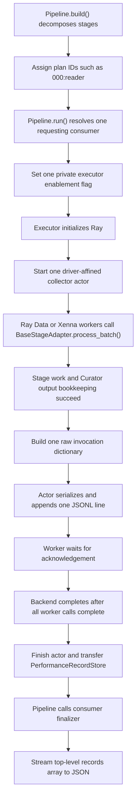
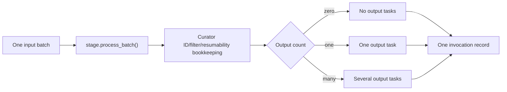
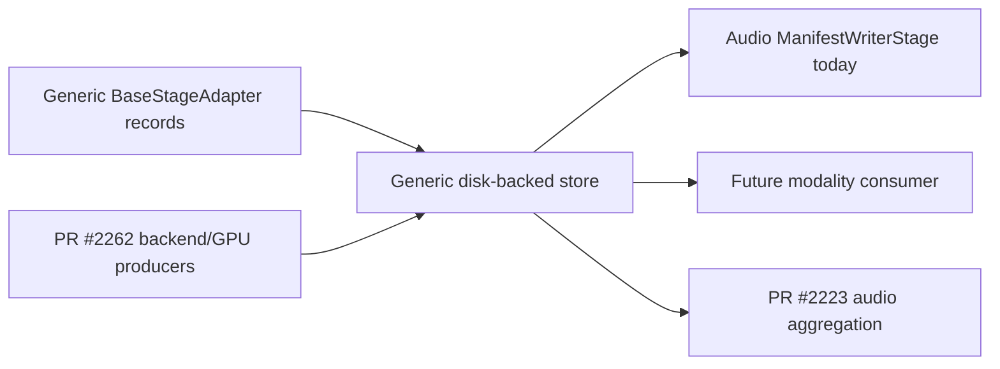

# Run-scoped stage performance telemetry

**Pull request:** [NVIDIA-NeMo/Curator#2296](https://github.com/NVIDIA-NeMo/Curator/pull/2296)

**Status:** Implemented on the pull-request branch

## Executive summary

This pull request adds an opt-in, run-scoped performance report for Curator pipelines executed by Ray Data or Xenna. The current user-facing consumer is the audio `ManifestWriterStage`, but collection itself is implemented in Curator's generic pipeline, executor, and stage-adapter layers.

When reporting is enabled, Curator writes one raw record after each successful `BaseStageAdapter.process_batch()` attempt. The record is published after Curator has completed task-ID assignment, filtering, Slurm source filtering, and resumability bookkeeping. A call that emits no output still has a record. A call that emits several outputs has one record, not one copy on every output task.

All workers publish to one run-scoped Ray actor. The actor is pinned to the driver node and appends JSON lines to a local, disk-backed spool. Each worker waits for its own append acknowledgement before its adapter call returns. After backend execution completes, the executor closes the actor, transfers the spool to the pipeline as a `PerformanceRecordStore`, and the selected consumer streams the records into the final JSON report.

The report is deliberately raw. It preserves every field in each record rather than grouping records or selecting a fixed subset. That makes this pull request a small transport and lifecycle foundation on which later pull requests can add audio summaries and backend or GPU fields without changing the collector.

When reporting is disabled, Curator follows the existing main-branch behavior: `StagePerfStats` is attached to each output task. No collector or report is created.

## Problem

Output tasks are not a complete accounting boundary for stage execution.

- **Zero output:** if a completed adapter call returns no task, there is no task on which to store its performance data.
- **Fan-out:** if one adapter call returns several tasks, attaching the same timing to every output makes a later sum count one execution several times.
- **Plan context:** task records alone do not identify stages that produced no output, distinguish repeated stage names, or show the concrete stage order after composite-stage decomposition.
- **Scale:** retaining every record in actor or driver memory makes memory grow with the number of adapter calls.

The new accounting boundary is therefore one completed generic stage-adapter attempt, independent of how many tasks that attempt emits.

## Terminology

### Processing stage

A `ProcessingStage` is the user-facing Curator stage. It can implement `process()` or `process_batch()` and can process any Curator task type or modality.

### Stage adapter

`BaseStageAdapter` is Curator's generic executor adapter in `nemo_curator/backends/base.py`. `RayDataStageAdapter` and `XennaStageAdapter` inherit from it and route backend batches through its `process_batch()` implementation.

This is not an audio-specific adapter and it is not an ASR model adapter. Stage authors do not create it to use telemetry; the integrated Ray Data and Xenna executors already wrap `ProcessingStage` execution with it.

### Invocation record

In this design, an invocation record describes one successful attempt of `BaseStageAdapter.process_batch()`. It is not a promise of exactly one record for a logical task across backend retries. If a backend retries work and more than one attempt reaches successful publication, the report can contain more than one attempt record.

### Performance consumer

A consumer is a pipeline stage that returns `True` from `requests_performance_records()` and implements `finalize_performance_report(...)`. It receives the disk-backed store and run context after successful backend execution. The first consumer shipped here is audio's `ManifestWriterStage`; the protocol itself is not audio-specific.

## Goals

This pull request is intended to:

1. retain successful zero-output adapter attempts;
2. avoid fan-out duplication by publishing outside the output-task loop;
3. preserve the current task-attached behavior when reporting is disabled;
4. identify the run and concrete built stages without relying on ambient run-ID environment variables;
5. keep collector and report-writing memory bounded as record count grows;
6. use the same collection path for Ray Data and Xenna;
7. fail the run instead of knowingly writing a partial report; and
8. preserve unknown fields so later telemetry producers can extend records without modifying this transport.

## Non-goals and ownership boundaries

This pull request does not provide:

- aggregated or stage-grouped summaries;
- input byte counts or an `AudioTask.input_data_size_bytes()` hook;
- output cardinality;
- GPU identity, utilization, memory, NVML, CPU, RAM, network, or other hardware telemetry;
- backend actor or worker identity;
- logical exactly-once accounting across Ray or Xenna retries;
- deterministic record arrival order across concurrent workers;
- zero-latency collection;
- a Swift client, upload policy, or new cloud-filesystem dependency extra; or
- support for several independently finalized reports in one run.

Follow-up ownership is intentionally separate:

- **PR #2223** owns audio/Qwen-specific metric interpretation and summaries built from these raw records.
- **PR #2262** owns GPU, actor, worker, and backend hardware telemetry fields and hooks.

## User-facing configuration

The current audio consumer is configured on the terminal writer:

```yaml
performance_report_path: /output/performance.json

stages:
  - _target_: nemo_curator.stages.audio.common.ManifestWriterStage
    output_path: /output/results.jsonl
    performance_report_path: ${performance_report_path}
```

The setting is stage-local, but a valid request enables collection once for the supported pipeline run:

- `null` disables collection;
- a non-empty path enables collection; and
- an empty or whitespace-only string is invalid.

The report destination must not resolve to the manifest destination. Under a Slurm array, the writer adds a shard suffix before performing the final collision check, for example `performance.shard-00007-of-00011.json`.

Local and fsspec-backed destinations are accepted. A remote URL works only when the corresponding fsspec implementation and credentials are already available in the environment; this pull request does not add a general cloud-filesystem installation extra.

The bundled Qwen-Omni tutorial defaults `performance_report_path` to `null`, so users opt in explicitly:

```bash
python nemo_curator/config/run.py \
  --config-path ../../tutorials/audio/qwen_omni_inprocess \
  --config-name pipeline \
  manifest_path=/data/input.jsonl \
  performance_report_path=/output/performance.json
```

Ray Data and Xenna advertise support for the run-scoped collector. If a report
is requested with another `BaseExecutor` implementation that has not opted in
to this private executor protocol, Curator fails before executing the pipeline
instead of writing a misleading empty report.

## Architecture



There is one collector actor and one local spool for the run. The design does not choose a collector count from stage speed, batch size, worker count, or modality.

## Component responsibilities

| File and function | Responsibility |
|---|---|
| `nemo_curator/pipeline/pipeline.py` — `Pipeline.build()` | Assign a stable plan-order ID to each concrete stage after decomposition. |
| `nemo_curator/pipeline/pipeline.py` — `Pipeline._build_performance_report_context()` | Create Curator-owned run, executor, pipeline-plan, and Slurm context. |
| `nemo_curator/pipeline/pipeline.py` — `Pipeline.run()` | Resolve the requesting consumer once, enable the executor once, transfer the finished store, and call the consumer. |
| `nemo_curator/stages/base.py` — `ProcessingStage.requests_performance_records()` | Provide the modality-neutral opt-in protocol; the default is `False`. |
| `nemo_curator/backends/base.py` — `BaseExecutor` collector methods | Start, stop, clean up, and transfer one run-scoped collector store. |
| `nemo_curator/backends/base.py` — `BaseStageAdapter.process_batch()` | Preserve legacy task statistics when disabled, or create and publish one raw record when enabled. |
| `nemo_curator/utils/stage_perf_collector.py` | Own the driver-affined actor, JSONL spool, synchronous publication, poison state, and `PerformanceRecordStore`. |
| `nemo_curator/backends/ray_data/executor.py` — `RayDataExecutor.execute()` | Place collector start/finish around Ray Data execution and final materialization. |
| `nemo_curator/backends/xenna/executor.py` — `XennaExecutor.execute()` | Place the same lifecycle around Xenna execution. |
| `nemo_curator/stages/audio/common.py` — `ManifestWriterStage` | Act as the first consumer and stream a raw report to local or fsspec storage. |
| `nemo_curator/utils/file_utils.py` — `write_json_file_streaming_array()` | Write a surrounding JSON object plus one incrementally emitted array. |

## Detailed lifecycle

### 1. Build the concrete plan

`Pipeline.build()` decomposes composite stages and then stamps every executable stage:

```python
for stage_index, stage in enumerate(self.stages):
    stage._curator_stage_id = f"{stage_index:03d}:{stage.name}"
```

For stages named `reader`, `asr`, and `writer`, the IDs are:

```text
000:reader
001:asr
002:writer
```

The prefix describes built-plan order. It does not claim that runtime activity windows are serialized or that records arrive in that order.

### 2. Resolve enablement once

`Pipeline.run()` scans the built stages from right to left for stages requesting records. Every requester must implement a callable `finalize_performance_report`. The rightmost requester becomes the consumer.

The pipeline passes a single boolean into the executor through `_set_stage_perf_collection_requested()`. The executor does not rescan stage configuration. The flag is reset in `finally` after `execute()` returns or raises.

When enabled, the pipeline also builds report context containing:

- a new Curator-owned UUID for this `Pipeline.run()` call;
- pipeline name and description;
- executor class name;
- ordered stage ID, name, fully qualified type, batch size, and worker count; and
- optional Slurm shard index and total shard count.

Slurm information is passed directly to the consumer as report context; it is not copied onto every stage or task.

### 3. Start one driver-affined collector

After Ray initialization, the executor creates one `_StagePerfCollector` actor with `max_concurrency=1`. A hard `NodeAffinitySchedulingStrategy` places it on the Ray driver's node.

The affinity is required because the actor writes to a node-local temporary JSONL file and the driver later reads that same path after actor shutdown. “Driver-affined” means placement on the same Ray node as the driver; it does not mean the actor executes inside the driver process.

The collector handle is stamped privately onto every concrete stage so its serialized worker-side adapter can find the actor.

### 4. Capture one successful adapter attempt

`BaseStageAdapter.process_batch()` always retains Curator's existing `StageTimer` lifecycle. When a collector handle is present, it additionally captures an epoch window and a monotonic elapsed time around the stage's `process_batch()` call.

After the stage call returns, the adapter performs existing Curator bookkeeping:

1. convert filtered `None` slots to sentinels;
2. assign output task IDs;
3. record failed tasks;
4. apply source-stage and Slurm filtering;
5. update resumability counters when enabled; and
6. remove sentinels before returning results.

Only after those steps succeed does it construct one raw record and call `record_stage_perf()`. The publication is outside the loop over output tasks.



If stage processing or adapter bookkeeping raises before publication, there is no successful adapter-attempt record. If required publication fails, the adapter call raises rather than returning success.

### 5. Acknowledge every required publication

`record_stage_perf()` submits `collector.record.remote(record)` and immediately waits with `ray.get()`.

This wait is necessary for the current actor-based design. A driver call made after backend work cannot reliably fence actor calls submitted by independent Ray Data or Xenna workers. By waiting at each producer:

1. a worker batch can complete only after its own record call is acknowledged;
2. backend completion waits for all successful worker batches; and
3. collector `finish()` is called only after backend completion.

The acknowledgement is not a disk `fsync` guarantee. It confirms that the actor serialized the record and completed its buffered file write. It also adds a Ray RPC and serialized-actor wait to every enabled adapter invocation, so enabled collection is not latency-free.

### 6. Spool with bounded memory

The actor converts the complete record dictionary to one JSON string plus a newline and performs one buffered file `write()`. It increments `record_count` only after that write succeeds.

The actor does not retain all records in memory. Its growing state is the local JSONL file; in-memory state is limited to the file object, count, and terminal status.

`PerformanceRecordStore.iter_dicts()` reads and decodes one line at a time. It returns raw dictionaries and does not reconstruct `StagePerfStats`, so fields unknown to this pull request are preserved.

### 7. Finish and transfer ownership

On backend success, `RayDataExecutor` or `XennaExecutor` calls `_stop_stage_perf_collector(..., keep_records=True)` before Ray shutdown. `finish()` closes the spool and returns its path and count. The actor is killed, while `PerformanceRecordStore` retains ownership of the file.

`Pipeline.run()` calls `executor.consume_external_perf_records()` once. That method clears the executor slot as it returns the store, preventing a second ownership transfer. The pipeline retains the store as `pipeline.performance_records` and passes the same object to the consumer.

A later call to `Pipeline.run()` cleans the previous store before beginning. Callers can also invoke `cleanup()`/`close()`, use the store as a context manager, or rely on its weak-reference finalizer as a last resort.

### 8. Stream the public report

`ManifestWriterStage.finalize_performance_report()` applies any Slurm shard suffix, validates the effective report path against the manifest path, and calls `write_json_file_streaming_array()`.

The writer emits report metadata followed by a top-level `records` array. Each item comes directly from `PerformanceRecordStore.iter_dicts()`, so finalization memory does not grow with the number of records.

Local output uses Curator's atomic text-write helper. Remote fsspec output streams directly and therefore has only the guarantees of the selected filesystem implementation.

## Report schema

The following is an illustrative shape, not captured benchmark output:

```json
{
  "schema_version": 1,
  "pipeline_name": "example",
  "run_id": "73006a419f89498fa4243238095ba950",
  "executor": "RayDataExecutor",
  "pipeline": {
    "pipeline_name": "example",
    "pipeline_description": "",
    "stages": [
      {
        "stage_id": "000:reader",
        "name": "reader",
        "type": "package.ReaderStage",
        "batch_size": 1,
        "num_workers": null
      },
      {
        "stage_id": "001:writer",
        "name": "writer",
        "type": "package.WriterStage",
        "batch_size": 1,
        "num_workers": 1
      }
    ]
  },
  "slurm_array": null,
  "wall_time_s": 2.75,
  "record_count": 2,
  "records": [
    {
      "stage_name": "reader",
      "stage_id": "000:reader",
      "invocation_id": "77de2081ec534fbda4df8d755889f311",
      "process_time": 0.42,
      "actor_idle_time": 0.0,
      "num_items_processed": 1,
      "custom_metrics": {},
      "window_start_s": 1786400000.1,
      "window_end_s": 1786400000.52
    },
    {
      "stage_name": "writer",
      "stage_id": "001:writer",
      "invocation_id": "34ea8bcc4a314fa7aa80a834792a1cf9",
      "process_time": 0.01,
      "actor_idle_time": 0.08,
      "num_items_processed": 1,
      "custom_metrics": {},
      "window_start_s": 1786400000.6,
      "window_end_s": 1786400000.61
    }
  ]
}
```

### Header fields

| Field | Meaning |
|---|---|
| `schema_version` | Version of the report envelope. |
| `pipeline_name` | Name supplied to `Pipeline`. |
| `run_id` | Fresh Curator-owned identity for this `Pipeline.run()` call. |
| `executor` | Executor class name. |
| `pipeline` | Pipeline name, description, and all concrete stages in built-plan order. |
| `slurm_array` | `{shard_index, total_shards}` when resolved, otherwise `null`. |
| `wall_time_s` | Monotonic elapsed time around `executor.execute()`. It excludes report finalization. |
| `record_count` | Number of successfully appended records in the store. |
| `records` | Raw invocation dictionaries in collector arrival order. |

### Core record fields produced here

| Field | Meaning |
|---|---|
| `stage_name` | Stage's display name. Names need not be unique. |
| `stage_id` | Stable identity within the concrete built plan. |
| `invocation_id` | Random UUID identifying this adapter attempt. |
| `process_time` | Monotonic elapsed seconds around the stage's `process_batch()` call. |
| `actor_idle_time` | Existing `StageTimer` idle-time value for that adapter instance. In enabled mode, the next idle window starts after the prior telemetry acknowledgement, so collector wait is not mislabeled as idle time. |
| `num_items_processed` | Existing `StageTimer` input-item count for the call. |
| `custom_metrics` | Metrics logged by the stage during the call. |
| `window_start_s`, `window_end_s` | Epoch timestamps surrounding the stage call, useful for placement on a shared timeline. |

The transport and writer do not whitelist these fields. If a later producer adds a JSON-serializable field, it remains in the spool and final `records` array.

## Ordering and interpretation

- `pipeline.stages` is in concrete built-plan order.
- `records` is in collector arrival order across workers and is not a stage-order trace.
- Windows from different workers or stages may overlap.
- `process_time` values describe attempts and should not be summed as an exactly-once logical-work total without accounting for backend retries.
- A planned stage with no successful published attempt appears in `pipeline.stages` but has no corresponding record.
- `wall_time_s` includes executor initialization, scheduling, execution, result materialization, collector finishing, and executor shutdown performed inside `execute()`. It does not include final JSON writing.

## Enabled and disabled behavior

| Behavior | `performance_report_path: null` | Non-empty `performance_report_path` |
|---|---|---|
| Collector actor | Not created | One per run |
| JSONL spool | Not created | One driver-node file |
| New invocation record | Not created | One per successful adapter attempt |
| New record copied to output tasks | No | No |
| Existing `StagePerfStats` attached to outputs | Preserved | Suppressed for this run's adapter calls |
| Zero-output attempts observable | No task to carry stats | Yes |
| Fan-out duplicates invocation stats | Existing behavior | No |
| Final report | None | Raw streaming JSON |

“Suppressed” applies to statistics that this run's adapters would otherwise add. Curator does not erase unrelated performance data already present on caller-supplied tasks.

## Failure model

The report is required when configured; errors are not silently downgraded.

- Collector creation or readiness failure fails executor startup and removes the temporary spool.
- A JSON-serialization or spool-write error latches the first failure, closes the file, and poisons the collector.
- A publication or acknowledgement error fails the adapter call. The worker also tries to poison the collector so an ambiguously acknowledged append cannot later become a successful report.
- A poisoned collector cannot finish into a `PerformanceRecordStore`.
- A backend failure stops the collector without retaining its records and cleans the spool.
- A successful backend run followed by report-writing failure raises from the consumer; the pipeline retains the store for inspection or explicit cleanup.

This is fail-closed against known collection errors. It is not a durability protocol for machine loss and does not claim transactional exactly-once delivery.

## Resource and performance characteristics

- **Driver memory:** bounded with respect to record count during collection and report writing.
- **Disk:** grows linearly with the number and serialized size of records until cleanup.
- **Actor memory:** bounded metadata plus Python and Ray runtime overhead.
- **Actor throughput:** one actor serializes all appends because `max_concurrency=1`.
- **Worker latency:** one Ray actor round trip and acknowledgement wait per enabled adapter invocation.
- **Disabled path:** no actor, spool, extra epoch window, or new record publication.

The synchronous wait favors report completeness over minimum per-batch latency. Pipelines with very fast, highly parallel adapter calls may observe collector contention. Per-stage, per-worker, or dynamically sharded collectors are not part of this pull request because they add routing, ownership, failure, and merge complexity without a stable workload-independent sizing rule.

## Modality-neutral extension protocol

Another modality does not need to modify collection code. It can provide a terminal `ProcessingStage` that:

1. returns `True` from `requests_performance_records()` when its report path or equivalent option is enabled; and
2. implements `finalize_performance_report(performance_records=..., wall_time_s=..., report_context=...)`.

The generic pipeline will select that stage, the existing executors will collect records from all generic stage-adapter calls, and the modality's consumer can stream or interpret the store. The consumer is responsible for its public schema and destination policy.

This protocol separates collection from interpretation:



Only one requesting consumer is finalized by the current pipeline contract. Multiple independent report consumers require a future explicit composition design.

## Alternatives considered

### Continue using output tasks

This is the disabled-path compatibility behavior, but it cannot represent zero-output calls and duplicates fan-out timing.

### Return `(tasks, records)` or an `ExecutionResult`

This would make side results explicit but would change executor result contracts and backend plumbing throughout Curator.

### Keep all records in actor or driver memory

This is simpler for small runs but makes peak memory proportional to invocation count.

### Asynchronous fire-and-forget publication plus a driver barrier

A driver barrier does not fence calls independently submitted by workers. It can let report tails arrive after finalization.

### Background worker queues or one collector per stage/worker

These can reduce the synchronous hot path for some workloads, but require queue bounds, drain ownership, failure propagation, retry semantics, collector assignment, and multi-spool merging. A fixed collector count is not uniformly optimal for heterogeneous pipelines. They are not justified for the minimal foundation.

## Tests and validation

Committed tests cover:

- one-output, zero-output, and fan-out publication, including tensor-bearing audio tasks;
- no task duplication when collection is enabled;
- exclusion of the prior publication wait from the next actor-idle window;
- one-time consumer resolution and record-store transfer;
- explicit rejection by executors that do not support this collector lifecycle;
- Ray Data and Xenna end-to-end report creation;
- collector lifecycle and multi-submitter completeness;
- collector start, acknowledgement, finish, poison, serialization, and cleanup failures;
- preservation of raw and future record fields in the final report;
- local atomic output and fsspec streaming output;
- blank paths, manifest/report collisions, and Slurm-suffixed collisions; and
- run, stage-plan, executor, and optional Slurm report context fields.

Historical ASR parity evidence is documented separately in `tutorials/audio/performance/README.md`. It validates transcript parity for an earlier compact-report revision; it is not presented as byte-for-byte evidence for the final raw schema.

## Review checklist

- Enabling is explicit and disabling remains the default.
- The publication point is outside the output loop and after Curator bookkeeping.
- No audio byte hook or task schema change is required.
- No aggregation, output cardinality, GPU, hardware, actor, or worker fields are promised here.
- Raw unknown fields survive collector and writer traversal.
- Failures do not knowingly produce a successful partial report.
- Retry semantics are described as attempt-level, not logical exactly-once.
- The acknowledgement latency and single-actor bottleneck are explicit.
- Audio is the first consumer, not the boundary of the collection feature.
