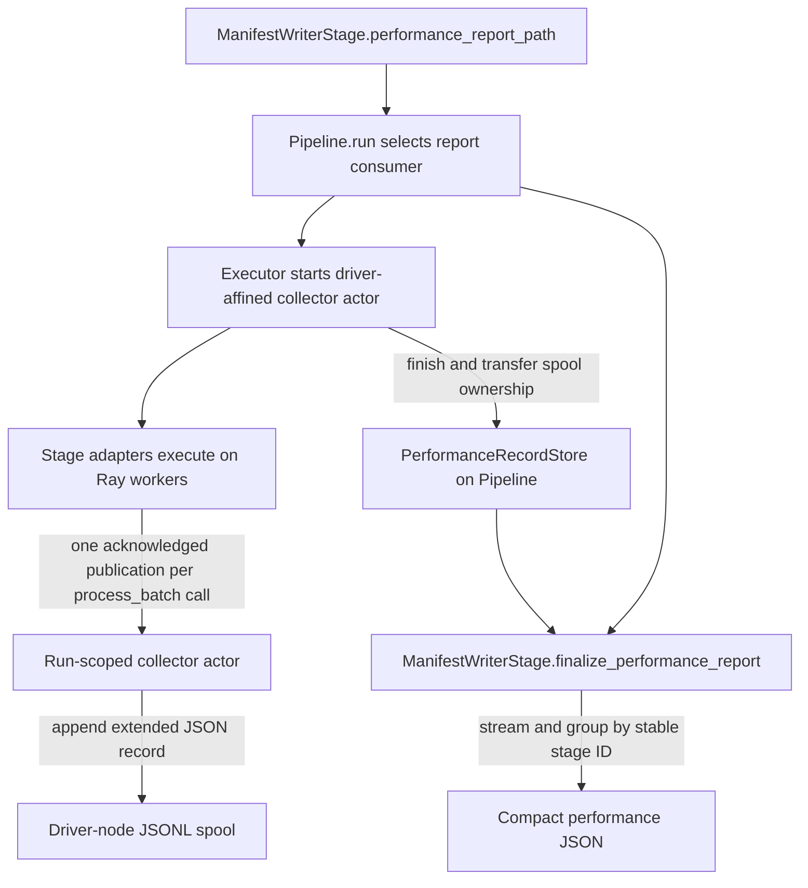

# Stage Performance Telemetry Design

**Status:** Draft implementation

**Pull request:** [NVIDIA-NeMo/Curator#2296](https://github.com/NVIDIA-NeMo/Curator/pull/2296)

**Last updated:** August 8, 2026

## Table of Contents

1. [Executive Summary](#executive-summary)
2. [Background and Problem Statement](#background-and-problem-statement)
3. [Goals](#goals)
4. [Non-Goals](#non-goals)
5. [User-Facing Contract](#user-facing-contract)
6. [Architecture](#architecture)
7. [Detailed Design](#detailed-design)
8. [Report Schema](#report-schema)
9. [Metric Semantics](#metric-semantics)
10. [Compatibility](#compatibility)
11. [Failure Model](#failure-model)
12. [Resource and Scaling Characteristics](#resource-and-scaling-characteristics)
13. [Alternatives Considered](#alternatives-considered)
14. [Testing and Validation](#testing-and-validation)
15. [Limitations and Follow-Up Work](#limitations-and-follow-up-work)

## Executive Summary

This design adds an opt-in, run-scoped performance report for Curator pipelines. A user enables it by setting `performance_report_path` on the terminal `ManifestWriterStage`. When enabled, Curator records one timing record for every completed `process_batch` invocation and writes a compact JSON report grouped by pipeline stage.

The report fixes two limitations of task-attached performance statistics:

- A stage invocation that emits no output task is still represented.
- A stage invocation that fans out into multiple output tasks is represented once, instead of copying the same processing time to every output task and making a later sum overestimate the real processing time.

The authoritative records are transported through a run-scoped, driver-affined Ray actor into a disk-backed JSONL spool. After execution, spool ownership moves to the pipeline and the terminal writer streams a stage-grouped report without loading all invocation records into memory. The report includes every planned stage, stable plan-order stage identifiers, per-invocation identifiers and processing times, stage activity windows, executor wall time, pipeline metadata, and optional Slurm-array identity.

When `performance_report_path` is not set, Curator does not create the collector or report. Existing task-attached performance behavior and its public serialization shape remain available.

## Background and Problem Statement

Curator stages operate on tasks, but stage processing is not required to be one input task to one output task. A single `process_batch` call can return:

- no output tasks, such as when every item is filtered;
- one output task; or
- multiple output tasks, such as a batch that is split or fanned out.

Historically, Curator attached a `StagePerfStats` object to each output task. That representation is useful for following an individual task, but output tasks are not a lossless accounting boundary for stage invocations.

### Zero-output loss

If a completed invocation produces no task, there is no object on which to attach its statistics. The invocation disappears from output-derived performance analysis.

### Fan-out duplication

If one invocation produces `N` output tasks, the same invocation-level processing time is attached to all `N` tasks. Summing task-attached times counts one execution `N` times. The validated 16-row ASR example produced two real ASR batch calls, but task-attached reference results contained 16 ASR records. Their summed ASR time was exactly eight times the sum of the two unique call durations.

### Missing run and plan context

Task records alone do not provide a complete ordered view of the pipeline. In particular, they cannot describe a planned stage that produced no outputs, and stage names alone are insufficient when names repeat. A run-level report needs a Curator-owned run identity, stable stage identities based on the built pipeline, and executor-level wall time.

### Unbounded driver memory risk

Large pipelines may execute millions of stage invocations. Returning all records as an in-memory list or retaining them inside an actor until the end makes peak memory scale with invocation count. The transport and report writer therefore need disk-backed, streaming behavior.

## Goals

The design has the following goals:

1. Record exactly one performance entry per successfully completed stage invocation when reporting is enabled.
2. Preserve invocations that produce zero output tasks.
3. Avoid invocation duplication when one call produces multiple output tasks.
4. Describe every stage in built pipeline order, including stages with zero recorded invocations.
5. Give every run, stage, and invocation an unambiguous identity.
6. Work with both `RayDataExecutor` and `XennaExecutor` execution paths.
7. Bound driver and collector memory independently of invocation count by spooling records to disk and streaming the final report.
8. Propagate collector and report failures instead of silently publishing an incomplete report.
9. Support local and fsspec-backed report destinations.
10. Preserve the disabled-path task performance contract.

## Non-Goals

This pull request does not:

- collect GPU, NVML, CPU, RAM, network, or per-actor hardware telemetry;
- upload artifacts to Swift or define Swift lifecycle policy;
- guarantee atomic replacement on every remote fsspec implementation;
- make invocation arrival order deterministic across concurrent workers;
- expose the internal raw JSONL spool as the public report format;
- infer serialized stage execution from stage activity windows;
- support multiple independent performance-report consumers in one pipeline;
- retain performance records across repeated calls to `Pipeline.run()`; or
- attribute executor setup, shutdown, scheduling, or report-writing time to individual stage processing calls.

Hardware and backend telemetry can build on the identities and report lifecycle defined here, but remains a separate feature.

## User-Facing Contract

### Enabling collection

Collection is enabled by configuring the terminal manifest writer:

```yaml
performance_report_path: /output/qwen_omni_performance.json

stages:
  - _target_: nemo_curator.stages.audio.common.ManifestWriterStage
    output_path: /output/qwen_omni_results.jsonl
    performance_report_path: ${performance_report_path}
```

The path may be a local filesystem path or a URL understood by fsspec. The report path must not resolve to the manifest path.

The opt-in is declared by a stage through `requests_performance_records()`, but collection is run-scoped. `Pipeline.run()` selects the rightmost requesting stage that also implements `finalize_performance_report()` as the single report consumer. The current supported consumer is `ManifestWriterStage`.

### Disabling collection

Omit `performance_report_path`, or set it to `null`. In that mode:

- no collector actor is created;
- no disk spool is created;
- no run-level performance report is written;
- no performance-report context is transferred to a consumer; and
- the existing task-attached `StagePerfStats.to_dict()` shape is preserved.

### Output ownership

When collection is enabled, run-scoped records are authoritative. Invocation records are not copied into output tasks. The `Pipeline` holds the returned disk-backed record store. The store owns its spool until the next run cleans the previous store, a caller explicitly cleans the store, the store's context manager exits, or its finalizer runs.

## Architecture



The design separates four concerns:

| Concern | Owner | Responsibility |
|---|---|---|
| Enablement and run context | `Pipeline` | Select one consumer; create run, executor, stage-plan, and Slurm context |
| Execution lifecycle | `BaseExecutor` and backend executors | Start, finish, clean up, and transfer the collector spool exactly once |
| Invocation capture and transport | `BaseStageAdapter` and collector actor | Measure each call and synchronously acknowledge one accepted actor append per invocation |
| Public report construction | `ManifestWriterStage` | Validate destination, group records by stage, and stream the compact report |

## Detailed Design

### Pipeline plan and identity

After composite stages are decomposed, `Pipeline.build()` assigns every concrete stage a stable identifier:

```python
for stage_index, stage in enumerate(self.stages):
    stage._curator_stage_id = f"{stage_index:03d}:{stage.name}"
```

For a pipeline containing `audio_reader`, `qwen_omni_asr`, and `manifest_writer`, the identifiers are:

```text
000:audio_reader
001:qwen_omni_asr
002:manifest_writer
```

The numeric prefix expresses exact built-plan order and disambiguates repeated stage names. It does not assert that execution windows cannot overlap.

At the beginning of each `Pipeline.run()`, Curator creates a new random run ID with `uuid.uuid4().hex`. This identity is owned by Curator and is not read from an uncontrolled environment variable. The report context also contains:

- pipeline name and description;
- executor class name;
- ordered metadata for every built stage; and
- Slurm-array context resolved once for the run.

Any performance-record store from a previous run is cleaned before the new run begins.

### Report-consumer selection

`Pipeline.run()` scans the built stages from right to left and chooses the first stage for which both conditions are true:

1. `requests_performance_records()` returns `True`; and
2. `finalize_performance_report` is callable.

This makes the terminal writer the lifecycle owner without changing `BaseExecutor.execute()` to return a new public result type. The current contract supports one consumer. Pipelines requiring multiple reports should add that behavior to one consumer rather than rely on multiple requesting stages.

### Collector lifecycle

`BaseExecutor._start_stage_perf_collector()` first checks whether any stage requests performance records. If not, it returns without importing or starting the transport.

When enabled, the executor creates one Ray actor for the run. `RayDataExecutor` and `XennaExecutor` use the same lifecycle:

1. initialize Ray;
2. start the collector;
3. execute the pipeline and materialize final outputs;
4. finish the collector and retain its record store;
5. shut down Ray;
6. transfer the record store exactly once to `Pipeline`; and
7. let the selected consumer write the report.

Failure paths stop the collector without retaining records and clean its spool. Successful execution transfers spool ownership from the actor lifecycle into the executor slot, then from the executor slot into the pipeline. `consume_external_perf_records()` clears the executor slot as it returns, preventing a second transfer.

### Driver affinity

The collector actor uses a hard Ray node-affinity constraint targeting the driver node. The actor does not retain the full record set in memory; it appends records to a local temporary file. The driver must be able to read that same file after the actor is killed, so actor placement and spool ownership cannot be independent.

This is referred to as **driver-affined**: the actor is scheduled on the same physical Ray node as the driver because its local disk artifact is part of the ownership-transfer contract.

### Per-invocation capture

`BaseStageAdapter.process_batch()` checks once per call whether the executor stamped a collector handle onto the stage. When enabled, it:

1. counts input items;
2. obtains the task-specific input byte count;
3. records an epoch start timestamp;
4. measures only `stage.process_batch()` with a monotonic clock;
5. applies existing task IDs, post-processing, filtering, and resumability handling;
6. creates one extended `StagePerfStats` record; and
7. publishes it once, outside the output-task loop.

The collector call is deliberately outside the loop over results. An invocation is the accounting unit; an output task is not. Publishing inside the loop would drop zero-output calls and multiply one processing duration by the fan-out count.

When reporting is disabled, the adapter retains the established behavior of attaching the stage statistics to each output task.

### Timing and input-size capture

`StageTimer.reinit()` now receives bytes rather than item count. These are different dimensions: eight audio rows are not eight bytes. Passing item count to a byte-to-megabyte conversion produced a value with the wrong unit.

The base `Task.input_data_size_bytes()` returns zero. Task implementations opt in only when they have an inexpensive, stable byte representation. `AudioTask` measures:

- the UTF-8 size of a compact, sorted JSON envelope; and
- tensor or NumPy storage through `nbytes`, or `numel() * element_size()`.

Non-JSON tensor and array values are replaced by `null` in the envelope before their storage is counted separately. This avoids attempting to JSON-serialize waveforms and prevents valid tensor-backed audio tasks from crashing telemetry.

Input byte counts are retained in the internal extended record for future aggregation. They are not currently exposed in the compact public report.

### Publication acknowledgement and completeness

Each worker calls the collector actor and waits for that publication's acknowledgement. This synchronous acknowledgement is intentional.

A driver-side barrier cannot fence actor calls submitted independently by Ray Data or Xenna workers. Ray guarantees ordering only under narrower submitter conditions; a later call from the driver may overtake publications from other submitters. Waiting at each producer means executor completion cannot precede an unacknowledged performance publication.

The acknowledgement is therefore the completeness boundary. It creates backpressure, but prevents a successful report from silently losing its tail.

### Disk-backed record store

The collector appends one extended JSON object per line to a unique temporary JSONL spool. In-memory actor state contains only bounded metadata such as the record count.

At finish, the actor returns the path and count as a `PerformanceRecordStore`. The store is reiterable and can yield dictionaries or reconstructed `StagePerfStats` instances without reading the complete file into memory. It supports:

- explicit `cleanup()`/`close()`;
- context-manager cleanup; and
- a weak-reference finalizer as a last resort.

The spool is an internal transport artifact, not a supported output. Its schema may evolve with the implementation while the public report remains versioned.

### Report construction

`ManifestWriterStage.finalize_performance_report()` pre-creates one summary for every stage in ordered pipeline metadata. It then streams the spool once, rejects unknown stage IDs, and writes each stage's invocation IDs and processing times to stage-specific temporary files. It tracks only the minimum valid start time and maximum valid end time in memory.

The final JSON writer streams those temporary arrays into the report. For local paths it:

1. writes a temporary file in the destination directory;
2. flushes and `fsync`s the file; and
3. atomically replaces the destination with `os.replace`.

For remote fsspec destinations it streams to the opened filesystem object. Generic remote filesystems do not provide a universal atomic-replace contract, so atomicity is guaranteed only for the local path implementation.

### Slurm-array reports

`SlurmArrayConfig.from_env()` is resolved once per pipeline run. The resolved shard identity is passed directly to the report consumer as run context rather than copied onto every stage.

When array context exists, the report name receives a shard suffix before it is opened, for example:

```text
performance.shard-00007-of-00020.json
```

The effective suffixed path is compared with the manifest path after suffix resolution. This second validation prevents an apparently distinct configured report path from becoming the manifest path after transformation and overwriting manifest data.

Invalid or partial Slurm-array environment configuration raises an error instead of publishing ambiguous shard identity.

## Report Schema

The report is a compact, stage-grouped JSON object with `schema_version` set to `1`:

```json
{
  "schema_version": 1,
  "pipeline_name": "qwen_omni_pipeline",
  "run_id": "<curator-owned UUID>",
  "executor": "RayDataExecutor",
  "pipeline": {
    "pipeline_name": "qwen_omni_pipeline",
    "pipeline_description": "...",
    "stages": [
      {
        "stage_id": "000:qwen_omni_asr",
        "name": "qwen_omni_asr",
        "type": "...",
        "batch_size": 8,
        "num_workers": 1
      },
      {
        "stage_id": "001:manifest_writer",
        "name": "manifest_writer",
        "type": "...",
        "batch_size": null,
        "num_workers": null
      }
    ]
  },
  "slurm_array": null,
  "wall_time_s": 45.559,
  "record_count": 18,
  "stage_performance": [
    {
      "stage_id": "000:qwen_omni_asr",
      "stage_start_s": 1786114658.1,
      "stage_end_s": 1786114660.2,
      "invocation_ids": ["<UUID>", "<UUID>"],
      "processing_times_s": [1.1, 0.9]
    },
    {
      "stage_id": "001:manifest_writer",
      "stage_start_s": 1786114660.3,
      "stage_end_s": 1786114660.5,
      "invocation_ids": ["<16 UUIDs>"],
      "processing_times_s": ["<16 durations>"]
    }
  ]
}
```

### Top-level fields

| Field | Meaning |
|---|---|
| `schema_version` | Public report schema version; currently `1` |
| `pipeline_name` | Name of the pipeline execution |
| `run_id` | New Curator-owned identity for this `Pipeline.run()` call |
| `executor` | Concrete executor class name |
| `pipeline` | Ordered built-stage metadata and pipeline description |
| `slurm_array` | Run-level shard index/count, or `null` |
| `wall_time_s` | Executor wall time as defined below |
| `record_count` | Total number of captured invocation records |
| `stage_performance` | One summary per planned stage in plan order |

### Stage fields

| Field | Meaning |
|---|---|
| `stage_id` | Stable identifier combining zero-padded plan index and stage name |
| `stage_start_s` | Earliest recorded invocation start in epoch seconds, or `null` |
| `stage_end_s` | Latest recorded invocation end in epoch seconds, or `null` |
| `invocation_ids` | One UUID per captured invocation |
| `processing_times_s` | Monotonic `process_batch` duration aligned by index with `invocation_ids` |

Every planned stage appears. A stage with no completed invocation has `null` start/end values and empty arrays. The following invariant holds:

```text
record_count == sum(len(stage.invocation_ids) for stage in stage_performance)
```

## Metric Semantics

### Invocation processing time

`processing_times_s[i]` measures the monotonic elapsed time around the corresponding call to `stage.process_batch()`. It does not include collector publication, report serialization, or the adapter's later output-task bookkeeping.

### Stage activity window

`stage_start_s` and `stage_end_s` are the minimum epoch start and maximum epoch end among a stage's captured invocations. They make cross-stage activity visible on a common clock.

The stage ID list gives exact pipeline plan order. The windows give observed activity bounds. They are different concepts: executor pipelining and concurrency can make adjacent stages overlap, so stage windows must not be added together or interpreted as a strictly serial timeline.

### Executor wall time

`wall_time_s` is measured with a monotonic clock around `executor.execute()`. For the integrated Ray Data and Xenna paths it includes executor initialization performed inside `execute`, scheduling, stage work, output materialization, collector drain/finish, and Ray shutdown. It excludes final performance-report serialization because finalization occurs after `execute()` returns.

Executor wall time is an end-to-end execution latency, not the sum of stage processing times. Stage calls can execute concurrently, and executor overhead is not assigned to a stage.

### Actor idle time, custom metrics, items, and bytes

The internal extended record retains legacy timing fields, item cardinality, input bytes, custom metrics, invocation identity, and timestamps. Schema version 1 intentionally exposes only the fields needed for exact invocation accounting and stage timing. This keeps the public report compact and avoids making internal transport details an early compatibility promise.

## Compatibility

### Disabled path

With no `performance_report_path`, the collector path is not active. Output tasks continue to receive the established `StagePerfStats.to_dict()` fields:

- `stage_name`;
- `process_time`;
- `actor_idle_time`;
- `input_data_size_mb`;
- `num_items_processed`; and
- `custom_metrics`.

Run, stage, and invocation identities are not added to that legacy public task serialization.

The input-size correction is intentional: item cardinality is no longer passed to an API that expects bytes. Task types that do not implement a byte-size contract report zero rather than a dimensionally invalid value.

### Enabled path

With reporting enabled, invocation statistics move out of tasks into the run-scoped collector. Task payload and output manifest content remain unchanged; only the ownership of performance statistics changes. Consumers that need exact whole-run accounting should use the performance report rather than summing task records.

### Custom executors and consumers

The collector transport is implemented in `BaseExecutor`, but a custom executor must participate in the start, finish, cleanup, and consume lifecycle to produce a report. A custom report consumer must both request records and implement `finalize_performance_report()`.

## Failure Model

Performance reporting is fail-closed once explicitly requested. A successful pipeline must not silently claim a complete report after dropping records.

| Failure | Behavior |
|---|---|
| Collector cannot start | Execution fails before stage work |
| Invocation publication fails | The stage call/pipeline fails; no silent record drop |
| Collector finish or spool transfer fails | Execution fails and temporary state is cleaned |
| Record contains an unknown stage ID | Report finalization fails |
| Configured or Slurm-resolved report collides with manifest | Validation fails before manifest data can be overwritten |
| Local report write fails before replace | Previous destination remains intact |
| Invalid/partial Slurm configuration | Run fails instead of emitting ambiguous shard metadata |
| Pipeline execution fails | Collector is stopped without retaining the incomplete spool |

Synchronous publication acknowledgement is part of this failure model. It trades some throughput for an explicit completeness guarantee.

## Resource and Scaling Characteristics

Let `R` be invocation count and `S` be stage count.

- Collector memory is `O(1)` with respect to `R`; record storage is `O(R)` on local disk.
- Report aggregation memory is `O(S)`; stage-specific temporary arrays and the final report are `O(R)` on disk.
- Publication adds one Ray actor call and acknowledgement per completed invocation.
- The collector requests no CPU resource, uses `max_concurrency=1`, and serializes appends to one spool.
- Final report construction reads the spool once and streams the output.

Committed stress tests cover 50,000 records. After baseline setup, collector memory growth remains below 512 KiB, and report-generation peak traced memory remains below 2 MiB. These tests protect the intended bounded-memory design rather than prescribing exact production memory use.

## Alternatives Considered

### Attach records only to output tasks

This is the previous model. It has the smallest new implementation cost and keeps task-local lineage, but it cannot represent zero-output calls and duplicates invocation statistics for fan-out calls. It is retained only for compatibility when run-scoped reporting is disabled.

### Keep all records in actor memory

This simplifies storage and final transfer for small runs. Memory grows with invocation count, the actor must remain alive through report creation or return a potentially large object, and actor loss loses the entire record set. A disk spool provides bounded memory and explicit ownership transfer.

### Return `(tasks, records)` from `execute()`

This makes performance data an explicit executor return value, but changes a central public interface and all executor callers for an opt-in feature. The executor-owned transfer slot preserves the existing result contract.

### Return an `ExecutionResult(tasks, records)` object

This is cleaner if Curator adopts a broader result model, but has the same compatibility and migration cost as changing the tuple return type. It is disproportionate to the current report feature.

### Let the writer access the actor directly

This couples a terminal stage to Ray actor lifetime and backend shutdown order. It also makes cleanup and custom executor behavior harder to reason about. Transferring a backend-neutral `PerformanceRecordStore` before finalization separates transport from serialization.

### Use a driver-side barrier after execution

A driver submission does not order publications already submitted by independent workers. It can finish before worker-originated actor calls. Producer-side acknowledgements provide the required ordering boundary.

### Accumulate records directly on `Pipeline`

Workers do not share the driver's Python object, so this requires a transport channel regardless. Direct accumulation would also make pipeline memory grow with invocation count.

### Publish the raw extended record list

A raw list exposes more fields immediately, but creates a large public artifact, requires consumers to solve stage grouping and zero-invocation representation, and prematurely freezes internal fields. The compact stage-grouped schema publishes the guarantees required by this feature while leaving room for later versioned metrics.

### Best-effort asynchronous publication

This can reduce per-call latency, but executor completion cannot prove that independent worker submissions reached the actor. Silent report truncation is less acceptable than failing an explicitly requested authoritative report.

## Testing and Validation

### Committed regression coverage

The test suite covers:

- one-to-one, zero-output, and fan-out invocation accounting;
- disabled-path task compatibility;
- collector start, publication, finish, cleanup, and exactly-once transfer;
- Ray Data and Xenna report enablement;
- tensor- and NumPy-backed audio input-size calculation;
- local, URI, and in-memory fsspec destinations;
- Slurm suffixing, context, invalid configuration, and post-suffix collision detection;
- unknown stage identity rejection;
- local atomic-write failure preserving an existing destination;
- report invariants and zero-invocation stages; and
- bounded-memory behavior at 50,000 records.

### Live GPU parity validation

The runtime implementation at `ab7081b325dfabc702a3c6642184c20c13633ac4` was validated against Curator main at `a4470c6fe9b20ec98eb0839939c5e89de8aca3e5` with a 16-row ASR run using batch size 8 on an NVIDIA GeForce RTX 3080 Ti. The target and reference produced:

- 16 of 16 exact transcript matches;
- byte-identical output JSONL manifests; and
- 100% sampled GPU utilization in both arms.

The target report contained 18 invocation records: two ASR batch invocations and 16 writer invocations. Target output tasks contained no attached performance records while reporting was enabled.

The reference path attached 32 records to 16 tasks. Its 16 attached ASR entries represented only two real ASR calls, and summing them overestimated the two unique processing durations by exactly the fan-out factor of eight. This validates the accounting problem and the new report's one-record-per-invocation behavior.

The measured target and reference pipeline wall times came from sequential canary runs and are not evidence of a causal performance change. The validation establishes output parity and telemetry semantics, not a performance-regression conclusion.

The complete reproducible example and exact report are in [`tutorials/audio/performance/README.md`](tutorials/audio/performance/README.md).

## Limitations and Follow-Up Work

1. **Hardware telemetry:** GPU identity/utilization and system metrics belong in a separate backend telemetry layer that can reuse the run and stage identities.
2. **Additional public metrics:** Item counts, input bytes, custom metrics, and idle-time aggregation require an intentional schema-version decision before exposure.
3. **Remote atomicity:** Filesystem-specific commit/rename support may improve guarantees beyond generic fsspec streaming.
4. **Multiple consumers:** The current lifecycle selects one terminal consumer. Supporting multiple independent reports requires explicit fan-out and ownership semantics.
5. **Retry semantics:** The report counts completed adapter invocations observed by the collector. If an executor retries completed work, a future extension may need attempt IDs or logical-invocation deduplication.
6. **Publication overhead:** Producer acknowledgements prioritize completeness. Future batching must preserve an equivalent fence and bounded-memory guarantee.
7. **Invocation ordering:** Arrays reflect collector arrival order within each stage. Consumers must use IDs and timestamps rather than assume a deterministic total order across workers.
