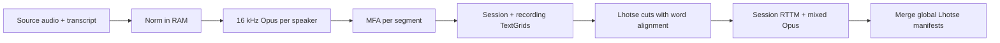

# David AI redelivered — MFA alignment pipeline

Segment-constrained [Montreal Forced Aligner (MFA)](https://montreal-forced-aligner.readthedocs.io/) pipeline for David AI redelivered English conversational audio. Each transcript segment is aligned independently, then results are concatenated into per-session TextGrids and downstream deliverables (Lhotse cutset, mixed-session RTTM).

The **RAM-by-session** pipeline processes each session end-to-end in RAM from original audio + transcript (no normalized JSON manifests on lustre).

## Input data layout

```
${DATA_ROOT}/${session_id}/
├── machine_generated_transcript.json   # segment list with speaker, start, end, text
├── ${speaker_id}_postprocessed.wav     # one full-track WAV per speaker
└── ...
```

Segment `start` / `end` times are on a **shared session timeline** (multi-speaker).

## Prerequisites

| Tool | Used in |
|------|---------|
| **ffmpeg** | Opus encode, segment extract for MFA, mixed audio |
| **MFA** (`mfa align`, `mfa g2p`) | Lexicon build, alignment |
| **Python 3.10+** with `nemo-curator`, `lhotse`, `textgrid`, `num2words` | All stages |

Pretrained MFA models under `MFA_ROOT_DIR` (default `~/MFA_models`):

- Dictionary: `english_us_arpa`
- Acoustic: `english_us_arpa`
- G2P: `english_us_arpa`

**Parallel MFA tip:** symlink `command_history.yaml` to `/dev/null` to avoid YAML corruption when running many workers:

```bash
ln -sf /dev/null ~/MFA_models/command_history.yaml
```

---

## RAM-by-session pipeline (recommended)

Each session runs end-to-end in RAM from original audio + transcript. **No `*_norm.jsonl` manifests are written.**

Per session (in memory): normalize text → 16 kHz Opus per speaker → MFA → TextGrids → Lhotse cuts (MFA words only) → mixed Opus + session RTTM (with fallbacks).

### Local quick start

```bash
cd tutorials/audio/david_ai_redelivered_mfa

export PATH="$HOME/miniconda3/envs/curator_pain_1/bin:$PATH"
export MFA_ROOT_DIR="$HOME/MFA_models"

# Full RAM pipeline (builds lexicon if missing)
WORKERS=16 bash run_david_ai_mfa_ram_session.sh

# Single session
SESSION=<session_id> WORKERS=4 bash run_david_ai_mfa_ram_session.sh
```

### Lexicon preprocessing (optional, run once)

Build the merged MFA dictionary in parallel before the main pipeline:

```bash
cd tutorials/audio/david_ai_redelivered_mfa

export PATH="$HOME/miniconda3/envs/curator_pain_1/bin:$PATH"
export MFA_ROOT_DIR="$HOME/MFA_models"
export PYTHONPATH="$PWD:$PWD/pipeline_ram:$PWD/lexicon"

python3 lexicon/preprocess_build_lexicon.py \
  --data-root /path/to/sessions \
  --lexicon-dir workdir_ram_session/lexicon \
  --workers 16
```

From existing normalized manifests instead of raw transcripts:

```bash
python3 lexicon/preprocess_build_lexicon.py \
  --manifests-dir workdir/manifests \
  --lexicon-dir workdir_ram_session/lexicon \
  --workers 16
```

Then run the RAM pipeline with lexicon rebuild skipped:

```bash
SKIP_LEXICON=1 WORKERS=16 bash run_david_ai_mfa_ram_session.sh
```

### Draco cluster

Uses existing `data_links` symlinks from the old cluster job (no linking step in the RAM script).

```bash
cd /lustre/fsw/portfolios/nemotron/users/ttimofeeva/Curator/tutorials/audio/david_ai_redelivered_mfa

# Step 1: lexicon (optional but recommended)
SLURM_ACCOUNT=nemotron_speechprod_asr SLURM_PARTITION=cpu_long CPUS=64 WORKERS=64 \
  bash lexicon/run_preprocess_lexicon_cluster.sh

# Step 2: RAM pipeline
SKIP_LEXICON=1 \
SLURM_ACCOUNT=nemotron_speechprod_asr SLURM_PARTITION=cpu_long CPUS=64 \
WORKERS=16 MFA_NUM_JOBS=4 \
  bash run_david_ai_mfa_ram_session_cluster.sh
```

Default paths on draco:

| Variable | Default |
|----------|---------|
| `DATA_ROOT` | `.../david_ai_mfa_workdir/data_links` (existing symlinks) |
| `WORK_DIR` | `.../david_ai_mfa_ram_workdir` (RAM pipeline outputs) |
| `RAM_DIR` | `/dev/shm/david_ai_ram_session` |

### RAM pipeline outputs (`workdir_ram_session/`)

| Artifact | Path |
|----------|------|
| Merged MFA dictionary | `lexicon/english_mfa_davidai_eng.dict` |
| Per-speaker 16 kHz Opus | `audio_16k/{speaker}_{session}_postprocessed.opus` |
| Session TextGrids | `textgrids/{session_id}.TextGrid`, `{session_id}_fastmss.TextGrid` |
| Per-recording TextGrids | `textgrids/{recording_id}.TextGrid`, `{recording_id}_fastmss.TextGrid` |
| Lhotse (per session, word-aligned) | `lhotse/sessions/{session_id}_cuts.jsonl.gz` |
| Lhotse (merged, if `MERGE_LHOTSE=1`) | `lhotse/david_ai_recordings.jsonl.gz`, `david_ai_supervisions.jsonl.gz`, `david_ai_cuts.jsonl.gz`, `david_ai_aligned_cuts.jsonl.gz` |
| Mixed session audio | `audio_mixed/{session_id}.opus` |
| Session RTTM | `audio_mixed/{session_id}.rttm` |

### Fallback behavior (RAM pipeline)

| Output | Fallback segments |
|--------|-------------------|
| **RTTM + mixed audio** | Yes — manifest boundaries used when MFA fails |
| **Lhotse cuts** | No — only MFA-aligned words (`merged_words`); speakers with no MFA alignment are skipped |

### RAM pipeline flow



Per session, in order:

1. **Normalize** transcript text in memory (no `*_norm.jsonl` written)
2. **Encode** 16 kHz Opus per speaker (`audio_16k/`)
3. **MFA align** each segment → session TextGrids + per-recording TextGrids
4. **Lhotse** — `MonoCut` per speaker with `supervision.alignment["word"]` from MFA (`merged_words` only)
5. **RTTM + mix** — session RTTM with fallbacks; mixed Opus with pause noise
6. **Merge** (end of run) — global `david_ai_{recordings,supervisions,cuts,aligned_cuts}.jsonl.gz`

Re-merge Lhotse only after a partial run:

```bash
export PYTHONPATH="$PWD:$PWD/pipeline_ram:$PWD/lexicon"
python3 pipeline_ram/stage_ram_merge_lhotse.py --lhotse-dir workdir_ram_session/lhotse
```

---

## Glued OOV repair (optional)

Detect high-confidence glued OOV tokens and build repair TSVs under `lexicon/`:

```bash
cd tutorials/audio/david_ai_redelivered_mfa
export PYTHONPATH="$PWD:$PWD/pipeline_ram:$PWD/lexicon"

python3 lexicon/detect_glued_oov_heuristic.py \
  --oov workdir/lexicon/oov_words.txt \
  --dictionary workdir/lexicon/english_mfa_davidai_eng.dict

# Install repairs on draco
bash lexicon/copy_unglue_repairs_to_draco.sh
```

---

## Text normalization

Transcripts are normalized for MFA lexicon compatibility:

1. Strip digit grouping commas (`2,000` → `2000`)
2. Verbalize numbers (`3` → `three`, decades, feet/inches, etc.)
3. Lowercase, map punctuation/symbols to spaces, keep `'` and `-`
4. Unknown tokens → `spn` (MFA unknown-word placeholder)

Whisper normalization is **not** used.

## TextGrid variants

- **Ordinary** (`{session_id}.TextGrid`): MFA words + `speech` placeholders for fallback segments.
- **FastMSS** (`{session_id}_fastmss.TextGrid`): MFA words only; failed segments are empty gaps.

## MFA and Opus

MFA requires PCM WAV + text in its corpus directory. This pipeline stores per-speaker audio as **Opus** on disk. Stage 2 (or the RAM session worker) decodes each segment to temporary `seg_*.wav` via ffmpeg before calling `mfa align`.

## Parallelism

| Level | Setting | Effect |
|-------|---------|--------|
| Sessions | `WORKERS` | Parallel sessions (RAM pipeline or stage 2 workers) |
| MFA jobs | `MFA_NUM_JOBS` | Threads inside each `mfa align` call |
| Lexicon | `WORKERS` in `lexicon/preprocess_build_lexicon.py` | Parallel text normalization for vocabulary |

Each MFA worker uses an **isolated MFA root** (copied dictionary + acoustic model) to avoid SQLite / model races.

Total MFA concurrency ≈ `WORKERS × MFA_NUM_JOBS`. Size workers to CPU count and available `/dev/shm` when using RAM-disk mode.

## Environment variables

### Shared

| Variable | Default | Description |
|----------|---------|-------------|
| `DATA_ROOT` | local test path / draco `data_links` | Input sessions |
| `MFA_ROOT_DIR` | `~/MFA_models` | MFA pretrained models |
| `NUM2WORDS_LANG` | `en` | Digit verbalization language |
| `WORKERS` | `4` | Parallel session workers |
| `MFA_NUM_JOBS` | `4` | MFA `-j` per alignment |
| `SEGMENT_PADDING` | `0.5` | Audio context around each segment for MFA |
| `SESSION` | *(empty)* | Process one session only |
| `FORCE` | `0` | Re-run and ignore `.done` markers |

### RAM-by-session

| Variable | Default | Description |
|----------|---------|-------------|
| `WORK_DIR` | `./workdir_ram_session` | RAM pipeline outputs |
| `RAM_DIR` | `/dev/shm/david_ai_ram_session` | Per-session MFA scratch |
| `SKIP_LEXICON` | `0` | Skip lexicon build if already done |
| `MERGE_LHOTSE` | `1` | Merge per-session cuts into global Lhotse file |
| `LINK_WORK_DIR` | draco `david_ai_mfa_workdir` | Where `data_links` symlinks live |

## Project layout

```
david_ai_redelivered_mfa/
├── run_david_ai_mfa_ram_session.sh        # RAM-by-session (local)
├── run_david_ai_mfa_ram_session_cluster.sh
├── submit_ram_200nodes.sh
├── sync_to_draco.sh
├── david_ai_common.py                     # Shared helpers
├── david_ai_glued_words.py                # Glued-token repair helpers
├── pipeline_ram/                          # Current RAM pipeline
│   ├── stage_ram_session_pipeline.py
│   ├── david_ai_ram_session.py
│   ├── david_ai_ram_lhotse.py
│   ├── stage_ram_merge_lhotse.py
│   ├── stage0_build_manifests.py
│   ├── stage2_mfa_align_textgrids.py
│   ├── stage2_mfa_worker.py
│   ├── stage4_build_final_outputs.py
│   └── stage4_build_lhotse.py
├── lexicon/                               # Dictionary + glued OOV tools
│   ├── preprocess_build_lexicon.py
│   ├── stage0_build_lexicon.py
│   ├── run_preprocess_lexicon_cluster.sh
│   ├── detect_glued_oov_heuristic.py
│   ├── detect_glued_oov_llm.py
│   └── copy_unglue_repairs_to_draco.sh
├── cluster/                               # Draco conda / miniconda setup
│   ├── install_curator_pain_1_draco.sh
│   ├── pack_and_upload_curator_env_draco.sh
│   └── miniconda_problem.md
├── tests/
│   ├── conftest.py
│   └── test_*.py
└── requirements.txt
```

## Resuming the RAM-by-session pipeline

Each fully finished session is marked in `workdir_ram_session/.done/sessions/{session_id}.done`. A session is considered done only when **all** of these exist:

| Output | Location |
|--------|----------|
| Per-session done flag | `.done/sessions/{session_id}.done` |
| Speaker 16 kHz Opus | `audio_16k/{speaker}_{session}_postprocessed.opus` |
| MFA TextGrids | `textgrids/{session_id}.TextGrid`, `{session_id}_fastmss.TextGrid` |
| Session RTTM + mixed audio | `audio_mixed/{session_id}.rttm`, `{session_id}.opus` |

On restart, completed sessions are **skipped automatically**. Partial sessions resume from the first missing step (e.g. skip MFA if TextGrids exist, skip mix if RTTM exists).

The pipeline-level `.done/ram_session_pipeline.done` is written only when **all** sessions succeed.

**Resubmit after a partial RAM run:**

```bash
# Draco
SKIP_LEXICON=1 bash run_david_ai_mfa_ram_session_cluster.sh

# Local
SKIP_LEXICON=1 bash run_david_ai_mfa_ram_session.sh
```

Use `FORCE=1` only to reprocess specific sessions (`SESSION=... FORCE=1`) or the full dataset (clears the pipeline `.done` marker and per-session flags for forced sessions).

---

## Troubleshooting

**Lustre small-file stalls** — Prefer the RAM-by-session pipeline for full runs (no per-session norm JSON on lustre). Use fewer `WORKERS` if jobs stall on lustre I/O.

**`mfa_temp/` not empty during a run** — Expected. Up to `WORKERS` active temp dirs hold segment WAV/TXT while MFA runs. The RAM session pipeline keeps scratch on tmpfs via `RAM_DIR`.

**Empty `text_norm` for filler segments** (`"Um..."`, `"..."`) — Normalization may produce empty strings; those segments are skipped for MFA.

**`spn` in normalized text** — Token not in MFA dictionary/alphabet; rebuild lexicon (`lexicon/preprocess_build_lexicon.py`) or fix source transcript.

**No Lhotse cut for a session** — RAM pipeline writes Lhotse only when at least one speaker has MFA alignment. RTTM/mix still proceed with fallbacks.
