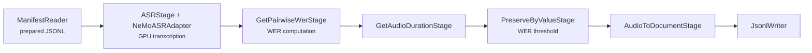

# Curating LibriSpeech with NeMo Curator

This tutorial reads real English [LibriSpeech](https://huggingface.co/datasets/openslr/librispeech_asr) audio from a prepared JSONL manifest, transcribes it, computes word error rate (WER) and duration, filters rows, and writes a curated manifest.

LibriSpeech preparation is a separate, reusable step. The pipeline starts at `ManifestReader`, so dataset download and staging are not repeated or included in pipeline timing.

## Pipeline



## Requirements

- x86_64 Linux
- `ffmpeg`
- NeMo Curator audio dependencies
- One CUDA GPU recommended for ASR inference
- Enough disk for the requested source-audio duration

From the repository root:

```bash
uv sync --extra audio_cuda12
source .venv/bin/activate
```

Use `audio_cpu` instead for a very small CPU-only smoke run.

## Prepare real LibriSpeech data

The shared preparation script streams the pinned `openslr/librispeech_asr` training splits, stages FLAC files without re-encoding them, and writes `manifest.jsonl`. It defaults to clean-100, clean-360, and other-500. This source is English and released under [CC BY 4.0](https://creativecommons.org/licenses/by/4.0/).

Prepare 15 minutes for a local tutorial run:

```bash
python benchmarking/data_prep/prepare_librispeech_data.py \
  --output-path ./example_audio/librispeech \
  --target-audio-hours 0.25
```

The resulting layout is:

```text
example_audio/librispeech/
├── manifest.jsonl
└── audio/
    └── *.flac
```

The nightly benchmark uses the same script and pinned source with a larger duration. Preparation is reusable: both Xenna and Ray Data consume the same manifest and audio files.

## Run

From the repository root:

```bash
python tutorials/audio/librispeech/main.py \
  --config-path . \
  --config-name pipeline \
  manifest_path=./example_audio/librispeech/manifest.jsonl
```

Select Ray Data with `backend=ray_data`:

```bash
python tutorials/audio/librispeech/main.py \
  --config-path . \
  --config-name pipeline \
  manifest_path=./example_audio/librispeech/manifest.jsonl \
  backend=ray_data
```

Both backends run on Ray. `main.py` starts `RayClient`, creates the selected executor, and stops the client in a `finally` block.

## Configuration

| Setting | Default | Purpose |
|---|---|---|
| `manifest_path` | required | Prepared LibriSpeech JSONL manifest |
| `output_dir` | `./example_audio/librispeech/result` | Directory for output JSONL shards |
| `backend` | `xenna` | `xenna` or `ray_data` |
| `wer_threshold` | `1000.0` | Keep rows with `wer_pct` at or below this value |
| `stages.1.model_id` | `nvidia/parakeet-tdt-0.6b-v2` | Compatible pretrained English NeMo ASR model |
| `stages.1.batch_size` | `16` | Waveforms per transcription call |
| `stages.1.resources.gpus` | `1.0` | GPUs scheduled for each ASR worker; use `0` for CPU |

The default WER threshold is intentionally permissive for the first run. LibriSpeech references are uppercase and unpunctuated, while model output can use different case and punctuation; `GetPairwiseWerStage` compares the strings as supplied. Inspect the WER distribution and choose a threshold that matches your normalization and curation policy.

For example:

```bash
python tutorials/audio/librispeech/main.py \
  --config-path . \
  --config-name pipeline \
  manifest_path=./example_audio/librispeech/manifest.jsonl \
  wer_threshold=25.0
```

## Stage behavior

1. `ManifestReader` streams the prepared JSONL and emits one `AudioTask` per row.
2. `ASRStage` and `NeMoASRAdapter` load audio in batches and add `pred_text`.
3. `GetPairwiseWerStage` adds `wer_pct` as a percentage.
4. `GetAudioDurationStage` reads the FLAC header and adds `duration` in seconds.
5. `PreserveByValueStage` keeps rows whose `wer_pct` is at or below the threshold.
6. `AudioToDocumentStage` and `JsonlWriter` write the surviving rows.

An output row has this shape:

```json
{
  "audio_filepath": "/data/librispeech/audio/6930-75918-0000.flac",
  "text": "A LIBRISPEECH REFERENCE TRANSCRIPT",
  "duration": 4.2,
  "pred_text": "a librispeech reference transcript",
  "wer_pct": 100.0
}
```

The values above are illustrative. Preparation writes `audio_filepath` and
`text`; the pipeline adds `pred_text`, `wer_pct`, and `duration`.

## Troubleshooting

| Symptom | Action |
|---|---|
| `manifest_path` is missing | Run the preparation command and pass its `manifest.jsonl` path |
| An audio file cannot be opened | Keep the staged `audio/` directory with its manifest; do not move only the JSONL |
| CUDA out of memory | Reduce `stages.1.batch_size` |
| No rows are written | Raise `wer_threshold`, then inspect case and punctuation normalization |
| First run appears idle | Wait for the NeMo checkpoint download and inspect Ray logs |
| CPU execution is slow | Use `stages.1.resources.gpus=1`; CPU is intended only for small smokes |

## License

The prepared dataset source, LibriSpeech ASR, is released under [CC BY 4.0](https://creativecommons.org/licenses/by/4.0/). Review its [dataset card](https://huggingface.co/datasets/openslr/librispeech_asr) before redistribution.
