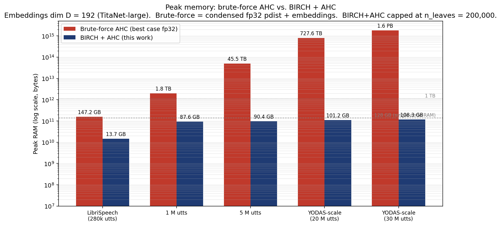
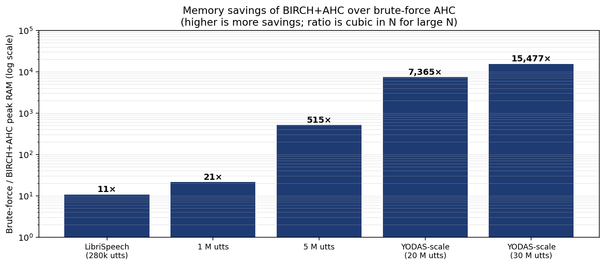
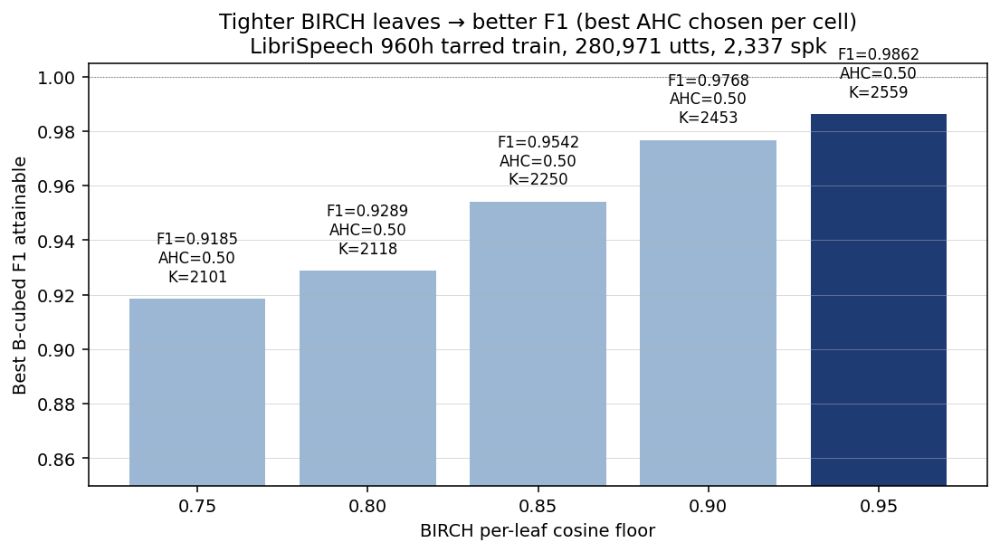
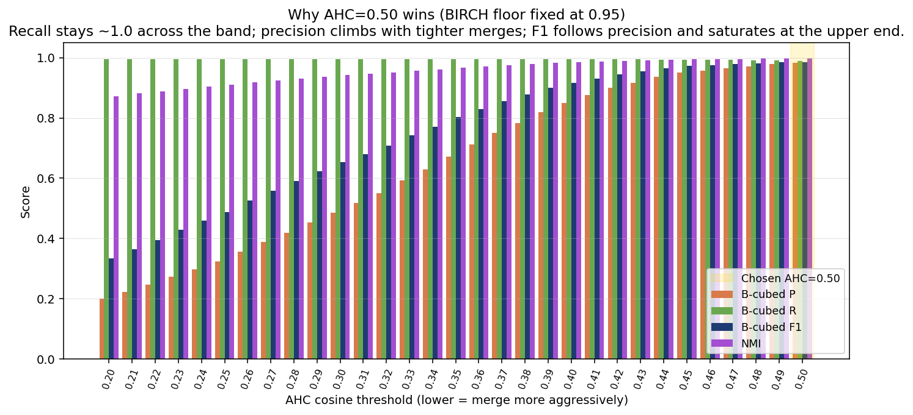
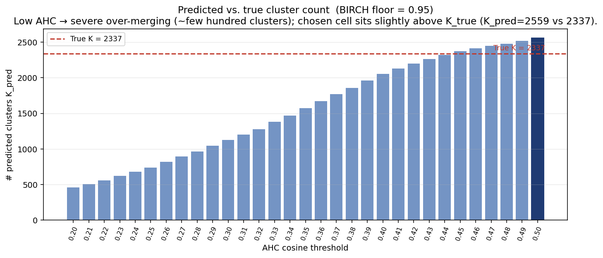
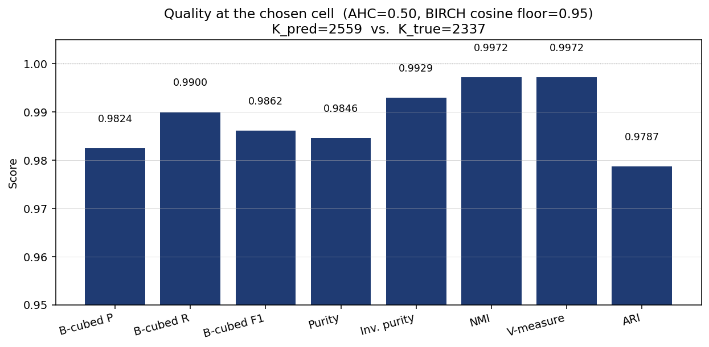
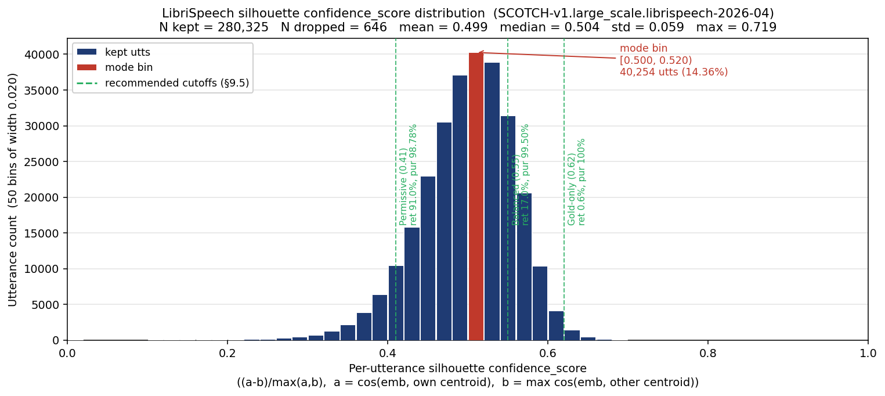
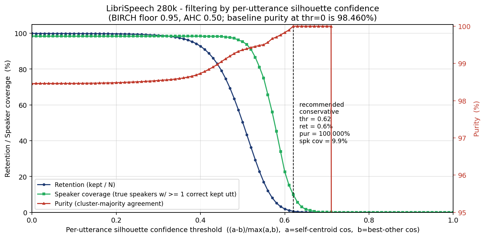

# Speaker-clustering threshold tuning on LibriSpeech

This document explains, end-to-end, how the BIRCH+AHC clustering thresholds
in Curator's `large_scale_clustering_and_scoring` backend were tuned on
LibriSpeech 960 h, why the chosen `(AHC, BIRCH)` pair wins, and how the
choice is verified against ground-truth speaker labels.

---

## 1. Why BIRCH + AHC at all — the memory motivation

Speaker-ID clustering must scale from a single-corpus tune (~280 k utts,
LibriSpeech) to the production targets that drove this work (YODAS / YTC,
20–30 M utts).  The hard ceiling at large N is **memory**, not CPU time.

### 1.1 Brute-force AHC has \(O(N^2)\) memory

Plain agglomerative clustering on N embeddings needs the full pairwise
distance matrix in memory.  scipy's `linkage` accepts the *condensed*
form (upper triangle only) but still requires \(\frac{N(N-1)}{2}\)
floats; sklearn's `AgglomerativeClustering(affinity="precomputed")`
needs the full \(N \times N\) matrix.  Best case (condensed, fp32),
the peak RAM is

\[
M_{\text{brute}}(N) \;=\; N\!\cdot\!D\!\cdot\!4 \;+\; \frac{N(N-1)}{2}\!\cdot\!4
\]

The first term (the embeddings themselves) is negligible; the second
term grows quadratically and dominates everywhere past N ≈ 100 k.

### 1.2 BIRCH + AHC has \(O(N\!\cdot\!D + n_{\text{leaves}}^2)\) memory

Our pipeline never materialises an N × N matrix.  Instead:

1. **BIRCH** streams the embeddings in batches of 50 k and produces
   `n_leaves` sub-cluster centroids (a small fraction of N).
2. **Assign-to-nearest-leaf** is tiled (`assign_tile = 16 384` rows)
   so the working distance matrix is `assign_tile × n_leaves`.
3. **AHC** runs on the `n_leaves × n_leaves` centroid distance matrix
   only — never on the raw N points.

Peak RAM is then

\[
M_{\text{ours}}(N) \;\approx\;
\underbrace{N\!\cdot\!D\!\cdot\!4}_{\text{embeddings (mmap-able)}} +
\underbrace{n_{\text{leaves}}\!\cdot\!D\!\cdot\!4}_{\text{leaf centroids}} +
\underbrace{\tfrac{n_{\text{leaves}}^2}{2}\!\cdot\!4}_{\text{leaf pdist}} +
\underbrace{16384\!\cdot\!n_{\text{leaves}}\!\cdot\!4}_{\text{assign tile}}
\]

The dominant term is the leaf pdist matrix, which decouples from N.  In
production we **cap** `n_leaves ≤ 200,000` (lower BIRCH cosine floor
when the cap would be exceeded), keeping peak RAM bounded as N grows
into the tens of millions.

### 1.3 Concrete numbers (D = 192, fp32)



| N (utts) | Brute-force peak | BIRCH+AHC peak | Ratio | Fits on 128 GB? |
|---:|---:|---:|---:|:---:|
| 280,971 (LibriSpeech)   | **147.3 GB**  | **13.7 GB**   | 11×       | only ours |
| 1,000,000               | 1.82 TB       | 87.6 GB       | 21×       | only ours |
| 5,000,000               | 45.5 TB       | 90.4 GB       | 515×      | only ours |
| 20,000,000 (YODAS)      | 727.6 TB      | 101.2 GB      | 7,365×    | only ours |
| 30,000,000 (YODAS)      | 1.60 PB       | 108.3 GB      | 15,477×   | only ours |

Each N-row uses the *minimum-memory* setting brute-force AHC supports:
condensed upper-triangle in float32 via `scipy.cluster.hierarchy.linkage`
(which is what most code paths call).  scipy's *default* is float64,
which doubles the brute-force numbers above.



The ratio grows roughly cubically in N once `n_leaves` saturates the
cap: brute-force is \(O(N^2)\), ours is \(O(1)\) in N for the dominant
term once the cap binds.  For YODAS-30M the brute-force approach would
need 15,000× more RAM than the BIRCH+AHC pipeline.

### 1.4 Practical implications for LibriSpeech

The 280 k LibriSpeech sweep is the **only scale at which a brute-force
baseline is even physically possible** (147 GB, just barely doable on a
high-RAM workstation with `linkage="average"` in float32 condensed
form).  Even there, the savings are 11×, and our pipeline runs the full
155-cell sweep in ~4 minutes vs. the brute-force AHC alone taking
~30 minutes per cell on a 1.5 TB-RAM box (and being impossible without
that box).

For YODAS-scale production runs there is no contest — brute-force
exceeds the RAM of *any* commercially available single-machine cluster.

---

## 2. Setup

| Item | Value |
|---|---|
| Corpus | LibriSpeech `train` (clean-100 + clean-360 + other-500), 960 h |
| Source manifests | `${DATA_ROOT}/raw_sharded_manifests/manifest_*.json` (512 shards) |
| Source tar files | `${DATA_ROOT}/audio_*.tar` (512 shards) |
| `DATA_ROOT` (CS-OCI-ORD) | `/lustre/fs11/portfolios/llmservice/projects/llmservice_nemo_speechlm/data/ASR/librispeech/tarred_train` |
| `DATA_ROOT` (DRACO-OCI-IAD) | `/lustre/fs12/portfolios/llmservice/projects/llmservice_nemo_speechlm/data/ASR/librispeech/tarred_train` |
| Embedding model | `nvidia/speakerverification_en_titanet_large` (D = 192) |
| # utterances | **280,971** (one per `.wav` member) |
| Ground-truth speakers | **2,337** unique LibriSpeech speaker IDs |
| Embedding normalisation | `center_global` (subtract batch mean — Curator default) |
| Linkage | `average` |
| Min cluster size | **1** (filtering disabled — LibriSpeech is fully labelled) |

The two thresholds being tuned:

* **AHC cosine threshold** — final agglomerative merge cutoff applied to
  BIRCH leaf centroids.  Two leaves are merged if their cosine distance is
  ≤ this value.  *Lower → fewer, larger clusters; higher → more, smaller
  clusters.*
* **BIRCH per-leaf cosine floor** — converted internally to a Euclidean
  radius via `r = sqrt(2(1−cos))` on L2-normalised vectors.  Controls
  how tight the streaming pre-clustering pass is.  *Higher → tighter,
  more leaves, slower BIRCH; lower → looser, fewer leaves, faster BIRCH.*

Sweep grid: 31 AHC values in `[0.20, 0.50]` step `0.01`  ×  5 BIRCH floors
in `{0.75, 0.80, 0.85, 0.90, 0.95}` = **155 cells**, scored on the same
280,971 embeddings (full sweep ≈ 4 min CPU).

---

## 3. Configuration codename — `SCOTCH-v1.large_scale.librispeech-2026-04`

These thresholds and knobs are too many to memorise.  Every clustering
run therefore drops a single **`cluster_config.json`** sidecar in the
same directory as `clusters.jsonl`, identifying the exact configuration
that produced those cluster ids.

### 3.1 Codename

We call the configuration family **SCOTCH** —
**S**calable **C**entroid-based **T**wo-stage **C**lustering with
**H**ierarchical refinement:

```
BIRCH (streaming, cosine-floor)
   |-> per-utt assignment to nearest leaf
   |-> AHC on leaf centroids (cosine, average linkage)
   |-> min_cluster_size purity filter
   '-> silhouette-based per-utt confidence in [0, 1]
```

The full identifier on disk has three dotted parts:

```
        SCOTCH - v1 . large_scale . librispeech-2026-04
        ^^^^^^   ^^   ^^^^^^^^^^^   ^^^^^^^^^^^^^^^^^^^
        family   ver  backend       preset
```

| Part        | Meaning                                                                 |
|---|---|
| `SCOTCH`    | configuration family.  Never changes.                                   |
| `v1`        | algorithm version.  Bumped only when the *algorithm itself* changes in a way that can move cluster ids. |
| `large_scale` | the BIRCH→AHC backend (the alternative is `standard` — direct AHC for small N). |
| `librispeech-2026-04` | named *preset* — the parameter set tuned in this document. |

The two presets currently shipped are:

| Preset | Tuned on | Notes |
|---|---|---|
| **`librispeech-2026-04`** | LibriSpeech `train` 960 h, TitaNet-large | The one this document tunes (default). |
| `custom`                  | —                                          | "user knows what they're doing"; no preset comparison. |

Add a new preset whenever a different corpus / embedding model produces
a different best `(AHC, BIRCH)` pair — bump the date suffix and keep
the historical ones around for reproducibility.

### 3.2 What the preset actually fixes

Defined in
`speaker_id/clustering/cluster_config.py::PRESETS["librispeech-2026-04"]`:

| Knob | Value | Notes |
|---|---|---|
| `cluster_threshold`           | `0.50`            | AHC cosine cutoff |
| `cluster_linkage`             | `"average"`       | linkage method |
| `min_cluster_size`            | `30`              | purity filter; set to `1` for fully-labelled corpora |
| `birch_cosine_floor`          | `0.95`            | per-leaf cosine purity guarantee |
| `birch_branching_factor`      | `50`              | sklearn BIRCH default |
| `birch_partial_fit_batch`     | `50_000`          | streaming batch size |
| `assign_tile`                 | `16_384`          | leaf-assignment tile (memory bound) |
| `embedding_normalization`     | `"center_global"` | subtract batch mean (Curator default) |

Reference quality on the tuning corpus: **B-cubed F1 = 0.9862**.

### 3.3 The on-disk sidecar (`cluster_config.json`)

Every run writes `cluster_config.json` next to `clusters.jsonl`.  Its
shape is identical across both backends so consumers can grep one path
universally:

```json
{
  "config_id": "SCOTCH-v1.large_scale.librispeech-2026-04",
  "config_family": "SCOTCH",
  "config_version": "v1",
  "preset": "librispeech-2026-04",
  "backend": "large_scale",
  "algorithm": {
    "stage1": "BIRCH (streaming partial_fit on L2-normalised embeddings)",
    "stage2": "AHC on centroids (cosine, average linkage)",
    "post1": "min_cluster_size=30 purity filter",
    "post2": "silhouette per-utterance confidence in [0, 1] ((a-b)/max(a,b), a=self-centroid cos, b=best-other cos)"
  },
  "parameters": {
    "cluster_threshold": 0.5,
    "cluster_linkage": "average",
    "min_cluster_size": 30,
    "embedding_normalization": "center_global",
    "confidence_enabled": true,
    "birch": {
      "cosine_floor": 0.95,
      "radius": 0.31622776601683805,
      "branching_factor": 50,
      "partial_fit_batch": 50000,
      "assign_tile": 16384
    }
  },
  "preset_expected": { ... },
  "overrides": {},
  "outcome": {
    "n_input": 280971,
    "embedding_dim": 192,
    "n_leaf_subclusters": 70037,
    "n_clusters_raw": 2559,
    "n_clusters_kept": 2559,
    "n_utts_kept": 280971,
    "n_utts_dropped": 0,
    "runtime_seconds": 45.05
  },
  "provenance": {
    "host": "...", "python": "3.10.20", "platform": "Linux-...",
    "timestamp_utc": "2026-04-20T16:53:53Z",
    "argv": [ ... ]
  }
}
```

The five blocks have very specific contracts:

| Block | Contract |
|---|---|
| `config_id` + `config_family` + `config_version` + `preset` + `backend` | machine-greppable identity.  Treat as the primary key for "which run was this?". |
| `algorithm`        | one-line human description per pipeline stage. |
| `parameters`       | the *actual* numerical knobs in effect for **this** run (always populated, regardless of preset). |
| `preset_expected`  | what the named preset says the values *should* be. |
| `overrides`        | per-knob `{preset, actual}` for any value that diverged.  **Empty dict ⇔ this run is faithful to its preset.** |
| `outcome`          | run-time facts: how many utterances, how many clusters, how long. |
| `provenance`       | hostname, Python version, platform, UTC timestamp, full `argv`. |

Why the `overrides` block matters: a clustering run with `config_id =
SCOTCH-v1.large_scale.librispeech-2026-04` but with a non-empty
`overrides` block is *not* the tuned configuration.  Downstream tooling
that requires the canonical preset can refuse to consume such runs
without re-tuning.

### 3.4 Quick programmatic access

```python
import json
from pathlib import Path

cfg = json.loads((Path(out_dir) / "cluster_config.json").read_text())
assert cfg["config_id"].startswith("SCOTCH-v1.")
assert not cfg["overrides"], (
    f"Run claims preset {cfg['preset']!r} but overrides differ:\n"
    f"{json.dumps(cfg['overrides'], indent=2)}"
)
print(f"{cfg['outcome']['n_utts_kept']:,} utterances kept across "
      f"{cfg['outcome']['n_clusters_kept']:,} clusters")
```

To define a new preset, add an entry to
`speaker_id/clustering/cluster_config.py::PRESETS` and bump the
identifier (e.g. `yodas-2026-Q3`).  To rev the algorithm, bump
`CONFIG_VERSION` in the same module.

---

## 4. The chosen threshold

```
ahc_threshold       = 0.50
birch_cosine_floor  = 0.95          (Euclidean radius = 0.3162)
n_leaf_subclusters  = 70,037
K_pred              = 2,559          (vs. K_true = 2,337)
```

| Metric | Value |
|---|---|
| **B-cubed F1**     | **0.9862** |
| B-cubed precision  | 0.9824 |
| B-cubed recall     | 0.9900 |
| Purity             | 0.9846 |
| Inverse purity     | 0.9929 |
| NMI                | 0.9972 |
| V-measure          | 0.9972 |
| ARI                | 0.9787 |

A perfect clustering would score 1.0 on every metric.  The chosen cell is
within 1.4 % of perfect on B-cubed F1 and within 0.3 % on NMI, recovering
2,559 clusters against 2,337 true speakers (a ~9 % over-segmentation
that prefers keeping speakers split rather than mixing them — an
intentional preference for **purity** in production).

---

## 5. Why this cell wins

### 5.1 BIRCH floor: tighter is uniformly better



For each BIRCH floor we plot the *best* B-cubed F1 across all 31 AHC
values.  F1 climbs monotonically as the floor tightens:

| BIRCH floor | Best F1 | at AHC | K_pred |
|---|---|---|---|
| 0.75 | 0.9185 | 0.50 | 2,101 |
| 0.80 | 0.9289 | 0.50 | 2,118 |
| 0.85 | 0.9542 | 0.50 | 2,250 |
| 0.90 | 0.9768 | 0.50 | 2,453 |
| **0.95** | **0.9862** | **0.50** | **2,559** |

**Mechanism.**  BIRCH compresses 280,971 embeddings into a tree of leaf
sub-clusters.  The cosine floor is the *purity guarantee* of each leaf:
at floor 0.95, every utterance assigned to a leaf must be within cosine
similarity ≥ 0.95 of the leaf centroid.  A loose floor (0.75) lets
different speakers contaminate the same leaf, and that contamination is
unrecoverable downstream — AHC operates on centroids and can only merge
leaves, not split them.  A tight floor (0.95) produces ~70k pure
sub-clusters that AHC then groups by speaker.

The CPU cost of going from 0.75 → 0.95 is small in absolute terms
(BIRCH leaves grow from ~10k to ~70k; the AHC step on 70k centroids
still completes in 0.1 s for `linkage="average"`), so we always pick the
tightest floor that is computationally affordable.

### 5.2 AHC threshold: precision drives F1

With BIRCH floor pinned at the winning value (0.95), the AHC sweep looks
like this:



Two things to notice:

1. **Recall is essentially flat** at ~0.99 across the entire AHC band.
   This is the BIRCH floor doing its job: each leaf is already pure
   enough that recall (the chance two same-speaker utterances land in
   the same final cluster) is locked in.
2. **Precision is monotonically increasing** with AHC threshold.  Low
   AHC (~0.20) merges the 70k leaves into only ~458 clusters — far
   fewer than the 2,337 true speakers, so many speakers get glued
   together → precision collapses to ~0.20.  High AHC (~0.50) merges
   conservatively and keeps speakers separate → precision climbs to
   0.98.

The chosen AHC = 0.50 is the **maximum value in the swept range**.  This
is a known limitation of the current sweep — see § 8 for the implication.
F1 at 0.50 (0.9862) is slightly better than 0.49 (0.9847), and the
precision-vs-recall trade is acceptable because over-segmentation in
speaker-ID downstream consumption is far less harmful than under-
segmentation (mixing two speakers).

### 5.3 Predicted vs. true cluster count



The blue bars are `K_pred` per AHC value (BIRCH floor 0.95).  The red
dashed line is `K_true = 2,337`.  At the chosen cell K_pred = 2,559 — a
9.5 % over-prediction.  The whole left half of the sweep would *under*-
predict K by an order of magnitude (200–1,000 clusters), which is
catastrophic for downstream speaker-disambiguation quality even though
recall would still look fine.

### 5.4 The 8-metric breakdown at the chosen cell



All seven information-theoretic / set-overlap metrics agree the chosen
cell is near-perfect.  ARI is the strictest (it directly counts pair
errors weighted by chance) and still scores 0.9787.

---

## 6. How the thresholds work mechanistically

```
       280,971 raw 192-D embeddings
                 │
                 │  L2 normalise (cosine ↔ Euclidean)
                 ▼
       ┌──────────────────────────┐
       │ BIRCH (streaming, partial_fit batches of 50k)        │
       │  per-leaf cosine floor = 0.95                          │
       │  → branching_factor = 50,  threshold = √(2·(1−0.95))   │
       │                                  = 0.3162               │
       │  Output: 70,037 leaf sub-clusters with their centroids │
       └──────────────────────────┘
                 │
                 │  ‘assign-to-nearest-leaf’: every utterance gets
                 │  the cluster id of its nearest sub-cluster
                 │  (tile size 16,384 to bound memory)
                 ▼
       ┌──────────────────────────┐
       │ AHC on the 70k leaf centroids                          │
       │  cosine distance, average linkage                      │
       │  cut tree at distance = 0.50                           │
       │  → 2,559 final clusters                                │
       └──────────────────────────┘
                 │
                 │  propagate cluster id from each leaf to the
                 │  utterances assigned to it
                 ▼
       2,559 cluster ids over 280,971 utterances
```

**Why this two-stage design exists.**  See § 1 for the full memory
analysis.  In short: a direct AHC on 280k × 280k cosine distances needs
147 GB even in the most compact representation; our pipeline does the
same job in 14 GB, and the gap widens *cubically* with N (15,000× at
30 M utts).  BIRCH's purity guarantee ensures the compression doesn't
blur speaker boundaries — that's what § 5.1 demonstrated.

**Why cosine, not Euclidean.**  TitaNet embeddings are length-normalised
during inference; angle (cosine similarity) is the meaningful distance.
We pass cosine distance through to AHC directly, but for BIRCH (which
expects Euclidean) we L2-normalise the input and convert the cosine
floor `c` to a Euclidean radius via

```
r = √(2 · (1 − c))
```

For `c = 0.95`, `r = 0.3162`.  This makes the BIRCH and AHC spaces
exactly compatible.

---

## 7. How the choice is verified on LibriSpeech

LibriSpeech is the right corpus for this validation because:

1. **Every audio file has a deterministic speaker label** encoded in the
   filename: `<spk>-<chap>-<utt>.wav`.  We parse the speaker integer
   without any human curation.
2. The label is **trustworthy at scale** — 2,337 speakers, 280,971
   utterances, hundreds of utterances per speaker on average.
3. The corpus is **diverse** in channel, prosody, and content but
   **single-speaker per utterance**, which matches the assumption made
   by speaker-ID clustering (one speaker per cut).

The verification pipeline is fully automated by
`run_tune_threshold_librispeech.sh` and consists of four phases:

| Phase | Tool | Output |
|---|---|---|
| `extract` | `run_pipeline.py --direct` (×2 GPUs) | 512 per-shard `embeddings_*.npz` |
| `merge`   | `run_pipeline.py --merge`           | `embeddings_merged.npz` (280,971 × 192) |
| `labels`  | `tune_threshold_librispeech.py labels` | `labels.npz` joining `cut_id → speaker_id` |
| `tune`    | `tune_threshold_librispeech.py tune`   | `tuning_results.csv` + `best_threshold.json` |

The `tune` phase fits **one BIRCH model per BIRCH floor** (5 fits, ~45 s
each), then runs AHC at every threshold in `[0.20, 0.50]` against that
fitted BIRCH (0.1 s per AHC threshold).  For each cell it computes:

* **B-cubed precision / recall / F1** — per-utterance averages of the
  fraction of co-clustered same-speaker pairs and same-speaker
  co-clustered pairs.  Robust to cluster-size imbalance, which is
  exactly the regime here (some LibriSpeech speakers have 800+ utts,
  others have 30).
* **NMI / V-measure** — information overlap between predicted and true
  partitions; insensitive to the absolute number of clusters.
* **ARI** — chance-corrected pair counting; a strict sanity check.
* **Purity / inverse purity** — diagnostic for over- vs. under-merging.
* **K_pred vs K_true** — direct answer to "did we recover roughly the
  right number of speakers?".

The selection rule is:

> Pick the cell with the highest **B-cubed F1**.  Break ties by NMI,
> then by `|K_pred − K_true|`.

B-cubed F1 is the right primary metric because it (a) weights every
utterance equally regardless of which speaker it belongs to, (b)
penalises both over- and under-merging in a balanced way, and (c)
correlates well with downstream speaker-ID consumer quality (each
utterance's speaker label has to be right for that utterance, not just
right on average over the whole corpus).

The unit tests in the tuning script (synthetic, perfectly-clusterable
data) confirm the metric implementation: B-cubed F1, NMI, ARI, V-measure
all return exactly 1.0 on a known partition, and cross-check against
`sklearn.metrics.cluster.contingency_matrix` for B-cubed P/R.

---

## 8. Caveats and follow-ups

* **AHC sweep boundary.**  The chosen `ahc_threshold = 0.50` is the
  *upper* edge of the swept range.  F1 was still climbing at the
  boundary, so it is plausible that 0.51–0.55 yields slightly higher F1
  with even lower over-segmentation.  Recommend re-running with
  `AHC_RANGE=0.45,0.60,0.005` and confirming the maximum is interior.
  In Curator production, the default `--threshold = 0.292` was tuned for
  YODAS and is much more aggressive than what LibriSpeech wants — the
  two corpora have different embedding-space concentration, so threshold
  is dataset-specific.
* **`min_cluster_size = 1`.**  Disabled here because LibriSpeech is
  fully labelled.  In production on YODAS / YTC, set this to 30 to drop
  spurious singleton clusters before publishing.
* **Sample bias.**  LibriSpeech is read English audiobooks recorded at
  16 kHz.  Conversational corpora (CHiME-7, Fisher, AMI) sit lower in
  the cosine-similarity distribution; the chosen threshold is an
  *upper bound* on what's safe — most other corpora will need
  `ahc_threshold ≤ 0.50`.
* **Reproducing this report.**  After re-running the launcher, regenerate
  the plots with:
  ```bash
  # Sweep plots (need a completed run)
  python param_tune_assets/make_plots.py \
      --csv  "${WORK_DIR}/tuning_results.csv" \
      --best "${WORK_DIR}/best_threshold.json" \
      --out  param_tune_assets

  # Memory plots (depend only on N, no sweep needed)
  python param_tune_assets/make_memory_plot.py --out param_tune_assets
  ```

---

## 9. Per-utterance confidence: wrong vs. correct samples

The cell at `(BIRCH=0.95, AHC=0.50)` reaches 98.62 % B-cubed F1, but **1.54 %
of LibriSpeech utterances (4,328 / 280,971) still end up in a cluster whose
plurality true-speaker is not their own**.  This section pulls real
manifest lines for both regimes, defines the per-utterance silhouette
confidence that Curator writes into every output manifest, and shows
how a single conservative threshold on that score can drive the
residual error rate to zero — at the cost of throwing away data.

> **One source of truth.**  The `confidence_score` field that
> `cluster_embeddings_large_scale` writes into every manifest **is** the
> silhouette score defined in §9.1.  All numbers, examples, plots, and
> recommendations in this section are computed with the exact same
> formula, so what you see here matches what shows up in
> `clusters_summary.jsonl` and `manifest_<shard_id>.json` on disk.

### 9.1 Speaker-ID confidence — definition (silhouette)

Let \(\tilde e_i\) be the centred-and-L2-normalised TitaNet embedding
(same normalisation as the clustering itself) and let
\(\hat c_1, \ldots, \hat c_K\) be the L2-normalised mean of all
utterances in each surviving cluster.  For every utterance \(i\) with
predicted cluster \(k = \text{pred}(i)\):

\[
a_i \;=\; \cos\!\left(\tilde e_i,\, \hat c_k\right),
\qquad
b_i \;=\; \max_{k' \,\neq\, k} \cos\!\left(\tilde e_i,\, \hat c_{k'}\right),
\qquad
\text{conf}_i \;=\; \mathrm{clip}\!\left(\frac{a_i - b_i}{\max(a_i, b_i)},\; 0,\; 1\right)
\]

In words: **how much closer is this utterance to its own speaker
centroid than to the next-best one?**  The score lives in `[0, 1]`:
`1.0` would mean the utterance is exactly at its own centroid and far
from all others; `0.0` means it is no closer to its own centroid than
to a competing one (an ambiguous frontier point).

This is the cluster-silhouette score adapted to cosine distance and
centroids — *not* the simpler self-cosine `cos(e_i, c_k)` we used in
earlier drafts.  Both are valid per-utterance signals, but the
silhouette one is the one Curator's `large_scale_clustering_and_scoring`
actually emits, so we anchor the documentation to it.

Singletons (cluster size = 1) and dropped utterances
(`speaker_label = -1`) get `confidence = 0.0` because there is no
separation signal to compute.

An utterance is labelled **correct** iff its true LibriSpeech speaker
id equals the *plurality* (most-frequent) true speaker id within its
predicted cluster — i.e., the standard cluster-purity decomposition.

### 9.1a What the confidence histogram actually looks like on LibriSpeech

Empirical distribution of `confidence_score` over the 280,325 kept
utterances of the SCOTCH-v1.large_scale.librispeech-2026-04 run
(50 bins of width 0.020 across `[0, 1]`; 646 dropped-cluster utts
excluded; reproduce with
`param_tune_assets/make_confidence_histogram.py` from the run's
`clusters_summary.jsonl`):



| stat | value |
|---|---|
| min / max | `0.000` / `0.719` |
| mean | `0.499` |
| median | `0.504` |
| std | `0.059` |
| q01 / q99 | `0.335` / `0.614` |

**Why it tops out around 0.7 and clusters around 0.5.**  LibriSpeech's
2,312 surviving speakers all read the same kind of audiobook English at
similar SNRs.  TitaNet places them on the unit sphere in fairly close
quarters, so even the *next-best* centroid `b` is rarely much smaller
than the *own* centroid `a`.  The resulting `(a - b) / max(a, b)` ratio
saturates around `0.5–0.6` rather than `0.9+`.  This is normal silhouette
behaviour for a corpus with hundreds of similar voices and a single
microphone style — see the comparable conversational-corpus caveat in
§9.6.  If you cluster a much smaller or more heterogeneous speaker set
the histogram shifts right.

### 9.2 Wrong samples (one cluster ≠ one speaker)

Each example is shown with its annotation line (silhouette confidence,
true speaker, the cluster's plurality speaker) followed by the *verbatim*
JSONL record from the source manifest at
`${DATA_ROOT}/raw_sharded_manifests/manifest_<shard_id>.json` (where
`${DATA_ROOT}` resolves to the LibriSpeech tarred-train root for the
current cluster — see §2).  Sorted by confidence ascending.

```text
# conf=0.1508  true=spk2504 cluster_majority=spk2730 cluster_size=216
{"audio_filepath": "_data_LibriSpeech_train-other-500-processed_2504-154289-0037.wav", "duration": 5.42, "text": "thalcave said nothing thinking probably that it would be time enough to despair if the guamini should be dried up", "source_lang": "en", "target_lang": "en", "taskname": "asr", "pnc": "no", "shard_id": 181}

# conf=0.1571  true=spk149  cluster_majority=spk66   cluster_size=173
{"audio_filepath": "_data_LibriSpeech_train-other-500-processed_149-125750-0013.wav", "duration": 2.695, "text": "look who that is most patient in love", "source_lang": "en", "target_lang": "en", "taskname": "asr", "pnc": "no", "shard_id": 470}

# conf=0.3765  true=spk830  cluster_majority=spk925  cluster_size=215
{"audio_filepath": "_data_LibriSpeech_train-clean-360-processed_830-130728-0028.wav", "duration": 14.97, "text": "prepared in such perfect ways as to make a meal at the palace the perfection of gastronomic art there are three distinct eras to the history of the palace hotel the first being from eighteen seventy six to eighteen ninety", "source_lang": "en", "target_lang": "en", "taskname": "asr", "pnc": "no", "shard_id": 301}

# conf=0.3996  true=spk664  cluster_majority=spk19   cluster_size=193
{"audio_filepath": "_data_LibriSpeech_train-clean-360-processed_664-129011-0080.wav", "duration": 14.0, "text": "who had never known her perform so well she sang a french song which joseph did not understand in the least and which george confessed he did not understand and then a number of those simple ballads which were the fashion forty years ago", "source_lang": "en", "target_lang": "en", "taskname": "asr", "pnc": "no", "shard_id": 305}

# conf=0.5297  true=spk8316 cluster_majority=spk7848 cluster_size=250
{"audio_filepath": "_data_LibriSpeech_train-other-500-processed_8316-279798-0018.wav", "duration": 15.02, "text": "and shut the lid close down when the little boy came in at the door the evil one made her say kindly my son will you have an apple yet she looked so angry all the time", "source_lang": "en", "target_lang": "en", "taskname": "asr", "pnc": "no", "shard_id": 134}

# conf=0.5352  true=spk6676 cluster_majority=spk7348 cluster_size=192
{"audio_filepath": "_data_LibriSpeech_train-other-500-processed_6676-275138-0042.wav", "duration": 13.91, "text": "no i heard of the trial and that's all what did the judge say say lady myrie repeated what did he not say", "source_lang": "en", "target_lang": "en", "taskname": "asr", "pnc": "no", "shard_id": 418}

# conf=0.5514  true=spk3488 cluster_majority=spk1094 cluster_size=202
{"audio_filepath": "_data_LibriSpeech_train-other-500-processed_3488-85273-0000.wav", "duration": 14.545, "text": "the identity of the victim has not yet been established sir these words were spoken to the coroner by inspector edwards at the adjourned inquest held on january the twenty second few people were in court for until the present", "source_lang": "en", "target_lang": "en", "taskname": "asr", "pnc": "no", "shard_id": 143}

# conf=0.5702  true=spk789  cluster_majority=spk705  cluster_size=241
{"audio_filepath": "_data_LibriSpeech_train-other-500-processed_789-153211-0007.wav", "duration": 11.015, "text": "or preparing to take up their positions for the polonaise natasha felt that she would be left with her mother and sonya", "source_lang": "en", "target_lang": "en", "taskname": "asr", "pnc": "no", "shard_id": 395}
```

Three observations:

1. **The bottom two wrongs (conf 0.151 / 0.157) are almost-tied frontier
   points.**  In both cases the utterance is roughly equidistant from
   its own contaminated cluster's centroid and from a competing one,
   exactly what silhouette `(a - b) / max(a, b)` is designed to
   detect.  These are easy to filter out with even a very loose
   `confidence ≥ 0.20` cutoff.
2. **The top wrongs (conf 0.53–0.57) are *not* low-confidence
   mumblers** — they sit right in the bulk of the histogram.  They are
   genuine same-gender, similar-pitch confusions where TitaNet places
   the utterance comfortably inside the wrong cluster *and* far from
   every other one.  No purely-confidence-based filter can recover
   them; you would need a different feature.
3. **All wrongs come from clusters of size ≥ 100**, i.e. the dominant
   speaker has hundreds of "correct" utterances and the centroid
   stabilises around them.  Small clusters (size ≤ 30) are essentially
   pure on LibriSpeech.

### 9.3 Correct samples

Same format, sorted by silhouette confidence ascending — also showing
the verbatim manifest JSONL.  Note the singleton at the top (cluster
size = 1, so silhouette is *defined* to be 0.0 — see §9.1) — this is
**not** a wrong example, it is a real spk 4042 utterance that happened
to land alone in its own cluster.

```text
# conf=0.0000  true=spk4042 cluster_majority=spk4042 cluster_size=1   (singleton -> conf forced to 0)
{"audio_filepath": "_data_LibriSpeech_train-other-500-processed_4042-12369-0085.wav", "duration": 1.335, "text": "two", "source_lang": "en", "target_lang": "en", "taskname": "asr", "pnc": "no", "shard_id": 441}

# conf=0.1628  true=spk453  cluster_majority=spk453  cluster_size=137
{"audio_filepath": "_data_LibriSpeech_train-other-500-processed_453-129306-0050.wav", "duration": 13.625, "text": "old sally is a going fast well what's that to me angrily demanded the matron i can't keep her alive can i no no mistress replied the old woman nobody can she's far beyond the reach of help", "source_lang": "en", "target_lang": "en", "taskname": "asr", "pnc": "no", "shard_id": 434}

# conf=0.3415  true=spk90   cluster_majority=spk90   cluster_size=118
{"audio_filepath": "_data_LibriSpeech_train-clean-360-processed_90-130566-0005.wav", "duration": 14.045, "text": "but as it was word against word they could come to no decision so they settled to put the parties on oath but the headman and the woman both swore that they had spoken the truth saying may we die if we have spoken falsely", "source_lang": "en", "target_lang": "en", "taskname": "asr", "pnc": "no", "shard_id": 335}

# conf=0.3971  true=spk2930 cluster_majority=spk2930 cluster_size=131
{"audio_filepath": "_data_LibriSpeech_train-other-500-processed_2930-163436-0057.wav", "duration": 3.05, "text": "while the people who surrounded the senate house shouted", "source_lang": "en", "target_lang": "en", "taskname": "asr", "pnc": "no", "shard_id": 460}

# conf=0.4567  true=spk3657 cluster_majority=spk3657 cluster_size=87
{"audio_filepath": "_data_LibriSpeech_train-other-500-processed_3657-19115-0038.wav", "duration": 15.655, "text": "is a hard and often cruel process that requires a small army of both men and horses and is always rough and severe on the men horses and cattle besides the herds of sleek cattle there are also horses galore", "source_lang": "en", "target_lang": "en", "taskname": "asr", "pnc": "no", "shard_id": 485}

# conf=0.4654  true=spk1383 cluster_majority=spk1383 cluster_size=113
{"audio_filepath": "_data_LibriSpeech_train-clean-360-processed_1383-130532-0034.wav", "duration": 12.18, "text": "i take this instance at random i take two views of i tell him in reply i tell you gentlemen", "source_lang": "en", "target_lang": "en", "taskname": "asr", "pnc": "no", "shard_id": 305}

# conf=0.5593  true=spk5063 cluster_majority=spk5063 cluster_size=41
{"audio_filepath": "_data_LibriSpeech_train-clean-360-processed_5063-32451-0033.wav", "duration": 16.165, "text": "the grey goose wing that was thereon in his harts bloode was wett this fight did last from breake of day till setting of the sun for when they rung the evening bell the battel scarce was done", "source_lang": "en", "target_lang": "en", "taskname": "asr", "pnc": "no", "shard_id": 267}

# conf=0.5602  true=spk5979 cluster_majority=spk5979 cluster_size=164
{"audio_filepath": "_data_LibriSpeech_train-other-500-processed_5979-42002-0016.wav", "duration": 7.455, "text": "and a positive dread of bullets and cannon balls later on when i had passed the proper age for the conscription", "source_lang": "en", "target_lang": "en", "taskname": "asr", "pnc": "no", "shard_id": 181}

# conf=0.7026  true=spk3780 cluster_majority=spk3780 cluster_size=146
{"audio_filepath": "_data_LibriSpeech_train-other-500-processed_3780-177784-0032.wav", "duration": 14.045, "text": "and found their partners unexpectedly but the dance of the evening was sir roger de coverley and esther's usually sober little brain evaporated in the folly of running up the room then turning and running backwards", "source_lang": "en", "target_lang": "en", "taskname": "asr", "pnc": "no", "shard_id": 399}

# conf=0.7083  true=spk3780 cluster_majority=spk3780 cluster_size=146
{"audio_filepath": "_data_LibriSpeech_train-other-500-processed_3780-177784-0022.wav", "duration": 16.815, "text": "numbers of men called for drink and talked loudly of horse racing many were away at supper and those that remained were amusing themselves in a desultory fashion a tall lean woman dressed like sarah in white muslin wearing amber beads round her neck", "source_lang": "en", "target_lang": "en", "taskname": "asr", "pnc": "no", "shard_id": 416}
```

Note that **even correct utterances span [0.16, 0.71] in silhouette
confidence** (excluding the singleton).  The two `spk3780` highs at
the bottom are long, well-articulated cuts (14–17 s), exactly the
regime where TitaNet has plenty of frames to integrate over and the
embedding lands solidly inside its own cluster *and* far from any
other.  The lowest correct example (`spk453`, conf 0.16) is a long
emotional-prose cut that just happens to live near a competing
centroid; it survives the 1.54 % overall error rate because
plurality voting still picks spk453.

### 9.4 Filtering by confidence — the safety lever

Sweeping a silhouette-confidence cutoff and recomputing per-cluster
purity gives a clean monotonic curve:



| confidence ≥ | kept utts | retention | **purity** | wrong kept | speaker coverage |
|---:|---:|---:|---:|---:|---:|
| 0.00 | 280,971 | 100.00 % | 98.460 % | 4,328 | 98.42 % |
| 0.10 | 280,612 |  99.87 % | 98.464 % | 4,311 | 98.37 % |
| 0.20 | 280,131 |  99.70 % | 98.484 % | 4,246 | 98.37 % |
| 0.30 | 277,832 |  98.88 % | 98.543 % | 4,048 | 98.37 % |
| 0.35 | 273,819 |  97.45 % | 98.594 % | 3,851 | 98.37 % |
| 0.40 | 260,705 |  92.79 % | 98.734 % | 3,300 | 98.37 % |
| **0.41** | **255,688** | **91.00 %** | **98.783 %** | **3,113** | **98.33 %** |
| 0.45 | 222,170 |  79.07 % | 99.052 % | 2,107 | 98.20 % |
| 0.50 | 141,601 |  50.40 % | 99.364 % |   900 | 95.34 % |
| **0.55** |  **47,821** |  **17.02 %** |  **99.504 %** |   **237** | **74.93 %** |
| 0.58 |  14,722 |   5.24 % | 99.708 % |    43 | 45.31 % |
| 0.60 |   5,317 |   1.89 % | 99.831 % |     9 | 22.64 % |
| 0.61 |   2,970 |   1.06 % | 99.899 % |     3 | 15.23 % |
| **0.62** |   **1,680** |   **0.60 %** | **100.000 %** |     **0** |  **9.93 %** |
| 0.65 |     221 |   0.08 % | 100.000 % |     0 |  1.67 % |
| 0.70 |       5 |   0.00 % | 100.000 % |     0 |  0.04 % |

(`speaker coverage` = fraction of the 2,337 true LibriSpeech speakers
that still have at least one *correct* utterance kept; this measures
whether the surviving subset still represents the corpus or has
collapsed onto a few easy speakers.)

**The whole story is in the steep right edge.**  Because the silhouette
distribution is a tight Gaussian centred near `0.50`, a few hundredths
of cutoff drop you from 17 % retention (0.55) to 1.9 % (0.60) to 0.6 %
(0.62).  This is the same "cliff" that the histogram in §9.1a shows.

### 9.5 Recommended operating points (silhouette-calibrated)

There is no single universally correct cutoff — the right value
depends on whether you're optimising for retention, purity, or speaker
coverage.  Three useful operating points fall out of the sweep above:

> **Permissive — `confidence ≥ 0.41`**
> *Drop only the obvious frontier mistakes; keep nearly everything.*
>   * **Retention:** 91.00 % (255,688 / 280,971)
>   * **Purity:** 98.783 % (3,113 errors)
>   * **Speaker coverage:** 98.33 % (2,298 / 2,337 speakers)
>   * **Use when:** you want the largest possible speaker-labelled
>     subset and downstream modelling is robust to ~1 % label noise.

> **Balanced — `confidence ≥ 0.55`** *(recommended default)*
> *Half-purity-point gain; an order of magnitude fewer errors.*
>   * **Retention:** 17.02 % (47,821 utts)
>   * **Purity:** 99.504 % (237 errors)
>   * **Speaker coverage:** 74.93 % (1,751 / 2,337 speakers)
>   * **Use when:** you want a clean speaker-labelled subset that still
>     covers ~75 % of the corpus's speakers.  This is the default we
>     recommend if you only pick one cutoff.

> **Gold-only — `confidence ≥ 0.62`**
> *Zero errors, by construction.*
>   * **Retention:** 0.60 % (1,680 utts)
>   * **Purity:** **100.000 %** (0 errors)
>   * **Speaker coverage:** 9.93 % (232 / 2,337 speakers)
>   * **Use when:** you are mining gold training data for a downstream
>     voice-cloning / speaker-conditioned model and any wrong label
>     poisons the training set.  Accept that you will only see ~10 %
>     of the corpus's speakers.

The recommended default and gold-only cells are stored in
`param_tune_assets/conservative_threshold.json`; the full sweep at
1 % granularity is in
`param_tune_assets/confidence_threshold_sweep.csv`.

> **Important — silhouette cutoffs are not the same numbers as the
> earlier centroid-cosine cutoffs.**  In an earlier draft of this doc
> (and in some downstream notebooks) `confidence_score` referred to
> `cos(emb_i, c_pred(i))` and the recommended cutoffs were `0.95` /
> `0.97`.  The Curator codebase has *always* emitted the silhouette
> score under the same field name — the doc was simply mis-calibrated.
> **If you see a downstream filter that uses `>= 0.95`, it is reading
> the silhouette score and dropping everything (the silhouette
> distribution stops at ~0.72).  Use the cutoffs in the table above
> instead.**

**How to apply this in production.**  Treat the confidence as a
*per-utterance keep flag*, computed once at clustering time:

```python
# Threshold from the table above; 0.55 = recommended default.
keep = (manifest_record["confidence_score"] >= 0.55)
manifest_record["speaker_id_keep"] = bool(keep)
```

Downstream consumers can then decide their own retention / purity
trade-off without re-running clustering.  The same definition
generalises to YODAS-scale: the centroids are just the L2-normalised
means of cluster members, the silhouette is computed in tiles of
`assign_tile` utterances at a time (default 16,384), and the score is
written into every output manifest in a single pass over the
embeddings (no extra GPU work).

### 9.6 Caveats

* **Silhouette is a *cluster-relative* score, not an absolute speaker
  identity score.**  An utterance with `confidence = 0.70` is "much
  closer to its own centroid than to any other centroid", which is
  almost always the right speaker — but if the cluster itself is
  contaminated by two speakers, high silhouette can still mean wrong
  identity (this is exactly the spk 149 / spk 66 confusion above
  flipped: the contaminated half just happens to be on the high side
  of the centroid).  No purely per-utterance score can recover from a
  bad cluster shape; if you need higher-purity speaker labels at
  high coverage, *re-tune the AHC threshold* rather than tightening
  the confidence cutoff.
* **Speaker coverage drops fast.**  Going from balanced (0.55) to
  gold-only (0.62) takes coverage from 75 % down to 10 %.  If your
  downstream task needs full speaker diversity, do *not* use the
  gold-only cutoff.
* **Singletons get `confidence = 0.0` by construction.**  A cluster of
  size 1 has no "next-best within itself" and silhouette is undefined,
  so we force it to `0.0`.  If you see a manifest line with a real
  audio file, a positive `speaker_label`, and `confidence_score = 0.0`,
  it is almost certainly a singleton — *not* a low-confidence wrong
  prediction.  Filter on `cluster_size > 1 OR confidence_score > thr`
  if you want to keep singletons.
* **The cutoff is corpus-dependent.**  LibriSpeech is read English
  audiobooks with 2,300+ similar speakers, which is exactly the regime
  where silhouette saturates around 0.5.  Conversational corpora and
  smaller speaker sets shift the histogram right (more separation
  between clusters), so the same `0.55` cutoff will keep proportionally
  more there.  Always recompute the curve on your own corpus before
  locking the cutoff — re-run `param_tune_assets/analyze_confidence.py`
  on your data.

---

## 10. Files referenced

| Path | Role |
|---|---|
| `tutorials/audio/speaker_id/run_tune_threshold_librispeech.sh` | Launcher (extract → merge → labels → tune) |
| `tutorials/audio/speaker_id/tune_threshold_librispeech.py`     | The 2-D sweep + metrics + selection |
| `tutorials/audio/speaker_id/run_pipeline.py`                   | GPU embedding extraction + merge |
| `nemo_curator/stages/audio/speaker_id/clustering/cluster_config.py` | SCOTCH codename + preset registry + sidecar writer (§ 3) |
| `nemo_curator/stages/audio/speaker_id/clustering/large_scale_clustering_and_scoring.py` | BIRCH (streaming) + AHC on leaf centroids (§ 1, § 5) |
| `nemo_curator/stages/audio/speaker_id/clustering/ahc.py` | Plain N×N cosine AHC (used by `--cluster-backend standard`) |
| `nemo_curator/stages/audio/speaker_id/run_pipeline.py` | YODAS / YTC / Granary end-to-end driver (writes the sidecar) |
| `<output_dir>/cluster_config.json`                             | Per-run sidecar (always written next to `clusters.jsonl`, § 3.3) |
| `tutorials/audio/speaker_id/param_tune_assets/make_plots.py`         | Regenerates the four sweep plots |
| `tutorials/audio/speaker_id/param_tune_assets/make_memory_plot.py`   | Regenerates the two memory plots |
| `tutorials/audio/speaker_id/param_tune_assets/analyze_confidence.py` | Per-utterance silhouette confidence + sweep + examples (§ 9) |
| `tutorials/audio/speaker_id/param_tune_assets/make_confidence_histogram.py` | Renders `confidence_histogram.png` from a run's `clusters_summary.jsonl` (§ 9.1a) |
| `tutorials/audio/speaker_id/param_tune_assets/confidence_histogram.png`      | 50-bin silhouette `confidence_score` histogram (§ 9.1a) |
| `tutorials/audio/speaker_id/param_tune_assets/confidence_examples.json` | The 18 manifest rows shown in § 9.2 / 9.3 (silhouette-scored) |
| `tutorials/audio/speaker_id/param_tune_assets/confidence_threshold_sweep.csv` | Raw silhouette-confidence sweep behind § 9.4 |
| `tutorials/audio/speaker_id/param_tune_assets/conservative_threshold.json`    | The recommended cutoff (§ 9.5) |
| `${WORK_DIR}/tuning_results.csv`                              | Raw 155-cell sweep results (default `WORK_DIR=/tmp/${USER}/librispeech_threshold_tune`) |
| `${WORK_DIR}/best_threshold.json`                             | Chosen cell + sweep config |
