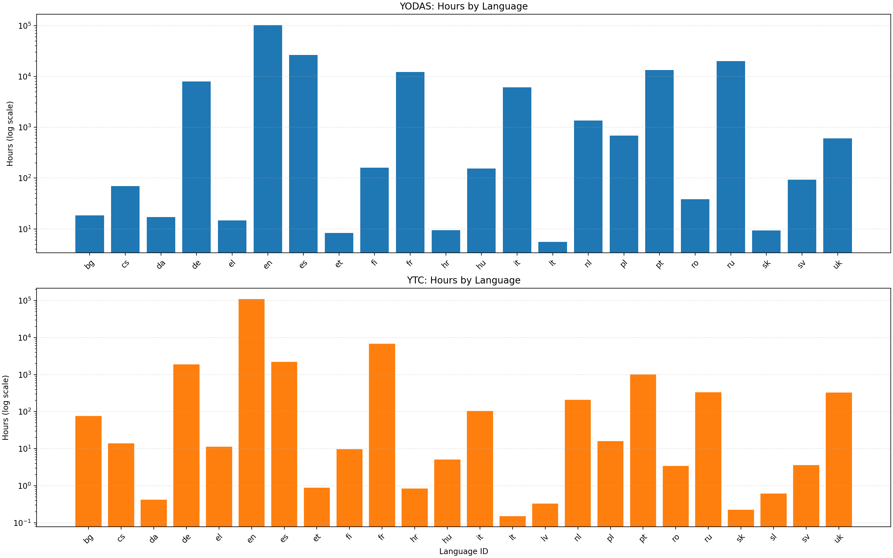

# Speaker ID for ASR Data — YODAS / YTC / Granary pipeline

Annotate NeMo-tarred ASR datasets (YODAS, YTC, Granary) with speaker embeddings
using the [WeSpeaker](https://github.com/wenet-e2c/wespeaker) platform.

> **Note** — this pipeline used to live in a standalone repo
> (`speaker_id_for_asr_data`).  Its core libraries have been **promoted into
> Curator** at `nemo_curator/stages/audio/speaker_id/` (clustering, embedding,
> data, multigpu, utils).  This tutorial folder hosts the end-user-facing
> driver scripts, examples, configs, and the YODAS/YTC end-to-end recipe.
>
> - **Tutorial entry point** (this folder): `run_pipeline.py`,
>   `tune_threshold_librispeech.py`, `scripts/`, `configs/`, `examples/`.
> - **Reusable code** (anywhere in Curator): `from
>   nemo_curator.stages.audio.speaker_id.clustering import ...`,
>   `... .embedding`, `... .data`, etc.

**One script. One command. Multiple languages.**

```bash
python run_pipeline.py --lang-file languages.json --base-dir /data/Yodas/
```

## Quick Start

```bash
# 1. Get Curator
git clone <curator-repo-url>
cd Curator/tutorials/audio/speaker_id
pip install -r requirements_yodas_pipeline.txt

# 2. Create a language list
echo '["da", "hr", "de"]' > languages.json

# 3. Configure S3 credentials (see S3 Configuration below)

# 4. Run everything
python run_pipeline.py --lang-file languages.json --base-dir /data/Yodas/
```

That's it. The pipeline downloads data, extracts wavs, computes speaker
embeddings (multi-GPU), and clusters speakers — for every language in your list.

If a language doesn't exist in the dataset, the pipeline prints a warning and
moves on:

```
WARNING: No such dataset for language 'kr', skipping.
```

## What It Does

The pipeline (`run_pipeline.py`) is a single `SpeakerIDPipeline` class that
runs four steps for each language:

### Step 1: Download (`_step_download`)

Downloads sharded audio tar archives and JSONL manifests from S3 (AIStore)
in parallel. Uses range-expansion syntax (`_OP_0..63_CL_`) to resolve all
shard filenames. Already-downloaded files are skipped automatically.

Skip with `--skip-download` if data is already on disk.

### Step 2: Extract (`_step_extract_tars`)

Extracts wav files from NeMo tar archives into `{lang_dir}/wavs/{subset}/`.

Skip with `--skip-extract` if wavs are already extracted.

### Step 3: Embed (`_step_build_manifest` + `_step_embed_single` / `_step_embed_multigpu`)

Builds a unified manifest from the sharded JSONL files, resolving absolute wav
paths. Then loads the WeSpeaker model and extracts speaker embeddings using
duration-aware dynamic batching (longest-first ordering for early OOM detection).

- **Single GPU:** Runs in-process on `cuda:0`.
- **Multi-GPU:** Launches one subprocess per GPU for CUDA isolation, shows a
  unified tqdm progress bar, then merges per-GPU shards.

Output: `embeddings.npy` (shape `(N, 256)`) and `utt_names.txt`.

Skip with `--skip-embed` to only download and extract.

### Step 4: Cluster (`_step_cluster`)

Runs Agglomerative Hierarchical Clustering (AHC) on the embeddings using
cosine similarity. Assigns every utterance a `cluster_id` (speaker) and an
optional `speaker_confidence` score.

Output: `clusters.jsonl` — one JSON object per line:

```json
{"utt_id": "0_by_whisper__00123", "cluster_id": 42, "speaker_confidence": 0.4735}
```

Skip with `--no-cluster`. Skip confidence scoring with `--no-confidence`.

## Language List File

Create a JSON file with the language codes you want to process:

```json
["da", "hr", "de", "cs", "en"]
```

The pipeline loops through each language. If a language doesn't exist in the
S3 bucket (or on disk when using `--skip-download`), it is skipped with a
warning and the pipeline continues to the next language.

## Dataset Language IDs and Stats

Source files:
- `/home/taejinp/projects/corpus_view/corpusview/corpus/asr/yodas.yaml`
- `/home/taejinp/projects/corpus_view/corpusview/corpus/asr/ytc.yaml`

Notes:
- Hours are aggregated per language across all entries in each YAML.
- The YAML metadata does not contain utterance counts, so utterances are `N/A`.

### Yodas Lang IDs (space-separated)

`bg cs da de el en es et fi fr hr hu it lt nl pl pt ro ru sk sv uk`

### YTC Lang IDs (space-separated)

`bg cs da de el en es et fi fr hr hu it lt lv nl pl pt ro ru sk sl sv uk`

### Yodas per-language stats

| Lang ID | Hours | Utterances |
|--------|------:|-----------:|
| bg | 18.551 | N/A |
| cs | 69.437 | N/A |
| da | 17.255 | N/A |
| de | 7925.484 | N/A |
| el | 14.758 | N/A |
| en | 102460.948 | N/A |
| es | 26613.252 | N/A |
| et | 8.375 | N/A |
| fi | 159.705 | N/A |
| fr | 12227.547 | N/A |
| hr | 9.428 | N/A |
| hu | 153.813 | N/A |
| it | 6145.072 | N/A |
| lt | 5.543 | N/A |
| nl | 1365.927 | N/A |
| pl | 684.660 | N/A |
| pt | 13423.677 | N/A |
| ro | 38.334 | N/A |
| ru | 20127.456 | N/A |
| sk | 9.359 | N/A |
| sv | 92.804 | N/A |
| uk | 606.248 | N/A |

### YTC per-language stats

| Lang ID | Hours | Utterances |
|--------|------:|-----------:|
| bg | 76.193 | N/A |
| cs | 14.067 | N/A |
| da | 0.417 | N/A |
| de | 1889.686 | N/A |
| el | 11.335 | N/A |
| en | 109541.059 | N/A |
| es | 2229.081 | N/A |
| et | 0.878 | N/A |
| fi | 9.698 | N/A |
| fr | 6773.856 | N/A |
| hr | 0.839 | N/A |
| hu | 5.058 | N/A |
| it | 104.557 | N/A |
| lt | 0.152 | N/A |
| lv | 0.330 | N/A |
| nl | 209.710 | N/A |
| pl | 15.970 | N/A |
| pt | 1011.654 | N/A |
| ro | 3.439 | N/A |
| ru | 332.934 | N/A |
| sk | 0.226 | N/A |
| sl | 0.614 | N/A |
| sv | 3.581 | N/A |
| uk | 326.420 | N/A |

### Hours Barplot (YODAS + YTC)



## CLI Arguments

| Argument | Default | Description |
|----------|---------|-------------|
| `--lang-file` | (required) | JSON file with list of language codes |
| `--base-dir` | `/disk_f_nvd/datasets/Yodas/` | Root data directory |
| `--model` | `voxceleb_resnet293_LM` | WeSpeaker model name or local path |
| `--num-gpus` | auto-detect | Number of GPUs for parallel extraction |
| `--batch-dur` | `600` | Max audio seconds per dynamic batch |
| `--threshold` | `0.363` | Cosine-similarity threshold for clustering |
| `--linkage` | `average` | AHC linkage method (`average`, `complete`, `single`) |
| `--cluster-backend` | `auto` | Clustering backend: `auto` / `standard` / `large_scale` (see [Large-Scale Clustering](#large-scale-clustering-datasets--500-hours)). `auto` consults the corpusview YAML for hours when available, else falls back to embedding count |
| `--min-cluster-size` | `30` | `large_scale` only: drop clusters with fewer than N utts (`cluster_id = -1`). Set to `1` to disable |
| `--auto-utterance-threshold` | `150000` | `auto` backend: switch to `large_scale` past this many utterances (~500 h) |
| `--s3cfg` | `~/.s3cfg[default]` | S3 credentials file + section |
| `--workers` | `16` | Parallel download threads |
| `--skip-download` | off | Skip S3 download |
| `--skip-extract` | off | Skip tar extraction |
| `--skip-embed` | off | Skip embedding extraction |
| `--no-cluster` | off | Skip speaker clustering |
| `--no-confidence` | off | Skip confidence scoring |
| `--force-download` | off | Re-download even if files exist |

## S3 Configuration

The pipeline reads credentials from `~/.s3cfg` (same format as s3cmd):

```ini
[default]
access_key = YOUR_ACCESS_KEY
secret_key = YOUR_SECRET_KEY
host_base = aistore-endpoint.example.com
bucket_location = us-east-1
use_https = True
```

Multiple sections are supported — select with `--s3cfg ~/.s3cfg[section_name]`.

## Default Model

**ResNet293_LM** (`voxceleb_resnet293_LM`)

- fbank frontend (80-dim log-mel, 25ms frame, 10ms shift)
- Calibrated on VoxCeleb1-O cleaned in this repo eval flow
- **EER: 0.521%**, **minDCF: 0.057**, **EER threshold: 0.362870**
- Fast inference, minimal dependencies
- Apache-2.0 license

Alternative: **W2V-BERT 2.0** (`w2vbert2_mfa`) — learned frontend, requires
`transformers` + `peft`. Pass `--model w2vbert2_mfa`. Use `--batch-dur 200`
or lower for learned frontends.

## Dynamic Batching

The extractor sorts utterances **longest-first** and fills batches until
total audio duration reaches `--batch-dur` seconds.

1. **Early OOM detection** — longest utterances run first, so memory issues
   surface in seconds, not hours.
2. **Efficient packing** — shorter utterances pack densely as the run
   progresses, ramping up throughput.

## Clustering Threshold

The cosine-similarity threshold is derived from **ResNet293_LM** on VoxCeleb1-O
cleaned (37,611 pairs), using:
`examples/voxceleb/v2/eval_resnet293_lm/run_eval.sh`.

| Metric (Vox1-O cleaned) | Value |
|-------------------------|-------|
| EER | **0.521%** |
| minDCF (p_target=0.01) | **0.057** |
| EER threshold | **0.362870** |
| **Default threshold used in this repo** | **0.363** |

Use `--threshold 0.363` as the default operating point for `voxceleb_resnet293_LM`.
If you want fewer false merges, use a slightly stricter value like `0.38`.

## Large-Scale Clustering (datasets > 500 hours)

The default clustering path (`speaker_id/clustering/ahc.py`) builds a full
`N x N` cosine-similarity matrix and so requires `O(N^2)` memory. That works
fine up to ~150,000 utterances (~500 hours of audio); past that, it OOMs on
even high-RAM machines.

For larger datasets, use the BIRCH + AHC pipeline in
`speaker_id/clustering/large_scale_clustering_and_scoring.py`:

| Stage | What it does | Memory |
|-------|--------------|--------|
| 1. BIRCH (streaming) | Compresses `N` utterances into `~10k–150k` leaf centroids via `partial_fit` | `O(n_subclusters * D)` |
| 2. Assign utts -> leaves | Tiled cosine-argmax — never materialises `(N, n_subclusters)` | `O(tile * n_subclusters)` |
| 3. AHC on centroids | Same SciPy AHC + cosine threshold as the standard path, but on `n_subclusters` instead of `N` | `O(n_subclusters^2)` |
| 4. Back-propagate | `centroid_label[leaf_idx]` lookup | `O(N)` |
| 5. **`min_cluster_size` filter** | **Drops clusters with `< min_cluster_size` utterances** (label set to `-1`) | `O(N)` |
| 6. Centroid-based confidence | Per-utterance silhouette vs speaker centroids — no `N x N` matrix | `O(N * K)` tiled |

The cosine-similarity threshold (`--threshold`) keeps the **same meaning**
as in the standard path — it's applied at the centroid AHC step, so a value
tuned on small data transfers as-is.

### When to use it

**Recommendation: switch to `large_scale` for any dataset above 500 hours of
audio**, or above 150,000 utterances. The CLI does this automatically when
`--backend auto` is set (the default).

| Dataset (Yodas) | Hours | Recommended backend |
|-----------------|------:|---------------------|
| `da` (Danish)   | 17    | `standard`          |
| `cs` (Czech)    | 69    | `standard`          |
| `pl` (Polish)   | 685   | **`large_scale`**   |
| `de` (German)   | 7,925 | **`large_scale`**   |
| `en` (English)  | 102,460 | **`large_scale`** |

### Filtering small clusters

The new path adds a `--min-cluster-size N` flag (default **30**) that drops
small / noisy clusters from the output by setting their `cluster_id` to `-1`.
This is the **purity-first** filter for downstream training-data curation
where the long tail of singletons / tiny clusters is not useful.

| `min_cluster_size` | Typical effect on a 30M-utt dataset |
|-------------------:|--------------------------------------|
| 1 (no filter)      | Keep everything; ~50% of clusters are singletons |
| 5                  | Drops ~10–15% of utterances |
| 30 (default)       | Drops ~30–50% of utterances; survivors are well-attested speakers |
| 100                | Drops ~50–70% of utterances; only major speakers remain |

Inspect dropped utterances by filtering for `cluster_id == -1` in
`clusters.jsonl`.

### Usage

```bash
# Auto: picks large_scale for >150k utterances (>500h)
python scripts/cluster_speakers.py \
    --embeddings-dir /disk_f_nvd/datasets/Yodas/de/wespeaker_embeddings/ \
    --threshold 0.363

# Explicit large-scale, with custom min cluster size:
python scripts/cluster_speakers.py \
    --embeddings-dir /disk_f_nvd/datasets/Yodas/de/wespeaker_embeddings/ \
    --backend large_scale \
    --min-cluster-size 30 \
    --threshold 0.363
```

Or programmatically:

```python
from nemo_curator.stages.audio.speaker_id.clustering.large_scale_clustering_and_scoring import (
    cluster_embeddings_large_scale,
    recommend_clustering_method,
)

backend = recommend_clustering_method(num_hours=685.0)   # -> "large_scale"

labels, confidence, stats = cluster_embeddings_large_scale(
    embeddings,                  # (N, D) float32
    threshold=0.363,
    min_cluster_size=30,
)
# labels[i] == -1  means utterance i was dropped by the size filter
```

## Speaker-ID Confidence

Every utterance in `clusters.jsonl` gets a `speaker_confidence` score (0 to 1).

- **Cohesion (a)** — average cosine similarity to own cluster
- **Separation (b)** — average cosine similarity to nearest rival cluster
- `confidence = clamp((a - b) / max(a, b), 0, 1)`

**Recommended filter: `speaker_confidence >= 0.2`** keeps ~67% of utterances
with reliable speaker labels.

```python
import json

with open("clusters.jsonl") as f:
    records = [json.loads(line) for line in f]

reliable = [r for r in records if r["speaker_confidence"] >= 0.2]
print(f"Reliable: {len(reliable)}/{len(records)}")
```

## Examples

```bash
# Process 3 languages on 4 GPUs
python run_pipeline.py \
    --lang-file languages.json \
    --base-dir /data/Yodas/ \
    --num-gpus 4

# Data already downloaded, just embed + cluster
python run_pipeline.py \
    --lang-file languages.json \
    --base-dir /data/Yodas/ \
    --skip-download --skip-extract

# Use a different model with lower batch duration
python run_pipeline.py \
    --lang-file languages.json \
    --base-dir /data/Yodas/ \
    --model w2vbert2_mfa \
    --batch-dur 200

# Only download and extract (no embedding or clustering)
python run_pipeline.py \
    --lang-file languages.json \
    --base-dir /data/Yodas/ \
    --skip-embed --no-cluster

# Custom S3 endpoint and default ResNet293_LM threshold
python run_pipeline.py \
    --lang-file languages.json \
    --base-dir /data/Yodas/ \
    --s3cfg ~/.s3cfg[pdx] \
    --threshold 0.363
```

## Output Structure

```
/data/Yodas/da/wespeaker_embeddings/
├── embeddings.npy       # (N, 256) float32
├── utt_names.txt        # N utterance IDs
├── clusters.jsonl       # speaker cluster assignments + confidence
└── wav.scp              # utterance -> wav path mapping
```

## Benchmark: Danish (da)

**Hardware:** 2x NVIDIA RTX 6000 Ada (48 GB each)

| Step | Time | Details |
|------|------|---------|
| S3 Download | 38s | 128 audio tars + 128 manifests, 2.2 GB |
| Tar Extraction | 3s | 13,312 wav files |
| Embedding Extraction | 3m 52s | 2 GPUs, SimAM_ResNet100 |
| Clustering | ~12s | 13,312 utts -> 1,786 speakers |
| **Total** | **~4m 45s** | **19.6 hours of audio** |

## License

Apache-2.0 (same as WeSpeaker)
