# Math Data Curation Pipeline

This example demonstrates a complete pipeline for curating mathematical content from Common Crawl, including CC Index lookup, text preprocessing, quality classification, deduplication, and LLM-based cleanup.

## Install
Use uv to create the project environment and install Curator with the math extra:

```bash
uv sync --extra math_cuda12
source .venv/bin/activate
```

**Note:** GPU detection - if `nvidia-smi` shows GPUs but examples log "No gpus found", `pynvml` may need to be reinstalled:
```bash
uv pip install --force-reinstall pynvml
```

## Prerequisites

### System Dependencies
- GPU(s) with CUDA for the Hugging Face model and vLLM
- Python environment with `nemo-curator[math_cuda12]` installed (uv sync above)
- Lynx system dependency for HTML rendering to text:
  - Ubuntu/Debian: `sudo apt-get update && sudo apt-get install -y lynx`
  - RHEL/Fedora: `sudo dnf install -y lynx` (or `sudo yum install -y lynx`)
  - Conda: `conda install -c conda-forge lynx`

### Common Crawl Index Requirements

The CC Index lookup script (`1_cc_index_lookup.py`) uses **cuDF for GPU-accelerated distributed joins** against a local CC Index

**Key points:**
- **Local CC Index required**: Download CC Index parquet files locally for GPU-accelerated joins
- **Distributed processing**: Uses Ray for distributed execution across multiple GPUs
- **cuDF joins**: GPU-accelerated inner joins for high performance
- **Broadcast pattern**: CC Index is loaded into Ray object store and broadcast to workers

**Download options:**

```bash
# Option 1: Download a single partition for testing (~1GB)
mkdir -p /tmp/cc-index/crawl=CC-MAIN-2024-10/subset=warc
wget -O /tmp/cc-index/crawl=CC-MAIN-2024-10/subset=warc/part-00000.parquet \
  "https://data.commoncrawl.org/cc-index/table/cc-main/warc/crawl=CC-MAIN-2024-10/subset=warc/part-00000-5bb2bfdd-dcc0-47b2-8a2d-f27c3c9bfe17.c000.gz.parquet"

# Option 2: Download full crawl index (~300GB compressed)
aws s3 sync s3://commoncrawl/cc-index/table/cc-main/warc/crawl=CC-MAIN-2024-10/ \
    /local/path/cc-index/crawl=CC-MAIN-2024-10/ --no-sign-request
```

## Understanding CC Index Lookup

Some datasets (OpenWebMath, InfiWebMath, MegaMath) only have URLs without WARC metadata. To fetch their content from Common Crawl, you first need to look up each URL's location in the CC Index.

The CC Index is [**publicly available on S3**](https://commoncrawl.org/access-the-data) and can be queried directly—no download required.

### How the Lookup Process Works

```
┌─────────────────────────┐         ┌───────────────────────────┐
│   Your Dataset          │         │   CC Index on S3          │
│   (e.g., OpenWebMath)   │         │   (queried directly)      │
├─────────────────────────┤         ├───────────────────────────┤
│ url                     │         │ url                       │
│ text (optional)         │         │ filename (WARC path)      │
│ ...other columns        │         │ offset (byte position)    │
└───────────┬─────────────┘         │ length (record size)      │
            │                       │ mime, status              │
            │                       └─────────────┬─────────────┘
            │                                     │
            └──────────────┬──────────────────────┘
                           │
                    INNER JOIN ON url
                           │
                           ▼
            ┌──────────────────────────────────────┐
            │        Enriched Dataset              │
            ├──────────────────────────────────────┤
            │ url                    ← original    │
            │ text                   ← original    │
            │ ...other columns       ← original    │
            │ warc_filename          ← from index  │
            │ warc_record_offset     ← from index  │
            │ warc_record_length     ← from index  │
            │ content_mime_type      ← from index  │
            │ http_status            ← from index  │
            └──────────────────────────────────────┘
                           │
                           ▼
            ┌──────────────────────────────────────┐
            │   2_text_preprocess.py --fetch-cc  │
            │   Uses WARC metadata to fetch actual │
            │   content from Common Crawl S3       │
            └──────────────────────────────────────┘
```

**Key Point:** The inner join means only URLs found in the CC Index are kept. URLs not in the specified crawl(s) are dropped.

### CC Index Location

The CC Index is stored at:
```
s3://commoncrawl/cc-index/table/cc-main/warc/crawl=CC-MAIN-YYYY-WW/
```

Each crawl snapshot (~2.5-3 billion URLs) has its own index partition. The script queries this directly via S3—no need to download hundreds of GB.

Available crawl IDs: https://index.commoncrawl.org/

## Dataset Configuration

Dataset configurations are stored in `datasets.json`. The `0_download.py` script reads this to download datasets from HuggingFace Hub.

Each dataset entry contains:
- `huggingface`: Source repository path for downloading
- `needs_cc_lookup`: Whether CC Index lookup is required (datasets without WARC metadata)
- `url_col`: Column name containing URLs (for datasets needing CC lookup)

### Pre-configured Datasets

| Dataset | HuggingFace Source | Has WARC Metadata | CC Index Lookup Required |
|---------|-------------------|-------------------|-------------------------|
| `FINEMATH_4PLUS` | HuggingFaceTB/finemath | ✅ Yes | No |
| `FINEMATH_3PLUS` | HuggingFaceTB/finemath | ✅ Yes | No |
| `OPENWEBMATH` | open-web-math/open-web-math | ❌ No | Yes |
| `OPC_FINEWEB_MATH` | OpenCoder-LLM/opc-fineweb-math-corpus | ❌ No | Yes |
| `MEGAMATH_PRO` | LLM360/MegaMath | ❌ No | Yes |
| `MEGAMATH_WEB` | LLM360/MegaMath | ❌ No | Yes |

### Custom Dataset Configuration

To add your own dataset, edit `datasets.json`:

```json
{
  "MY_DATASET": {
    "huggingface": "my-org/my-dataset",
    "needs_cc_lookup": true,
    "url_col": "url"
  }
}
```

For datasets with WARC metadata already included, set `"needs_cc_lookup": false` and omit `url_col`.


## Complete Pipeline Flow

```mermaid
flowchart TD
    subgraph download["Download (Optional)"]
        HF[("HuggingFace Hub")]
        DL["0_download.py"]
        RAW["Raw Parquet Files<br/><i>$MATH_DATA_DIR/raw/</i>"]
    end

    subgraph datasets["Input Datasets"]
        D1["FineMath 3+/4+<br/><i>Has WARC metadata</i>"]
        D2["OpenWebMath<br/>InfiWebMath<br/>MegaMath<br/><i>URL only</i>"]
    end

    subgraph step1["Step 1: CC Index Lookup"]
        CC_INDEX[("CC Index on S3<br/>s3://commoncrawl/cc-index/")]
        LOOKUP["1_cc_index_lookup.py"]
        ENRICHED["Enriched Dataset<br/><i>+ warc_filename</i><br/><i>+ offset, length</i>"]
    end

    subgraph step2["Step 2: Text Preprocessing"]
        CC_S3[("Common Crawl S3<br/>s3://commoncrawl/crawl-data/")]
        EXTRACT["2_text_preprocess.py<br/>--fetch-cc"]
        PREPROCESSED["Preprocessed Data<br/><i>text, url, type</i>"]
    end

    subgraph step3["Step 3: Quality Classification"]
        CLASSIFY["3_quality_classifier.py<br/><i>FineMath model</i>"]
        CLASSIFIED["Classified Data<br/><i>+ finemath_scores</i>"]
    end

    subgraph step4["Step 4: Deduplication"]
        DEDUP["4_deduplication.py<br/><i>Fuzzy matching</i>"]
        DEDUPED["Deduplicated Data"]
    end

    subgraph step5["Step 5: LLM Cleanup"]
        LLM["5_llm_cleanup.py<br/><i>vLLM + Phi-4</i>"]
        FINAL["Final Cleaned Data<br/><i>+ cleaned_text</i>"]
    end

    %% Download flow (optional)
    HF -->|"Download"| DL
    DL --> RAW
    RAW --> D1
    RAW --> D2

    %% Flow for datasets WITH WARC metadata
    D1 -->|"Has warc_filename,<br/>offset, length"| EXTRACT

    %% Flow for datasets WITHOUT WARC metadata
    D2 -->|"URL only"| LOOKUP
    LOOKUP <-->|"Query"| CC_INDEX
    LOOKUP --> ENRICHED
    ENRICHED --> EXTRACT

    %% Common flow after preprocessing
    EXTRACT <-->|"Fetch from Common Crawl<br/><i>HTTPS range requests</i>"| CC_S3
    EXTRACT --> PREPROCESSED
    PREPROCESSED --> CLASSIFY
    CLASSIFY --> CLASSIFIED
    CLASSIFIED --> DEDUP
    DEDUP --> DEDUPED
    DEDUPED --> LLM
    LLM --> FINAL

    %% ==========================================
    %% NVIDIA Color Scheme
    %% ==========================================
    %% Primary Green (#76b900): Python scripts / processing tools
    %% Dark Gray (#666666): Input and final datasets
    %% Light Gray (#999999): Intermediate outputs
    %% Purple (#7b68ee): Data stores, S3 buckets (cylinders)
    %% All boxes have black borders (#000000)

    classDef nvidiaGreen fill:#76b900,stroke:#000000,color:white,stroke-width:2px
    classDef nvidiaGray fill:#666666,stroke:#000000,color:white,stroke-width:2px
    classDef nvidiaLightGray fill:#999999,stroke:#000000,color:white,stroke-width:2px
    classDef nvidiaPurple fill:#c9b8e6,stroke:#000000,color:#333,stroke-width:2px

    %% Apply NVIDIA colors to nodes
    %% Input datasets - Gray
    class D1,D2 nvidiaGray

    %% External data stores - Purple (cylinders)
    class HF,CC_INDEX,CC_S3 nvidiaPurple

    %% Processing steps (Python scripts) - NVIDIA Green
    class DL,LOOKUP,EXTRACT,CLASSIFY,DEDUP,LLM nvidiaGreen

    %% Intermediate outputs - Light Gray
    class RAW,ENRICHED,PREPROCESSED,CLASSIFIED,DEDUPED nvidiaLightGray

    %% Final output - Gray
    class FINAL nvidiaGray

    %% Subgraph styling (Note: subgraph styling support varies by renderer)
    style download fill:transparent,stroke:#000000,stroke-width:2px,stroke-dasharray:5 5,color:#333
    style datasets fill:transparent,stroke:#000000,stroke-width:2px,color:#333
    style step1 fill:transparent,stroke:#000000,stroke-width:2px,color:#333
    style step2 fill:transparent,stroke:#000000,stroke-width:2px,color:#333
    style step3 fill:transparent,stroke:#000000,stroke-width:2px,color:#333
    style step4 fill:transparent,stroke:#000000,stroke-width:2px,color:#333
    style step5 fill:transparent,stroke:#000000,stroke-width:2px,color:#333

    %% Link/Arrow styling (Note: linkStyle support varies by renderer)
    linkStyle default stroke:#76b900,stroke-width:2px
```



### Pipeline Summary

| Step | Script | Input | Output | Required For |
|------|--------|-------|--------|--------------|
| — | `0_download.py` | HuggingFace | Raw parquet files | Optional (if data not already available) |
| 1 | `1_cc_index_lookup.py` | URLs | URLs + WARC metadata | Datasets without WARC metadata |
| 2 | `2_text_preprocess.py` | WARC metadata | Extracted text | All datasets |
| 3 | `3_quality_classifier.py` | Text | Text + quality scores | All datasets |
| 4 | `4_deduplication.py` | Scored text | Deduplicated text | All datasets |
| 5 | `5_llm_cleanup.py` | Deduplicated text | Cleaned text | Optional |

### Working Directory Setup

```bash
# Create working directories
export MATH_DATA_DIR=/tmp/math_pipeline
mkdir -p $MATH_DATA_DIR/{raw,enriched,preprocessed,classified,dedup_cache,dedup_ids,deduplicated,cleaned}
```

## Download Dataset from HuggingFace (Optional)

**Skip this step if you already have the dataset downloaded locally.**

The `0_download.py` script downloads math datasets from HuggingFace Hub. It reads dataset configurations from `datasets.json` and downloads parquet files to `$MATH_DATA_DIR/raw/<dataset_name>/`.

### Authentication (Optional)

For gated datasets or higher download rate limits, authenticate with HuggingFace:

```bash
# Option 1: Environment variable
export HF_TOKEN=hf_xxxxxxxxxxxxxxxxxxxxxxxxxxxxx

# Option 2: CLI login (saves token to ~/.cache/huggingface/token)
huggingface-cli login
```

Get your token at: https://huggingface.co/settings/tokens

### Download Commands

```bash
# List available datasets
python tutorials/math/0_download.py --list

# Download a specific dataset
python tutorials/math/0_download.py \
    --dataset FINEMATH_4PLUS \
    --output-dir $MATH_DATA_DIR/raw

# Download multiple datasets
python tutorials/math/0_download.py \
    --dataset FINEMATH_4PLUS OPENWEBMATH \
    --output-dir $MATH_DATA_DIR/raw

# Download only a few files for testing
python tutorials/math/0_download.py \
    --dataset FINEMATH_4PLUS \
    --output-dir $MATH_DATA_DIR/raw \
    --max-files 5

# Parallel download with 8 workers (recommended for large datasets)
python tutorials/math/0_download.py \
    --dataset FINEMATH_4PLUS \
    --output-dir $MATH_DATA_DIR/raw \
    --workers 8
```

**Output structure:**
```
$MATH_DATA_DIR/raw/
├── finemath_4plus/
│   ├── train-00000-of-00XXX.parquet
│   ├── train-00001-of-00XXX.parquet
│   └── ...
└── openwebmath/
    └── ...
```

**Dataset sizes (approximate):**
| Dataset | Tokens | Notes |
|---------|--------|-------|
| FINEMATH_4PLUS | ~9.5B | High-quality math (score ≥4) |
| FINEMATH_3PLUS | ~30B | Good quality math (score ≥3) |
| OPENWEBMATH | ~14B | Requires CC Index lookup |

## Step 1: CC Index Lookup (For Datasets Without WARC Metadata)

**Skip this step if your dataset already has WARC metadata** (like FineMath).

For datasets that only have URLs (OpenWebMath, InfiWebMath, MegaMath), enrich them with WARC metadata by joining against a local CC Index using GPU-accelerated cuDF.

### Download CC Index for Testing

First, download a small slice of the CC Index for local testing:

```bash
# Create directory structure
export CC_INDEX_DIR=/tmp/cc-index
mkdir -p "$CC_INDEX_DIR/crawl=CC-MAIN-2024-10/subset=warc"

# Download a single partition file (~1GB) for testing
# Get the exact filename from: https://data.commoncrawl.org/cc-index/table/cc-main/warc/crawl=CC-MAIN-2024-10/subset=warc/
wget -O "$CC_INDEX_DIR/crawl=CC-MAIN-2024-10/subset=warc/part-00000.parquet" \
  "https://data.commoncrawl.org/cc-index/table/cc-main/warc/crawl=CC-MAIN-2024-10/subset=warc/part-00000-5bb2bfdd-dcc0-47b2-8a2d-f27c3c9bfe17.c000.gz.parquet"
```

**Note**: Each CC Index crawl has ~300 partition files. For testing, one file is sufficient but match rates will be low.

### Run CC Index Lookup

```bash
# Run CC Index lookup (auto-detects all available crawls)
python tutorials/math/1_cc_index_lookup.py \
    --input $MATH_DATA_DIR/raw/openwebmath \
    --output $MATH_DATA_DIR/enriched \
    --cc-index-path $CC_INDEX_DIR

# Or specify specific crawls
python tutorials/math/1_cc_index_lookup.py \
    --input $MATH_DATA_DIR/raw/openwebmath \
    --output $MATH_DATA_DIR/enriched \
    --cc-index-path $CC_INDEX_DIR \
    --crawls CC-MAIN-2024-10 CC-MAIN-2024-18
```

**Output columns added:**

| Column | Description | Example |
|--------|-------------|---------|
| `warc_filename` | Path to WARC file | `crawl-data/CC-MAIN-2024-10/.../CC-MAIN-...warc.gz` |
| `warc_record_offset` | Byte offset in WARC | `123456789` |
| `warc_record_length` | Record size in bytes | `45678` |
| `content_mime_type` | MIME type | `text/html` |
| `http_status` | HTTP status code | `200` |

## Step 2: Text Preprocessing (decode → type-detect → extract)

Extract and preprocess text from raw web data:

```bash
# For datasets WITH WARC metadata (FineMath) - fetch directly from CC
python tutorials/math/2_text_preprocess.py \
    --input "$MATH_DATA_DIR/raw/finemath_4plus/**/*.parquet" \
    --output $MATH_DATA_DIR/preprocessed \
    --fetch-cc

# For datasets AFTER CC Index lookup (Step 1 output)
python tutorials/math/2_text_preprocess.py \
    --input "$MATH_DATA_DIR/enriched/*.parquet" \
    --output $MATH_DATA_DIR/preprocessed \
    --fetch-cc

# For local data with binary_content already present
python tutorials/math/2_text_preprocess.py \
    --input "tutorials/math/data/*.parquet" \
    --output $MATH_DATA_DIR/preprocessed

# Optional: Add --report-stats to see extraction statistics
python tutorials/math/2_text_preprocess.py \
    --input "tutorials/math/data/*.parquet" \
    --output $MATH_DATA_DIR/preprocessed \
    --report-stats
```

**Input**: Parquet files with either:
- `binary_content` (bytes), `url`, `mime_type` - for local data
- `warc_filename`, `warc_record_offset`, `warc_record_length` - with `--fetch-cc` flag

**Output**: JSONL files with columns: `text`, `url`, `type`

## Step 3: Quality Classification

Classify mathematical content quality using the FineMath model:

```bash
python tutorials/math/3_quality_classifier.py \
  --input "$MATH_DATA_DIR/preprocessed/*.jsonl" \
  --output $MATH_DATA_DIR/classified
```

**Input**: JSONL files from Step 2

**Output**: JSONL files with additional columns:
- `finemath_scores`: float scores (0..5)
- `finemath_int_scores`: integer scores (0..5)

**Example Output**:
```json
{"id":0,"text":"The derivative of x^2 is 2x.","finemath_scores":1.6865234375,"finemath_int_scores":2}
{"id":1,"text":"This is plain English without math.","finemath_scores":0.9130859375,"finemath_int_scores":1}
{"id":2,"text":"Let $f(x)=x^2$. Then $f'(x)=2x.","finemath_scores":2.291015625,"finemath_int_scores":2}
{"id":3,"text":"We have $$\\int_0^1 x^2 dx = 1/3.$$.","finemath_scores":1.9150390625,"finemath_int_scores":2}
```

## Step 4: Deduplication

Remove duplicate content using fuzzy deduplication:

```bash
python tutorials/math/4_deduplication.py \
  --input $MATH_DATA_DIR/classified \
  --cache_dir $MATH_DATA_DIR/dedup_cache \
  --duplicate_ids_dir $MATH_DATA_DIR/dedup_ids \
  --output $MATH_DATA_DIR/deduplicated \
  --input_filetype jsonl
```

**Input**: JSONL files from Step 3

**Output**: Deduplicated JSONL files

**Process**: Deduplication takes place in two stages:
1. First stage: Duplicate IDs are identified and saved to `duplicate_ids_dir`
2. Second stage: Duplicates are removed from the dataset

**Note**: The `cache_dir` must be empty between runs.

## Step 5: LLM Cleanup

Clean and refine text using a large language model. This step uses vLLM for efficient inference and requires a GPU.

**Note**: The `--chunk_data` flag is required to tokenize and chunk the input text before LLM processing.

```bash
python tutorials/math/5_llm_cleanup.py \
  --input $MATH_DATA_DIR/deduplicated \
  --output $MATH_DATA_DIR/cleaned \
  --model microsoft/phi-4 \
  --prompt HTML_TO_TEXT_PROMPT \
  --chunk_data \
  --chunk_length 5000 \
  --input_filetype jsonl
```

**Input**: JSONL files from Step 4

**Output**: JSONL files with additional columns:
- `cleaned_text`: LLM-processed text (or `label` if `--classification` is used)
- `chunk_id`: Sequential chunk identifier
- All original metadata fields preserved

**Additional options**:
- `--chunk_length`: Maximum tokens per chunk (default: 5000)
- `--classification`: Output classification labels instead of cleaned text
- `--max_model_len`: Maximum model context length (auto-detected if not specified)
- `--filter_by_n_tokens`: Filter chunks by token count
- `--temperature`, `--top_p`, `--top_k`, `--min_p`: Sampling parameters

## Alternative Prompts and Use Cases

The LLM cleanup step supports various specialized prompts for different mathematical content processing needs:

### Content Cleaning Prompts

**`HTML_TO_TEXT_PROMPT`** (default): Extract main content, preserve math, standardize equations to LaTeX `$...$`, remove boilerplate

**`HTML_TO_TEXT_PROMPT_CODE`**: For pages mixing math and significant code (e.g., computational math tutorials)

```bash
python tutorials/math/5_llm_cleanup.py \
  --input $MATH_DATA_DIR/deduplicated \
  --output $MATH_DATA_DIR/cleaned_code \
  --model microsoft/phi-4 \
  --prompt HTML_TO_TEXT_PROMPT_CODE \
  --chunk_data \
  --chunk_length 5000 \
  --input_filetype jsonl
```
