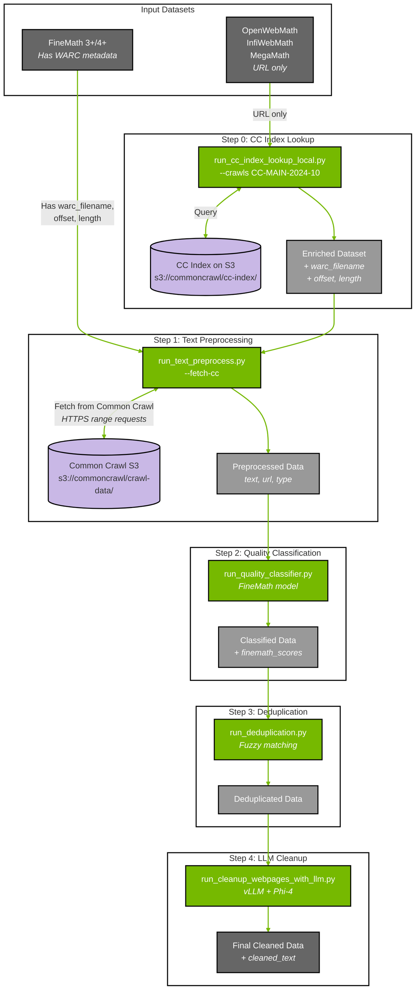

# Math Data Curation Pipeline

This example demonstrates a complete pipeline for curating mathematical content from Common Crawl, including CC Index lookup, text preprocessing, quality classification, deduplication, and LLM-based cleanup.

## Install
Use uv to create the project environment and install Curator with the math extra:

```bash
uv sync --extra math_cuda12
source .venv/bin/activate
```

**Note:** GPU detection - if `nvidia-smi` shows GPUs but examples log "No gpus found", `pynvml` may need to be reinstalled:
```bash
uv pip install --force-reinstall pynvml
```

## Prerequisites

### System Dependencies
- GPU(s) with CUDA for the HF model and vLLM
- Python environment with `nemo-curator[math_cuda12]` installed (uv sync above)
- Lynx system dependency for HTML rendering to text:
  - Ubuntu/Debian: `sudo apt-get update && sudo apt-get install -y lynx`
  - RHEL/Fedora: `sudo dnf install -y lynx` (or `sudo yum install -y lynx`)
  - Conda: `conda install -c conda-forge lynx`

### Common Crawl Index Requirements

**No local download required.** The CC Index lookup script (`run_cc_index_lookup_local.py`) queries the Common Crawl Index **directly from S3** using anonymous access.

**Key points:**
- **No CC Index download**: The script uses `polars.scan_parquet()` to stream CC Index parquet files directly from `s3://commoncrawl/cc-index/table/cc-main/warc/`
- **Anonymous S3 access**: No AWS credentials required—uses public anonymous access to Common Crawl's S3 bucket
- **Network requirement**: Ensure your environment can reach `s3://commoncrawl/` (port 443 HTTPS)
- **Memory efficient**: Polars' lazy evaluation means only matching records are materialized, not the entire index (~300GB+ per crawl)

**When to consider local index:**
- If you have unreliable network connectivity to S3
- If you're processing millions of URLs repeatedly (local index avoids repeated S3 queries)
- If your cluster has limited egress bandwidth

To download a CC Index snapshot locally (optional):
```bash
# Download a specific crawl's index (~300GB compressed)
aws s3 sync s3://commoncrawl/cc-index/table/cc-main/warc/crawl=CC-MAIN-2024-10/ \
    /local/path/cc-index/CC-MAIN-2024-10/ --no-sign-request
```

## Understanding CC Index Lookup

Some datasets (OpenWebMath, InfiWebMath, MegaMath) only have URLs without WARC metadata. To fetch their content from Common Crawl, you first need to look up each URL's location in the CC Index.

The CC Index is [**publicly available on S3**](https://commoncrawl.org/access-the-data) and can be queried directly—no download required.

### How the Lookup Process Works

```
┌─────────────────────────┐         ┌───────────────────────────┐
│   Your Dataset          │         │   CC Index on S3          │
│   (e.g., OpenWebMath)   │         │   (queried directly)      │
├─────────────────────────┤         ├───────────────────────────┤
│ url                     │         │ url                       │
│ text (optional)         │         │ filename (WARC path)      │
│ ...other columns        │         │ offset (byte position)    │
└───────────┬─────────────┘         │ length (record size)      │
            │                       │ mime, status              │
            │                       └─────────────┬─────────────┘
            │                                     │
            └──────────────┬──────────────────────┘
                           │
                    INNER JOIN ON url
                           │
                           ▼
            ┌──────────────────────────────────────┐
            │        Enriched Dataset              │
            ├──────────────────────────────────────┤
            │ url                    ← original    │
            │ text                   ← original    │
            │ ...other columns       ← original    │
            │ warc_filename          ← from index  │
            │ warc_record_offset     ← from index  │
            │ warc_record_length     ← from index  │
            │ content_mime_type      ← from index  │
            │ http_status            ← from index  │
            └──────────────────────────────────────┘
                           │
                           ▼
            ┌──────────────────────────────────────┐
            │   run_text_preprocess.py --fetch-cc  │
            │   Uses WARC metadata to fetch actual │
            │   content from Common Crawl S3       │
            └──────────────────────────────────────┘
```

**Key Point:** The inner join means only URLs found in the CC Index are kept. URLs not in the specified crawl(s) are dropped.

### CC Index Location

The CC Index is stored at:
```
s3://commoncrawl/cc-index/table/cc-main/warc/crawl=CC-MAIN-YYYY-WW/
```

Each crawl snapshot (~2.5-3 billion URLs) has its own index partition. The script queries this directly via S3—no need to download hundreds of GB.

Available crawl IDs: https://index.commoncrawl.org/

## Dataset Configuration

Dataset configurations are stored in `datasets.json`. This file defines:
- Input paths for each dataset
- Output directory names
- Whether CC Index lookup is required
- Column mappings for WARC metadata

### Pre-configured Datasets

| Dataset | HuggingFace Source | Has WARC Metadata | CC Index Lookup Required |
|---------|-------------------|-------------------|-------------------------|
| `FINEMATH_4PLUS` | HuggingFaceTB/finemath | ✅ Yes | No |
| `FINEMATH_3PLUS` | HuggingFaceTB/finemath | ✅ Yes | No |
| `OPENWEBMATH` | open-web-math/open-web-math | ❌ No | Yes |
| `INFIWEBMATH_4PLUS` | OpenCoder-LLM/opc-fineweb-math-corpus | ❌ No | Yes |
| `INFIWEBMATH_3PLUS` | OpenCoder-LLM/opc-fineweb-math-corpus | ❌ No | Yes |
| `MEGAMATH_PRO` | LLM360/MegaMath | ❌ No | Yes |
| `MEGAMATH_WEB` | LLM360/MegaMath | ❌ No | Yes |

### Custom Dataset Configuration

To add your own dataset, edit `datasets.json` or create a custom config file:

```json
{
  "MY_DATASET": {
    "huggingface": "my-org/my-dataset",
    "input": "/path/to/my/data/*.parquet",
    "output": "my_dataset_processed",
    "fetch_cc": true,
    "needs_cc_lookup": true,
    "url_col": "url",
    "columns": {
      "warc_filename": "warc_filename",
      "offset": "warc_record_offset",
      "length": "warc_record_length"
    }
  }
}
```

Use with a custom config:
```bash
python run_all_preprocess.py --output-base /output \
    --datasets-config /path/to/my_datasets.json \
    --datasets MY_DATASET \
    --crawls CC-MAIN-2024-10
```

## Complete Pipeline Flow



### Pipeline Summary

| Step | Script | Input | Output | Required For |
|------|--------|-------|--------|--------------|
| 0 | `run_cc_index_lookup_local.py` | URLs | URLs + WARC metadata | Datasets without WARC metadata |
| 1 | `run_text_preprocess.py` | WARC metadata | Extracted text | All datasets |
| 2 | `run_quality_classifier.py` | Text | Text + quality scores | All datasets |
| 3 | `run_deduplication.py` | Scored text | Deduplicated text | All datasets |
| 4 | `run_cleanup_webpages_with_llm.py` | Deduplicated text | Cleaned text | Optional |

### Working Directory Setup

```bash
# Create working directories
export MATH_DATA_DIR=/tmp/math_pipeline
mkdir -p $MATH_DATA_DIR/{enriched,preprocessed,classified,dedup_cache,dedup_ids,deduplicated,cleaned}
```

## Step 0: CC Index Lookup (For Datasets Without WARC Metadata)

**Skip this step if your dataset already has WARC metadata** (like FineMath).

For datasets that only have URLs (OpenWebMath, InfiWebMath, MegaMath), enrich them with WARC metadata by querying the CC Index on S3:

```bash
# Query CC Index directly from S3 (no download required)
python tutorials/math/run_cc_index_lookup_local.py \
    --input "/path/to/openwebmath/*.parquet" \
    --output $MATH_DATA_DIR/enriched \
    --crawls CC-MAIN-2024-10

# Multiple crawls for better URL coverage
python tutorials/math/run_cc_index_lookup_local.py \
    --input "/path/to/openwebmath/*.parquet" \
    --output $MATH_DATA_DIR/enriched \
    --crawls CC-MAIN-2024-10 CC-MAIN-2024-18 CC-MAIN-2023-50
```

**Output columns added:**

| Column | Description | Example |
|--------|-------------|---------|
| `warc_filename` | Path to WARC file | `crawl-data/CC-MAIN-2024-10/.../CC-MAIN-...warc.gz` |
| `warc_record_offset` | Byte offset in WARC | `123456789` |
| `warc_record_length` | Record size in bytes | `45678` |
| `content_mime_type` | MIME type | `text/html` |
| `http_status` | HTTP status code | `200` |

## Step 1: Text Preprocessing (decode → type-detect → extract)

Extract and preprocess text from raw web data:

```bash
# For datasets WITH WARC metadata (FineMath) - fetch directly from CC
python tutorials/math/run_text_preprocess.py \
    --input "/path/to/finemath/*.parquet" \
    --output $MATH_DATA_DIR/preprocessed \
    --fetch-cc

# For datasets AFTER CC Index lookup (Step 0 output)
python tutorials/math/run_text_preprocess.py \
    --input "$MATH_DATA_DIR/enriched/*.parquet" \
    --output $MATH_DATA_DIR/preprocessed \
    --fetch-cc

# For local data with binary_content already present
python tutorials/math/run_text_preprocess.py \
    --input "tutorials/math/data/*.parquet" \
    --output $MATH_DATA_DIR/preprocessed

# Optional: Add --report-stats to see extraction statistics
python tutorials/math/run_text_preprocess.py \
    --input "tutorials/math/data/*.parquet" \
    --output $MATH_DATA_DIR/preprocessed \
    --report-stats
```

**Input**: Parquet files with either:
- `binary_content` (bytes), `url`, `mime_type` - for local data
- `warc_filename`, `warc_record_offset`, `warc_record_length` - with `--fetch-cc` flag

**Output**: JSONL files with columns: `text`, `url`, `type`

## Step 2: Quality Classification

Classify mathematical content quality using the FineMath model:

```bash
python tutorials/math/run_quality_classifier.py \
  --input "$MATH_DATA_DIR/preprocessed/*.jsonl" \
  --output $MATH_DATA_DIR/classified
```

**Input**: JSONL files from Step 1

**Output**: JSONL files with additional columns:
- `finemath_scores`: float scores (0..5)
- `finemath_int_scores`: integer scores (0..5)

**Example Output**:
```json
{"id":0,"text":"The derivative of x^2 is 2x.","finemath_scores":1.6865234375,"finemath_int_scores":2}
{"id":1,"text":"This is plain English without math.","finemath_scores":0.9130859375,"finemath_int_scores":1}
{"id":2,"text":"Let $f(x)=x^2$. Then $f'(x)=2x.","finemath_scores":2.291015625,"finemath_int_scores":2}
{"id":3,"text":"We have $$\\int_0^1 x^2 dx = 1/3.$$.","finemath_scores":1.9150390625,"finemath_int_scores":2}
```

## Step 3: Deduplication

Remove duplicate content using fuzzy deduplication:

```bash
python tutorials/math/run_deduplication.py \
  --input $MATH_DATA_DIR/classified \
  --cache_dir $MATH_DATA_DIR/dedup_cache \
  --duplicate_ids_dir $MATH_DATA_DIR/dedup_ids \
  --output $MATH_DATA_DIR/deduplicated \
  --input_filetype jsonl
```

**Input**: JSONL files from Step 2

**Output**: Deduplicated JSONL files

**Process**: Deduplication takes place in two stages:
1. First stage: Duplicate IDs are identified and saved to `duplicate_ids_dir`
2. Second stage: Duplicates are removed from the dataset

**Note**: The `cache_dir` must be empty between runs.

## Step 4: LLM Cleanup

Clean and refine text using a large language model (optional chunking for long texts):

### Option 1: Clean with chunking (for long texts)

For long texts that exceed model context limits, chunk first then clean each chunk:

```bash
python tutorials/math/run_cleanup_webpages_with_llm.py \
  --input $MATH_DATA_DIR/deduplicated \
  --output $MATH_DATA_DIR/cleaned \
  --model microsoft/phi-4 \
  --prompt HTML_TO_TEXT_PROMPT \
  --chunk_data \
  --chunk_length 5000 \
  --input_filetype parquet
```

**Input**: JSONL files from Step 3

**Output**: JSONL files with additional columns:
- `cleaned_text`: LLM-processed text (or `label` if `--classification` is used)
- `chunk_id`: Sequential chunk identifier (if chunking was used)
- `n_tokens`: Number of tokens in the chunk (if chunking was used)
- All original metadata fields preserved

### Option 2: Clean without chunking (for short texts)

For texts that fit within model context limits, clean directly:

```bash
python tutorials/math/run_cleanup_webpages_with_llm.py \
  --input $MATH_DATA_DIR/deduplicated \
  --output $MATH_DATA_DIR/cleaned \
  --model microsoft/phi-4 \
  --prompt HTML_TO_TEXT_PROMPT \
  --input_filetype parquet
```

**Additional options**:
- `--classification`: Output classification labels instead of cleaned text
- `--max_model_len`: Maximum model context length (auto-detected if not specified)
- `--filter_by_n_tokens`: Filter chunks by token count (requires `--chunk_data`)
- `--temperature`, `--top_p`, `--top_k`, `--min_p`: Sampling parameters

## Alternative Prompts and Use Cases

The LLM cleanup step supports various specialized prompts for different mathematical content processing needs:

### Content Cleaning Prompts

**`HTML_TO_TEXT_PROMPT`** (default): Extract main content, preserve math, standardize equations to LaTeX `$...$`, remove boilerplate

**`HTML_TO_TEXT_PROMPT_CODE`**: For pages mixing math and significant code (e.g., computational math tutorials)

```bash
python tutorials/math/run_cleanup_webpages_with_llm.py \
  --input $MATH_DATA_DIR/deduplicated \
  --output $MATH_DATA_DIR/cleaned_code \
  --model microsoft/phi-4 \
  --prompt HTML_TO_TEXT_PROMPT_CODE \
  --chunk_data \
  --chunk_length 5000 \
  --input_filetype parquet
```
---

## Orchestrated Processing (Multiple Datasets)

Use `run_all_preprocess.py` to process multiple datasets with automatic CC Index lookup:

```bash
# Process FineMath (has WARC metadata, direct fetch)
python tutorials/math/run_all_preprocess.py \
    --output-base $MATH_DATA_DIR \
    --datasets FINEMATH_4PLUS

# Process OpenWebMath (needs CC Index lookup)
python tutorials/math/run_all_preprocess.py \
    --output-base $MATH_DATA_DIR \
    --datasets OPENWEBMATH \
    --crawls CC-MAIN-2024-10

# Process all datasets with CC Index lookup
python tutorials/math/run_all_preprocess.py \
    --output-base $MATH_DATA_DIR \
    --crawls CC-MAIN-2024-10 CC-MAIN-2024-18

# Only process datasets that don't need CC lookup
python tutorials/math/run_all_preprocess.py \
    --output-base $MATH_DATA_DIR \
    --ready-only
```

---

## Running Individual Steps

You can also run individual steps independently with custom input/output directories. Just ensure the input format matches what each script expects.
